## はじめに(本書の位置付け)

### 本資料の目的

本ドキュメントは、LPWEB設計システム開発(以下、本開発)における、画面設計を定義したドキュメントである。

## 画面一覧

<table>
  <thead>
    <tr>
      <th>画面名</th>
      <th>URL</th>
    </tr>
  </thead>
  <tbody style="font-size: smaller;">
    <tr>
      <td>ログイン画面</td>
      <td>/users/sign_in</td>
    </tr>
    <tr>
      <td>パスワードリマインダー</td>
      <td>/users/password/new</td>
    </tr>
    <tr>
      <td>ユーザー一覧・検索画面</td>
      <td>/users</td>
    </tr>
    <tr>
      <td>ユーザー編集画面</td>
      <td>/users/edit/:id</td>
    </tr>
    <tr>
      <td>ユーザー詳細画面</td>
      <td>/sales/users/:id</td>
    </tr>
    <tr>
      <td>登録情報画面</td>
      <td>/users/:id/profile</td>
    </tr>
    <tr>
      <td>形式選択画面</td>
      <td>/products</td>
    </tr>
    <tr>
      <td>案件一覧画面</td>
      <td>/projects</td>
    </tr>
    <tr>
      <td>ライナープレート編集画面</td>
      <td>/liner_plate_masters</td>
    </tr>
    <tr>
      <td>ライナープレート計算用マスタ編集画面</td>
      <td>/liner_plate_calc_masters</td>
    </tr>
    <tr>
      <td>H型鋼編集画面</td>
      <td>/h_beam_masters</td>
    </tr>
    <tr>
      <td>補強リング計算用マスタ編集画面</td>
      <td>/h_beam_calc_masters</td>
    </tr>
    <tr>
      <td>SDB案件検索画面</td>
      <td>/search_sdbs</td>
    </tr>
    <tr>
      <td>カゴ枠情報入力画面</td>
      <td>/reinforcement_cage_inputs/new</td>
    </tr>
    <tr>
      <td>基本情報入力画面(円形立杭)</td>
      <td>/lp_input_circles/new</td>
    </tr>
    <tr>
      <td>基本情報入力画面(矩形立杭)</td>
      <td>/lp_input_rectangles/new</td>
    </tr>
    <tr>
      <td>基本情報入力画面(集水井)</td>
      <td>/lp_input_drainages/new</td>
    </tr>
    <tr>
      <td>基本情報入力画面(小判形)</td>
      <td>/lp_input_ovals/new</td>
    </tr>
    <tr>
      <td>基本情報入力画面(R矩形)</td>
      <td>/lp_input_radius_rectangles/new</td>
    </tr>
    <tr>
      <td>基本情報入力画面(矩形支保工)</td>
      <td>/lp_input_rectangle_shorings/new</td>
    </tr>
    <tr>
      <td>外枠・支保工設定画面(円形立杭)</td>
      <td>/shoring_input_circles/:id/edit</td>
    </tr>
    <tr>
      <td>外枠・支保工設定画面(矩形立杭)</td>
      <td>/shoring_input_rectangles/:id/edit</td>
    </tr>
    <tr>
      <td>外枠・支保工設定画面(集水井)</td>
      <td>/shoring_input_drainages/:id/edit</td>
    </tr>
    <tr>
      <td>外枠・支保工設定画面(小判形)</td>
      <td>/shoring_input_ovals/:id/edit</td>
    </tr>
    <tr>
      <td>外枠・支保工設定画面(R矩形)</td>
      <td>/shoring_input_radius_rectangles/:id/edit</td>
    </tr>
    <tr>
      <td>外枠・支保工設定画面(矩形支保工)</td>
      <td>/shoring_input_rectangle_shorings/:id/edit</td>
    </tr>
    <tr>
      <td>カゴ枠計算結果画面</td>
      <td>/reinforcement_cage_calc_results/:id</td>
    </tr>
    <tr>
      <td>ライナープレート計算結果画面(円形立杭)</td>
      <td>/lp_calc_result_circles/:id</td>
    </tr>
    <tr>
      <td>ライナープレート計算結果画面(矩形立杭)</td>
      <td>/lp_calc_result_rectangles/:id</td>
    </tr>
    <tr>
      <td>ライナープレート計算結果画面(集水井)</td>
      <td>/lp_calc_result_drainages/:id</td>
    </tr>
    <tr>
      <td>ライナープレート計算結果画面(小判形)</td>
      <td>/lp_calc_result_ovals/:id</td>
    </tr>
    <tr>
      <td>計算待ち画面</td>
      <td>/calculation_on_progress</td>
    </tr>
    <tr>
      <td>ライナープレート計算結果画面(R矩形)</td>
      <td>/lp_calc_result_radius_rectangles/:id</td>
    </tr>
    <tr>
      <td>ライナープレート計算結果画面(矩形支保工)</td>
      <td>/lp_calc_result_rectangle_shorings/:id</td>
    </tr>
    <tr>
      <td>外枠の手動計算画面</td>
      <td>/manual_calc_outer_frames</td>
    </tr>
    <tr>
      <td>支保工の手動計算画面</td>
      <td>/manual_calc_shorings</td>
    </tr>
    <tr>
      <td>継手部の手動計算画面</td>
      <td>/manual_calc_joints</td>
    </tr>
    <tr>
      <td>略図表示画面</td>
      <td>/show_diagrams</td>
    </tr>
    <tr>
      <td>別構成提案画面</td>
      <td>/lp_other_options</td>
    </tr>
    <tr>
      <td>設計計算書情報入力画面</td>
      <td>/design_calculations/new, /design_calculations/edit/:id</td>
    </tr>
    <tr>
      <td>材料・図面情報入力画面</td>
      <td>/design_calculations/new, /design_calculations/edit/:id</td>
    </tr>
    <tr>
      <td>見積書入力画面</td>
      <td>/estimates/new, /estimates/edit/:id</td>
    </tr>
    <tr>
      <td>材料表マスタ編集画面</td>
      <td>/material_masters</td>
    </tr>
    <tr>
      <td>LP単重マスタ編集画面</td>
      <td>/lp_unit_mass_masters</td>
    </tr>
    <tr>
      <td>LP本体組み立てボルトマスタ編集画面</td>
      <td>/liner_plate_bolt_masters</td>
    </tr>
    <tr>
      <td>LP製造可能範囲マスタ編集画面</td>
      <td>/liner_plate_bending_process_scope_masters</td>
    </tr>
    <tr>
      <td>H形鋼単重マスタ編集画面</td>
      <td>/h_beam_unit_mass_masters</td>
    </tr>
    <tr>
      <td>継手板単重マスタ編集画面</td>
      <td>/h_beam_splice_plate_unit_mass_masters</td>
    </tr>
    <tr>
      <td>H形鋼製造可能範囲マスタ編集画面</td>
      <td>/h_beam_bending_process_scope_masters</td>
    </tr>
    <tr>
      <td>H形鋼コーナーアングルマスタ編集画面</td>
      <td>/h_beam_corner_angle_masters</td>
    </tr>
    <tr>
      <td>見積書マスタ編集画面</td>
      <td>/estimate_masters</td>
    </tr>
    <tr>
      <td>LP単価マスタ編集画面</td>
      <td>/liner_plate_unit_price_masters</td>
    </tr>
    <tr>
      <td>H形鋼単価マスタ編集画面</td>
      <td>/h_beam_unit_price_masters</td>
    </tr>
    <tr>
      <td>パッキングマスタ編集画面</td>
      <td>/packing_masters</td>
    </tr>
    <tr>
      <td>マスタCSVアップロード確認画面</td>
      <td>/***_masters/upload</td>
    </tr>
    <tr>
      <td>計算指示書管理画面</td>
      <td>/calc_instruction_management/instruction_queues</td>
    </tr>
    <tr>
      <td>APIトークン一覧画面</td>
      <td>/calc_instruction_management/api_tokens</td>
    </tr>
    <tr>
      <td>計算指示書詳細画面</td>
      <td>/calc_instruction_management/instruction_queues/:id/histories</td>
    </tr>
    <tr>
      <td>計算指示書新規作成画面</td>
      <td>/calc_instruction_management/instruction_queues/new</td>
    </tr>
  </tbody>
</table>

## 画面基本構成

### 基本構成(ログイン)

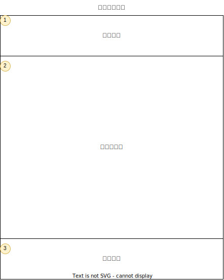{width=30%}

<table>
  <caption>ログイン画面-ヘッダー項目</caption>
  <thead>
    <tr>
      <th>No</th>
      <th>ラベル</th>
      <th>コントロール</th>
      <th>表示桁数</th>
      <th>文字揃え</th>
      <th>初期値</th>
      <th>説明</th>
    </tr>
  </thead>
  <tbody style="font-size: smaller;">
    <tr>
      <td>1</td>
      <td>ヘッダー</td>
      <td>-</td>
      <td>-</td>
      <td>-</td>
      <td>-</td>
      <td>ログイン画面のヘッダー領域</td>
    </tr>
    <tr>
      <td>2</td>
      <td>コンテンツ</td>
      <td>-</td>
      <td>-</td>
      <td>-</td>
      <td>-</td>
      <td>ログイン画面のコンテンツ領域。ログインのための入力内容などを表示する</td>
    </tr>
    <tr>
      <td>3</td>
      <td>フッター</td>
      <td>-</td>
      <td>-</td>
      <td>-</td>
      <td>-</td>
      <td>共通のフッター領域</td>
    </tr>
  </tbody>
</table>

### 基本構成

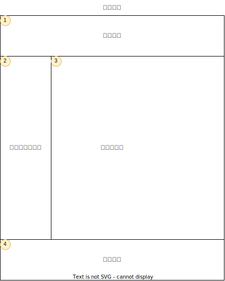

<table>
  <caption>ログイン画面-ヘッダー項目</caption>
  <thead>
    <tr>
      <th>No</th>
      <th>ラベル</th>
      <th>コントロール</th>
      <th>表示桁数</th>
      <th>文字揃え</th>
      <th>初期値</th>
      <th>説明</th>
    </tr>
  </thead>
  <tbody style="font-size: smaller;">
    <tr>
      <td>1</td>
      <td>ヘッダー</td>
      <td>-</td>
      <td>-</td>
      <td>-</td>
      <td>-</td>
      <td>ヘッダー領域</td>
    </tr>
    <tr>
      <td>2</td>
      <td>サイドメニュー</td>
      <td>-</td>
      <td>-</td>
      <td>-</td>
      <td>-</td>
      <td>サイドメニューの表示領域</td>
    </tr>
    <tr>
      <td>3</td>
      <td>コンテンツ</td>
      <td>-</td>
      <td>-</td>
      <td>-</td>
      <td>-</td>
      <td>各画面のコンテンツを表示する。内容は[コンテンツの構成](#コンテンツ)に従って表示する</td>
    </tr>
    <tr>
      <td>3</td>
      <td>フッター</td>
      <td>-</td>
      <td>-</td>
      <td>-</td>
      <td>-</td>
      <td>共通のフッター領域</td>
    </tr>
  </tbody>
</table>

### ヘッダー(ログイン)

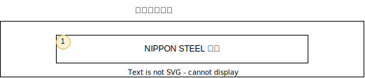

<table>
  <caption>ログイン画面-ヘッダー項目</caption>
  <thead>
    <tr>
      <th>No</th>
      <th>ラベル</th>
      <th>コントロール</th>
      <th>表示桁数</th>
      <th>文字揃え</th>
      <th>初期値</th>
      <th>説明</th>
    </tr>
  </thead>
  <tbody style="font-size: smaller;">
    <tr>
      <td>1</td>
      <td>ロゴ</td>
      <td>image</td>
      <td>-</td>
      <td>-</td>
      <td>-</td>
      <td>日鉄建材株式会社のロゴを中央揃えで表示する</td>
    </tr>
  </tbody>
</table>

### ヘッダー

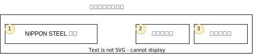

<table>
  <caption>ヘッダー項目</caption>
  <thead>
    <tr>
      <th>No</th>
      <th>ラベル</th>
      <th>コントロール</th>
      <th>表示桁数</th>
      <th>文字揃え</th>
      <th>初期値</th>
      <th>説明</th>
    </tr>
  </thead>
  <tbody>
    <tr>
      <td>1</td>
      <td>ロゴ</td>
      <td>image</td>
      <td>-</td>
      <td>-</td>
      <td>-</td>
      <td>日鉄建材株式会社のロゴを中央揃えで表示する</td>
    </tr>
    <tr>
      <td>2</td>
      <td>ユーザー名</td>
      <td>text</td>
      <td>-</td>
      <td>中央</td>
      <td>`users.name`</td>
      <td>ログイン中のユーザーのユーザー名を表示する</td>
    </tr>
    <tr>
      <td>3</td>
      <td>ログアウト</td>
      <td>link</td>
      <td>-</td>
      <td>中央</td>
      <td>-</td>
      <td>クリックでログアウトし、ログイン画面へ遷移する</td>
    </tr>
  </tbody>
</table>

### フッター

<table>
  <caption>フッター</caption>
  <thead>
    <tr>
      <th>No</th>
      <th>ラベル</th>
      <th>コントロール</th>
      <th>表示桁数</th>
      <th>文字揃え</th>
      <th>初期値</th>
      <th>説明</th>
    </tr>
  </thead>
  <tbody>
    <tr>
      <td>1</td>
      <td>利用規約</td>
      <td>link</td>
      <td>-</td>
      <td>-</td>
      <td>-</td>
      <td>クリックで外部の利用規約画面を別窓で開く</td>
    </tr>
    <tr>
      <td>2</td>
      <td>問い合わせ</td>
      <td>link</td>
      <td>-</td>
      <td>-</td>
      <td>-</td>
      <td>クリックで外部のお問い合わせ画面を別窓で開く</td>
    </tr>
    <tr>
      <td>3</td>
      <td>操作説明書</td>
      <td>link</td>
      <td>-</td>
      <td>-</td>
      <td>-</td>
      <td>クリックで操作説明書を別窓で開く。 
          ログインユーザーのみ表示。 
          ゲスト、ビジター権限は社外用の操作説明書が、管理者・営業・設計者権限では社内用の操作説明書が表示される。
      </td>
    </tr>
  </tbody>
</table>

<!--
<table>
  <caption>フッター</caption>
  <thead>
    <tr>
      <th>No</th>
      <th>ラベル</th>
      <th>コントロール</th>
      <th>表示桁数</th>
      <th>文字揃え</th>
      <th>初期値</th>
      <th>説明</th>
    </tr>
  </thead>
  <tbody>
    <tr>
      <td>1</td>
      <td></td>
      <td>リンク</td>
      <td>-</td>
      <td>-</td>
      <td>-</td>
      <td>個人情報保護方針へのリンク</td>
    </tr>
    <tr>
      <td>2</td>
      <td></td>
      <td>リンク</td>
      <td>-</td>
      <td>-</td>
      <td>-</td>
      <td>支店一覧へのリンク</td>
    </tr>
    <tr>
      <td>3</td>
      <td></td>
      <td>リンク</td>
      <td>-</td>
      <td>-</td>
      <td>-</td>
      <td>日鉄建材株式会社へのリンク</td>
    </tr>
  </tbody>
</table>
-->

### コンテンツ

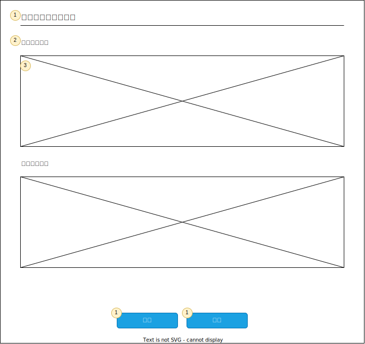{ width=40% }

<table>
  <caption>コンテンツ</caption>
  <thead>
    <tr>
      <th>No</th>
      <th>ラベル</th>
      <th>コントロール</th>
      <th>表示桁数</th>
      <th>文字揃え</th>
      <th>初期値</th>
      <th>説明</th>
    </tr>
  </thead>
  <tbody>
    <tr>
      <td>1</td>
      <td>コンテンツタイトル</td>
      <td>text</td>
      <td>-</td>
      <td>左</td>
      <td>-</td>
      <td>画面のタイトルを表示</td>
    </tr>
    <tr>
      <td>2</td>
      <td>サブタイトル</td>
      <td>text</td>
      <td>-</td>
      <td>左</td>
      <td>-</td>
      <td>コンテンツのサブタイトルを表示</td>
    </tr>
    <tr>
      <td>3</td>
      <td>-</td>
      <td>-</td>
      <td>--</td>
      <td>-</td>
      <td>-</td>
      <td>コンテンツの表示ブロック</td>
    </tr>
    <tr>
      <td>4</td>
      <td>戻る</td>
      <td>button</td>
      <td>-</td>
      <td>-</td>
      <td>-</td>
      <td>次の画面へ遷移する</td>
    </tr>
    <tr>
      <td>5</td>
      <td>次へ</td>
      <td>button</td>
      <td>-</td>
      <td>-</td>
      <td>-</td>
      <td>前の画面に遷移する</td>
    </tr>
  </tbody>
</table>

### サイドメニュー

{ width=35% }

<table style="font-size: 0.8em">
  <caption>サイドメニュー</caption>
  <thead>
    <tr>
      <th>No</th>
      <th>ラベル</th>
      <th>コントロール</th>
      <th>表示桁数</th>
      <th>文字揃え</th>
      <th>初期値</th>
      <th>説明</th>
    </tr>
  </thead>
  <tbody>
    <tr>
      <td>a1</td>
      <td>メニュー</td>
      <td>text</td>
      <td>-</td>
      <td>-</td>
      <td>-</td>
      <td></td>
    </tr>
    <tr>
      <td>a2</td>
      <td>商品一覧</td>
      <td>link</td>
      <td>-</td>
      <td>-</td>
      <td>-</td>
      <td>商品一覧ページへ遷移する</td>
    </tr>
    <tr>
      <td>a3</td>
      <td>案件一覧</td>
      <td>link</td>
      <td>-</td>
      <td>-</td>
      <td>-</td>
      <td>案件一覧ページへ遷移する</td>
    </tr>
    <!-- <tr>
      <td>a4</td>
      <td>歩掛/直工</td>
      <td></td>
      <td>-</td>
      <td>-</td>
      <td>-</td>
      <td>歩掛/直工ページへ遷移する/Phase5以降対応</td>
    </tr> -->
    <tr>
      <td>b1</td>
      <td>管理メニュー</td>
      <td>text</td>
      <td>-</td>
      <td>-</td>
      <td>-</td>
      <td>管理者権限のあるユーザーのみ表示</td>
    </tr>
    <tr>
      <td>b2</td>
      <td>ユーザー一覧</td>
      <td>link</td>
      <td>-</td>
      <td>-</td>
      <td>-</td>
      <td>ユーザー一覧ページへ遷移する</td>
    </tr>
    <tr>
      <td>b3</td>
      <td>LPマスタ編集</td>
      <td>link</td>
      <td>-</td>
      <td>-</td>
      <td>-</td>
      <td>LPマスタ編集画面へ遷移する</td>
    </tr>
    <tr>
      <td>b4</td>
      <td>H形鋼マスタ編集</td>
      <td>link</td>
      <td>-</td>
      <td>-</td>
      <td>-</td>
      <td>H形鋼マスタ編集へ遷移する</td>
    </tr>
    <tr>
      <td>b5</td>
      <td>材料マスタ編集</td>
      <td>link</td>
      <td>-</td>
      <td>-</td>
      <td>-</td>
      <td>材料マスタ編集へ遷移する</td>
    </tr>
    <tr>
      <td>b6</td>
      <td>見積マスタ編集</td>
      <td>link</td>
      <td>-</td>
      <td>-</td>
      <td>-</td>
      <td>見積マスタ編集へ遷移する</td>
    </tr>
    <tr>
      <td>b7</td>
      <td>計算指示書管理</td>
      <td>link</td>
      <td>-</td>
      <td>-</td>
      <td>-</td>
      <td>計算指示書管理画面へ遷移する</td>
    </tr>
  </tbody>
</table>

## 画面項目

### ログイン画面

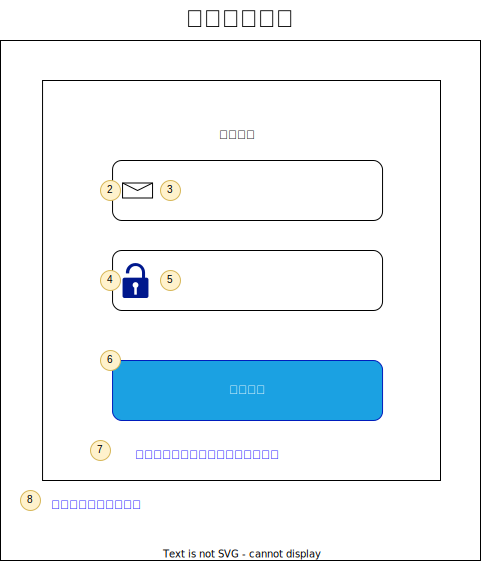{ width=30% }

<table>
  <caption>ログイン画面</caption>
  <thead>
    <tr>
      <th>No</th>
      <th>ラベル</th>
      <th>コントロール</th>
      <th>表示桁数</th>
      <th>文字揃え</th>
      <th>初期値</th>
      <th>説明</th>
    </tr>
  </thead>
  <tbody>
    <tr>
      <td>1</td>
      <td></td>
      <td>icon</td>
      <td>-</td>
      <td>-</td>
      <td>-</td>
      <td>メールのアイコン</td>
    </tr>
    <tr>
      <td>2</td>
      <td></td>
      <td>textfield</td>
      <td>-</td>
      <td>-</td>
      <td>-</td>
      <td>メールアドレスの入力フォーム</td>
    </tr>
    <tr>
      <td>3</td>
      <td></td>
      <td>icon</td>
      <td>-</td>
      <td>-</td>
      <td>-</td>
      <td>鍵アイコン</td>
    </tr>
    <tr>
      <td>4</td>
      <td></td>
      <td>passwordfield</td>
      <td>-</td>
      <td>-</td>
      <td>-</td>
      <td>パスワード入力フィールド</td>
    </tr>
    <tr>
      <td>6</td>
      <td>ログイン</td>
      <td>button</td>
      <td>-</td>
      <td>-</td>
      <td>-</td>
      <td>ログインボタン</td>
    </tr>
    <tr>
      <td>7</td>
      <td>パスワードを忘れた方はこちら</td>
      <td>link</td>
      <td>-</td>
      <td>-</td>
      <td>-</td>
      <td>パスワード忘れメール送信画面へ遷移する</td>
    </tr>
    <tr>
      <td>8</td>
      <td>新規登録はこちら</td>
      <td>link</td>
      <td>-</td>
      <td>-</td>
      <td>-</td>
      <td>新規登録画面へ遷移する</td>
    </tr>
  </tbody>
</table>

### 新規ユーザー登録画面

{width=50%}

<table>
  <caption>新規ユーザー登録画面</caption>
  <thead>
    <tr>
      <th>No</th>
      <th>ラベル</th>
      <th>コントロール</th>
      <th>表示桁数</th>
      <th>文字揃え</th>
      <th>初期値</th>
      <th>説明</th>
    </tr>
  </thead>
  <tbody>
    <tr>
      <td>1</td>
      <td>ユーザー新規登録</td>
      <td>text</td>
      <td>-</td>
      <td>左</td>
      <td>-</td>
      <td>コンテンツのタイトル</td>
    </tr>
    <tr>
      <td>2</td>
      <td>※は必ず入力してください</td>
      <td>text</td>
      <td>-</td>
      <td>左</td>
      <td>-</td>
      <td></td>
    </tr>
    <tr>
      <td>3</td>
      <td>会社名</td>
      <td>label</td>
      <td>-</td>
      <td>左</td>
      <td>-</td>
      <td></td>
    </tr>
    <tr>
      <td>4</td>
      <td></td>
      <td>textfield</td>
      <td>-</td>
      <td>-</td>
      <td>employees.company</td>
      <td>会社名入力フィールド</td>
    </tr>
    <tr>
      <td>5</td>
      <td>部署名</td>
      <td>label</td>
      <td>-</td>
      <td>左</td>
      <td>-</td>
      <td></td>
    </tr>
    <tr>
      <td>6</td>
      <td></td>
      <td>textfield</td>
      <td>-</td>
      <td>-</td>
      <td>employees.department</td>
      <td>部署名入力フィールド</td>
    </tr>
    <tr>
      <td>7</td>
      <td>氏名</td>
      <td>label</td>
      <td>-</td>
      <td>左</td>
      <td>-</td>
      <td></td>
    </tr>
    <tr>
      <td>8</td>
      <td></td>
      <td>textfield</td>
      <td>-</td>
      <td>-</td>
      <td>employees.company_name</td>
      <td>氏名入力フィールド</td>
    </tr>
    <tr>
      <td>9</td>
      <td>メールアドレス</td>
      <td>label</td>
      <td>-</td>
      <td>左</td>
      <td>-</td>
      <td></td>
    </tr>
    <tr>
      <td>10</td>
      <td></td>
      <td>textfield</td>
      <td>-</td>
      <td>-</td>
      <td>employees.company_name</td>
      <td>メールアドレス入力フィールド</td>
    </tr>
    <tr>
      <td>11</td>
      <td>電話番号</td>
      <td>label</td>
      <td>-</td>
      <td>左</td>
      <td>-</td>
      <td></td>
    </tr>
    <tr>
      <td>12</td>
      <td></td>
      <td>textfield</td>
      <td>-</td>
      <td>-</td>
      <td>employees.phone_number</td>
      <td>電話番号入力フィールド</td>
    </tr>
    <tr>
      <td>13</td>
      <td>郵便番号</td>
      <td>label</td>
      <td>-</td>
      <td>左</td>
      <td>-</td>
      <td></td>
    </tr>
    <tr>
      <td>14</td>
      <td></td>
      <td>textfield</td>
      <td>-</td>
      <td>-</td>
      <td>employees.zip_code</td>
      <td>郵便番号入力フィールド</td>
    </tr>
    <tr>
      <td>15</td>
      <td>都道府県</td>
      <td>label</td>
      <td>-</td>
      <td>左</td>
      <td>-</td>
      <td></td>
    </tr>
    <tr>
      <td>16</td>
      <td></td>
      <td>dropdown</td>
      <td>-</td>
      <td>-</td>
      <td>employees.prefecture</td>
      <td>都道府県ドロップダウン</td>
    </tr>
    <tr>
      <td>17</td>
      <td>住所</td>
      <td>label</td>
      <td>-</td>
      <td>左</td>
      <td>-</td>
      <td></td>
    </tr>
    <tr>
      <td>18</td>
      <td></td>
      <td>textfield</td>
      <td>-</td>
      <td>-</td>
      <td>employees.address</td>
      <td>住所入力フィールド</td>
    </tr>
    <tr>
      <td>19</td>
      <td>パスワード</td>
      <td>label</td>
      <td>-</td>
      <td>左</td>
      <td>-</td>
      <td></td>
    </tr>
    <tr>
      <td>20</td>
      <td></td>
      <td>passwordfield</td>
      <td>-</td>
      <td>-</td>
      <td>-</td>
      <td>パスワード入力フィールド 
      登録時に users.encrypted_password へパスワードを暗号化して保存</td>
    </tr>
    <tr>
      <td>21</td>
      <td>パスワード再入力</td>
      <td>label</td>
      <td>-</td>
      <td>左</td>
      <td>-</td>
      <td></td>
    </tr>
    <tr>
      <td>22</td>
      <td></td>
      <td>passwordfield</td>
      <td>-</td>
      <td>-</td>
      <td>-</td>
      <td>確認用パスワード入力フィールド</td>
    </tr>
    <tr>
      <td>23</td>
      <td>キャンセル</td>
      <td>button</td>
      <td>-</td>
      <td>-</td>
      <td>-</td>
      <td>ログイン画面へ遷移する</td>
    </tr>
    <tr>
      <td>24</td>
      <td>登録</td>
      <td>button</td>
      <td>-</td>
      <td>-</td>
      <td>-</td>
      <td>新規登録を実行し、ログイン登録画面へ遷移する</td>
    </tr>
  </tbody>
</table>

### パスワード忘れメール送信画面

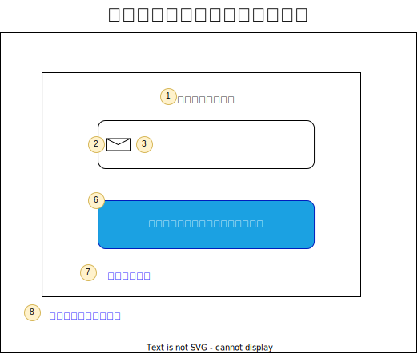{width=50%}

<table>
  <caption>パスワード忘れメール送信画面</caption>
  <thead>
    <tr>
      <th>No</th>
      <th>ラベル</th>
      <th>コントロール</th>
      <th>表示桁数</th>
      <th>文字揃え</th>
      <th>初期値</th>
      <th>説明</th>
    </tr>
  </thead>
  <tbody>
    <tr>
      <td>1</td>
      <td>パスワード再設定</td>
      <td>text</td>
      <td>-</td>
      <td>中央</td>
      <td>-</td>
      <td></td>
    </tr>
    <tr>
      <td>2</td>
      <td></td>
      <td>icon</td>
      <td>-</td>
      <td>-</td>
      <td>-</td>
      <td></td>
    </tr>
    <tr>
      <td>3</td>
      <td></td>
      <td>textfield</td>
      <td>-</td>
      <td>-</td>
      <td>-</td>
      <td>メールアドレスの入力フォーム</td>
    </tr>
    <tr>
      <td>4</td>
      <td>パスワード再設定用のリンクを送信</td>
      <td>button</td>
      <td>-</td>
      <td>-</td>
      <td>-</td>
      <td>入力されたメールアドレスへ再設定用のリンクを送信する。</td>
    </tr>
    <tr>
      <td>5</td>
      <td>ログイン</td>
      <td>link</td>
      <td>-</td>
      <td>左</td>
      <td>-</td>
      <td>ログイン画面へ遷移する</td>
    </tr>
    <tr>
      <td>6</td>
      <td>新規登録はこちら</td>
      <td>link</td>
      <td>-</td>
      <td>左</td>
      <td>-</td>
      <td>新規登録画面へ遷移する</td>
    </tr>
  </tbody>
</table>

### パスワード設定画面

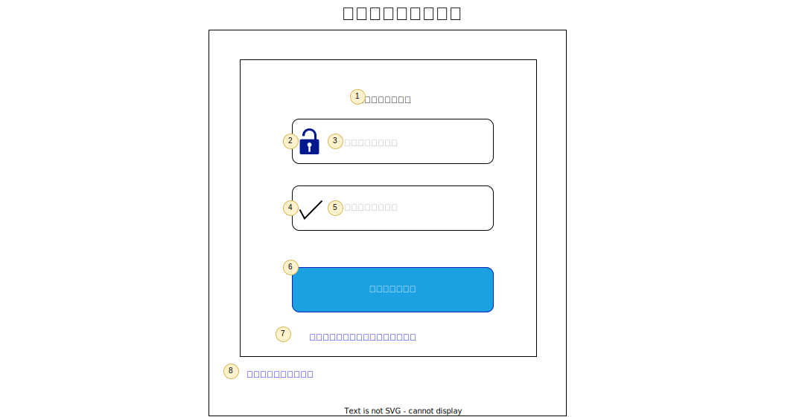{width=100%}

<table>
  <caption>パスワード設定画面</caption>
  <thead>
    <tr>
      <th>No</th>
      <th>ラベル</th>
      <th>コントロール</th>
      <th>表示桁数</th>
      <th>文字揃え</th>
      <th>初期値</th>
      <th>説明</th>
    </tr>
  </thead>
  <tbody>
    <tr>
      <td>1</td>
      <td>パスワード再設定</td>
      <td>text</td>
      <td>-</td>
      <td>中央</td>
      <td>-</td>
      <td></td>
    </tr>
    <tr>
      <td>2</td>
      <td></td>
      <td>icon</td>
      <td>-</td>
      <td>-</td>
      <td>-</td>
      <td>鍵アイコンを表示</td>
    </tr>
    <tr>
      <td>3</td>
      <td></td>
      <td>passwordfield</td>
      <td>-</td>
      <td>-</td>
      <td>-</td>
      <td>パスワード入力フォーム</td>
    </tr>
    <tr>
      <td>4</td>
      <td></td>
      <td>icon</td>
      <td>-</td>
      <td>-</td>
      <td>-</td>
      <td>チェックマークのアイコンを表示</td>
    </tr>
    <tr>
      <td>5</td>
      <td></td>
      <td>passwordfield</td>
      <td>-</td>
      <td>-</td>
      <td>-</td>
      <td>確認用パスワード入力フィールド</td>
    </tr>
    <tr>
      <td>6</td>
      <td>パスワード変更</td>
      <td>button</td>
      <td>-</td>
      <td>中央</td>
      <td>-</td>
      <td>パスワード変更を実行し、ログイン画面へ遷移する</td>
    </tr>
    <tr>
      <td>7</td>
      <td>パスワードを忘れた方はこちら</td>
      <td>link</td>
      <td>-</td>
      <td>-</td>
      <td>-</td>
      <td>パスワード忘れメール送信画面へ遷移する</td>
    </tr>
    <tr>
      <td>8</td>
      <td>新規登録はこちら</td>
      <td>link</td>
      <td>-</td>
      <td>-</td>
      <td>-</td>
      <td>新規登録画面へ遷移する</td>
    </tr>
  </tbody>
</table>

### ユーザー一覧画面

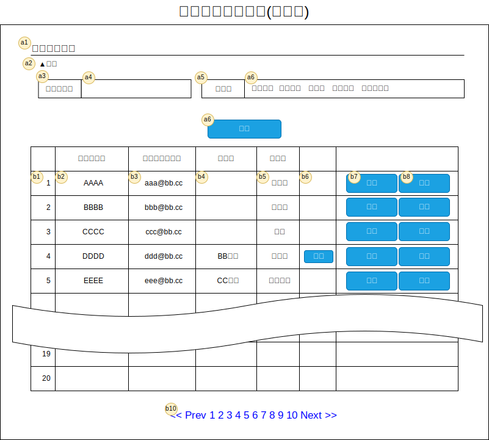{width=60%}

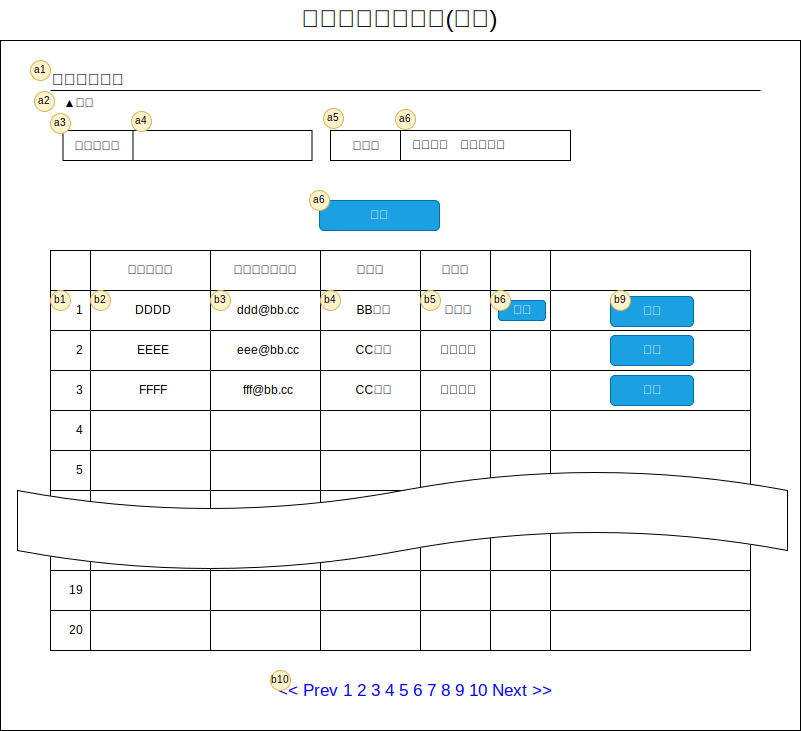{width=60%}

<table>
  <caption>ユーザー一覧画面</caption>
  <thead>
    <tr>
      <th>No</th>
      <th>ラベル</th>
      <th>コントロール</th>
      <th>表示桁数</th>
      <th>文字揃え</th>
      <th>初期値</th>
      <th>説明</th>
    </tr>
  </thead>
  <tbody>
    <tr>
      <td>a1</td>
      <td>ユーザー一覧</td>
      <td>text</td>
      <td>-</td>
      <td>左</td>
      <td>-</td>
      <td>画面のタイトルを表示する</td>
    </tr>
    <tr>
      <td>a2</td>
      <td>▲検索</td>
      <td>text</td>
      <td>-</td>
      <td>左</td>
      <td>-</td>
      <td>クリックすると検索項目が隠れる。▼の時にクリックすると検索項目が表示される。</td>
    </tr>
    <tr>
      <td>a3</td>
      <td>ユーザー名</td>
      <td>label</td>
      <td>-</td>
      <td>左</td>
      <td>-</td>
      <td>検索項目:ユーザー名のラベル</td>
    </tr>
    <tr>
      <td>a4</td>
      <td>ユーザー名入力フィールド</td>
      <td>textfield</td>
      <td>-</td>
      <td>-</td>
      <td>-</td>
      <td>検索条件のユーザー名を入力するテキストフィールド</td>
    </tr>
    <tr>
      <td>a5</td>
      <td>権限名</td>
      <td>label</td>
      <td>-</td>
      <td>左</td>
      <td>-</td>
      <td>検索項目:権限名のラベル</td>
    </tr>
    <tr>
      <td>a6</td>
      <td>権限名チェックボックス</td>
      <td>checkbox</td>
      <td>-</td>
      <td>-</td>
      <td>-</td>
      <td>権限名を選択する。選択肢は以下の通り。
        <ul>
          <li>管理者</li>
          <li>設計者</li>
          <li>営業</li>
          <li>ゲスト</li>
          <li>ビジター</li>
        <ul>
      </td>
    </tr>
    <tr>
      <td>a6</td>
      <td>検索ボタン</td>
      <td>button</td>
      <td>-</td>
      <td>-</td>
      <td>-</td>
      <td>入力条件をもとに検索を実行する。 検索項目のパラメータは ?q=xxx とする</td>
    </tr>
    <tr>
      <td>b1</td>
      <td>ID</td>
      <td>text</td>
      <td>-</td>
      <td>右</td>
      <td>`users.id`</td>
      <td>レコードのIDを表示する。</td>
    </tr>
    <tr>
      <td>b2</td>
      <td>ユーザー名</td>
      <td>text</td>
      <td>-</td>
      <td>左</td>
      <td>`users.name`</td>
      <td>ユーザー名を表示する。</td>
    </tr>
    <tr>
      <td>b3</td>
      <td>メールアドレス</td>
      <td>text</td>
      <td>-</td>
      <td>左</td>
      <td>`users.mail`</td>
      <td>メールアドレスを表示する。</td>
    </tr>
    <tr>
      <td>b4</td>
      <td>会社名</td>
      <td>text</td>
      <td>-</td>
      <td>左</td>
      <td>`users.mail`</td>
      <td>会社名を表示する。権限が社内ユーザー（営業・設計者・管理者）の場合は表示しない</td>
    </tr>
    <tr>
      <td>b5</td>
      <td>権限名</td>
      <td>text</td>
      <td>-</td>
      <td>左</td>
      <td>`users.role`</td>
      <td>対象ユーザーの権限名を表示する。Userテーブルのroleの値をもとに以下を表示する。 
      <ul>
        <li>admin-管理者</li>
        <li>engineer-設計者</li>
        <li>sales-営業</li>
        <li>guest-ゲスト</li>
        <li>visitor-ビジター</li>
      </ul>
      </td>
    </tr>
    <tr>
      <td>b6</td>
      <td>承認</td>
      <td>link</td>
      <td>-</td>
      <td>中央</td>
      <td>-</td>
      <td>クリックで対象ユーザー(ビジター)がゲストになる</td>
    </tr>
    <tr>
      <td>b7</td>
      <td>編集</td>
      <td>link</td>
      <td>-</td>
      <td>中央</td>
      <td>-</td>
      <td>クリックで対象ユーザーの編集画面へ遷移する</td>
    </tr>
    <tr>
      <td>b8</td>
      <td>削除</td>
      <td>link</td>
      <td>-</td>
      <td>中央</td>
      <td>-</td>
      <td>クリックで削除の確認ダイアログを表示する。「はい」を選択すると、データを削除する</td>
    </tr>
    <tr>
      <td>b9</td>
      <td>詳細</td>
      <td>link</td>
      <td>-</td>
      <td>中央</td>
      <td>-</td>
      <td>クリックでユーザーの登録内容を表示する</td>
    </tr>
    <tr>
      <td>b10</td>
      <td>ページへのリンク</td>
      <td>link</td>
      <td>-</td>
      <td>-</td>
      <td>-</td>
      <td>20件以上データがあると、ページネーションのリンクを出力する。20件以下の場合は表示しない。</td>
    </tr>
  </tbody>
</table>

#### 特記事項

- 作成順の降順でソートして表示する

### ユーザー編集画面

<table>
  <caption></caption>
  <thead>
    <tr>
      <th>No</th>
      <th>ラベル</th>
      <th>コントロール</th>
      <th>表示 桁数</th>
      <th>文字 揃え</th>
      <th>初期値</th>
      <th>説明</th>
    </tr>
  </thead>
  <tbody>
    <tr>
      <td>1</td>
      <td>ユーザー編集</td>
      <td>text</td>
      <td>-</td>
      <td>左</td>
      <td>-</td>
      <td>画面のタイトルを表示する</td>
    </tr>
    <tr>
      <td>2</td>
      <td>※は必ず入力してください</td>
      <td>text</td>
      <td>-</td>
      <td>左</td>
      <td>-</td>
      <td>入力項目に対する注意事項</td>
    </tr>
    <tr>
      <td>3</td>
      <td>権限</td>
      <td>label</td>
      <td>-</td>
      <td>左</td>
      <td>-</td>
      <td></td>
    </tr>
    <tr>
      <td>4</td>
      <td></td>
      <td>dropdown</td>
      <td>-</td>
      <td>-</td>
      <td>users.role</td>
      <td>権限情報を選択する。選択肢は以下の通り。
        <ul>
          <li>管理者</li>
          <li>設計者</li>
          <li>営業</li>
          <li>ゲスト</li>
          <li>ビジター</li>
        <ul>
      </td>
    </tr>
    <tr>
      <td>5</td>
      <td>会社名</td>
      <td>label</td>
      <td>-</td>
      <td>左</td>
      <td>-</td>
      <td>入力項目:会社名 のラベル</td>
    </tr>
    <tr>
      <td>6</td>
      <td>会社名入力フィールド</td>
      <td>textfield</td>
      <td>-</td>
      <td>-</td>
      <td>`employees.company`</td>
      <td>会社名を入力する。必須入力。1文字以上50文字以下で入力を行う。51文字以上は入力できない。
        
エラー項目とメッセージ
          <dl>
            <dt>会社名が空</dt>
            <dd>会社名は必須項目です。</dd>
          </dl>
        

      </td>
    </tr>
    <tr>
      <td>7</td>
      <td>部署名</td>
      <td>label</td>
      <td>-</td>
      <td>左</td>
      <td>-</td>
      <td>入力項目:部署名 のラベル</td>
    </tr>
    <tr>
      <td>8</td>
      <td>部署名入力フィールド</td>
      <td>textfield</td>
      <td>-</td>
      <td>-</td>
      <td>`employees.department`</td>
      <td>部署名を入力する。0文字以上50文字以下で入力を行う。51文字以上は入力できない。0文字の場合は、`NULL`で登録する。</td>
    </tr>
    <tr>
      <td>9</td>
      <td>氏名</td>
      <td>label</td>
      <td>-</td>
      <td>左</td>
      <td>-</td>
      <td>入力項目:氏名 のラベル</td>
    </tr>
    <tr>
      <td>10</td>
      <td>氏名入力フィールド</td>
      <td>textfield</td>
      <td>-</td>
      <td>-</td>
      <td>`employees.name`</td>
      <td>氏名を入力する。必須入力。1文字以上50文字以下で入力を行う。51文字以上は入力できない。
        
エラー項目とメッセージ
          <dl>
            <dt>入力が空</dt>
            <dd>氏名は必須項目です。</dd>
          </dl>
        

      </td>
    </tr>
    <tr>
      <td>11</td>
      <td>メールアドレス</td>
      <td>label</td>
      <td>-</td>
      <td>左</td>
      <td>-</td>
      <td>入力項目:メールアドレス のラベル</td>
    </tr>
    <tr>
      <td>12</td>
      <td>メールアドレス入力フィールド</td>
      <td>textfield</td>
      <td>-</td>
      <td>-</td>
      <td>`users.email`</td>
      <td>メールアドレスを入力する。必須入力。メールアドレスの形式に従う。 
        
エラー項目とメッセージ
          <dl>
            <dt>すでに同じメールアドレスが登録されている場合</dt>
            <dd>入力されたメールアドレスは既に登録されています。</dd>
            <dt>メールアドレスの形式が不正</dt>
            <dd>メールアドレスの形式が不正です。</dd>
          </dl>
        

      </td>
    </tr>
    <tr>
      <td>13</td>
      <td>電話番号</td>
      <td>label</td>
      <td>-</td>
      <td>左</td>
      <td>-</td>
      <td>入力項目:電話番号 のラベル</td>
    </tr>
    <tr>
      <td>14</td>
      <td>電話番号入力フィールド</td>
      <td>textfield</td>
      <td>-</td>
      <td>-</td>
      <td>`employees.phone`</td>
      <td>電話番号を入力する。空の場合は`NULL`で登録する。
        電話番号の形式は以下の通り
        <ul>
          <li>0で始まる</li>
          <li>2桁以上の数字 "-" 1桁以上の数字 "-" 1桁以上の数字</li>
          <li>ハイフンを含めた文字の長さが 12-13文字</li>
        </ul>
        
エラー項目とメッセージ
          <dl>
            <dt>電話番号の形式が不正</dt>
            <dd>電話番号の形式が不正です。</dd>
          </dl>
        

      </td>
    </tr>
    <tr>
      <td>15</td>
      <td>郵便番号</td>
      <td>label</td>
      <td>-</td>
      <td>左</td>
      <td>-</td>
      <td>入力項目:郵便番号 のラベル</td>
    </tr>
    <tr>
      <td>16</td>
      <td>郵便番号入力フィールド</td>
      <td>textfield</td>
      <td>-</td>
      <td>-</td>
      <td>`employees.zip`</td>
      <td>郵便番号を入力する。空の場合は`NULL`で登録する。
      郵便番号の形式は 3桁の数値-4桁の数値
        
エラー項目とメッセージ
          <dl>
            <dt>郵便番号の形式が不正</dt>
            <dd>郵便番号の形式が不正です。</dd>
          </dl>
        

    </tr>
    <tr>
      <td>17</td>
      <td>都道府県</td>
      <td>Label</td>
      <td>-</td>
      <td>左</td>
      <td>-</td>
      <td>入力項目:都道府県 のラベル</td>
    </tr>
    <tr>
      <td>18</td>
      <td>都道府県入力フィールド</td>
      <td>ComboBox</td>
      <td>-</td>
      <td>-</td>
      <td>`employees.prefecture`</td>
      <td>都道府県を入力する。ComboBoxの選択の中から1つ選択を行う。</td>
    </tr>
    <tr>
      <td>19</td>
      <td>住所</td>
      <td>label</td>
      <td>-</td>
      <td>左
      <td>-</td>
      <td>入力項目:住所 のラベル</td>
    </tr>
    <tr>
      <td>20</td>
      <td>住所入力フィールド</td>
      <td>textfield</td>
      <td>-</td>
      <td>-</td>
      <td>`employees.address`の値</td>
      <td>住所を入力する。0文字以上50文字以内で入力を行う。51文字以上は入力できない。</td>
    </tr>
    <tr>
      <td>21</td>
      <td>パスワード</td>
      <td>label</td>
      <td>-</td>
      <td>左</td>
      <td>-</td>
      <td>入力項目:パスワード のラベル</td>
    </tr>
    <tr>
      <td>22</td>
      <td>パスワード入力フィールド</td>
      <td>パスワードフィールド</td>
      <td>-</td>
      <td>-</td>
      <td>-</td>
      <td>パスワードを入力する。英字(大)、英字(小)、数字から2種類を使用し、8文字以上で設定する。
        
エラー項目とメッセージ
          <dl>
            <dt>入力文字種の不足</dt>
            <dd>パスワードはアルファベットの大文字・小文字、数字から2種類以上を使用してください。</dd>
            <dt>入力が8文字未満</dt>
            <dd>パスワードは8文字以上で設定してください。</dd>
          </dl>
        

      </td>
    </tr>
    <tr>
      <td>23</td>
      <td>パスワード再入力</td>
      <td>＜/td>
      <td>-</td>
      <td>左</td>
      <td>-</td>
      <td>入力項目:再入力 のラベル</td>
    </tr>
    <tr>
      <td>24</td>
      <td>パスワード再入力フィールド</td>
      <td>パスワードフィールド</td>
      <td>-</td>
      <td>-</td>
      <td>-</td>
      <td>パスワードを入力する。英字(大)、英字(小)、数字から2種類を使用し、8文字以上で設定する。
        
エラー項目とメッセージ
          <dl>
            <dt>パスワード入力フィールドと入力が一致しない</dt>
            <dd>パスワードが一致しません。</dd>
          </dl>
        

      </td>
    </tr>
    <tr>
      <td>25</td>
      <td>印影文字</td>
      <td>label</td>
      <td>-</td>
      <td>左</td>
      <td>-</td>
      <td></td>
    </tr>
    <tr>
      <td>26</td>
      <td></td>
      <td>textfield</td>
      <td>-</td>
      <td>左</td>
      <td>users.stamp_name</td>
      <td>見積書の電子印用印影文字入力フィールド。4文字以内。 
      入力がなかった場合は見積書出力時に電子印は表示されない。</td>
    </tr>
    <tr>
      <td>27</td>
      <td>戻る</td>
      <td>link</td>
      <td>-</td>
      <td>-</td>
      <td>-</td>
      <td>入力内容を破棄し、ユーザー一覧画面に遷移する。</td>
    </tr>
    <tr>
      <td>28</td>
      <td>更新</td>
      <td>button</td>
      <td>-</td>
      <td>-</td>
      <td>-</td>
      <td>入力内容でデータを更新する。入力内容にエラーがある場合は、画面上部にエラーメッセージを表示し、編集画面に戻る。更新に成功した場合は、ユーザー一覧画面に遷移する</td>
    </tr>
  </tbody>
</table>

### ユーザー詳細画面(営業)

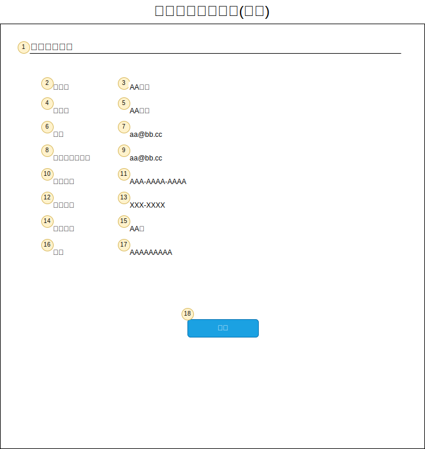
<table>
  <caption></caption>
  <thead>
    <tr>
      <th>No</th>
      <th>ラベル</th>
      <th>コントロール</th>
      <th>表示 桁数</th>
      <th>文字 揃え</th>
      <th>初期値</th>
      <th>説明</th>
    </tr>
  </thead>
  <tbody>
    <tr>
      <td>1</td>
      <td>ユーザー詳細</td>
      <td>text</td>
      <td>-</td>
      <td>左</td>
      <td>-</td>
      <td>画面のタイトルを表示する</td>
    </tr>
    <tr>
      <td>2</td>
      <td>会社名</td>
      <td>text</td>
      <td>-</td>
      <td>左</td>
      <td>-</td>
      <td>-</td>
    </tr>
    <tr>
      <td>3</td>
      <td>-</td>
      <td>text</td>
      <td>-</td>
      <td>左</td>
      <td>-</td>
      <td>会社名を表示する。</td>
    </tr>
    <tr>
      <td>4</td>
      <td>部署名</td>
      <td>text</td>
      <td>-</td>
      <td>左</td>
      <td>-</td>
      <td>-</td>
    </tr>
    <tr>
      <td>5</td>
      <td>-</td>
      <td>text</td>
      <td>-</td>
      <td>左</td>
      <td>-</td>
      <td>部署名を表示する。</td>
    </tr>
    <tr>
      <td>6</td>
      <td>氏名</td>
      <td>text</td>
      <td>-</td>
      <td>左</td>
      <td>-</td>
      <td>-</td>
    </tr>
    <tr>
      <td>7</td>
      <td>-</td>
      <td>text</td>
      <td>-</td>
      <td>左</td>
      <td>-</td>
      <td>氏名を表示する。</td>
    </tr>
    <tr>
      <td>8</td>
      <td>メールアドレス</td>
      <td>text</td>
      <td>-</td>
      <td>左</td>
      <td>-</td>
      <td>-</td>
    </tr>
    <tr>
      <td>9</td>
      <td>-</td>
      <td>text</td>
      <td>-</td>
      <td>左</td>
      <td>-</td>
      <td>メールアドレスのmailtoリンクを表示する。</td>
    </tr>
    <tr>
      <td>10</td>
      <td>電話番号</td>
      <td>text</td>
      <td>-</td>
      <td>左</td>
      <td>-</td>
      <td>-</td>
    </tr>
    <tr>
      <td>11</td>
      <td>-</td>
      <td>text</td>
      <td>-</td>
      <td>左</td>
      <td>-</td>
      <td>電話番号を表示する</td>
    </tr>
    <tr>
      <td>12</td>
      <td>郵便番号</td>
      <td>text</td>
      <td>-</td>
      <td>左</td>
      <td>-</td>
      <td>-</td>
    </tr>
    <tr>
      <td>13</td>
      <td>-</td>
      <td>text</td>
      <td>-</td>
      <td>左</td>
      <td>-</td>
      <td>郵便番号を表示する</td>
    </tr>
    <tr>
      <td>14</td>
      <td>都道府県</td>
      <td>text</td>
      <td>-</td>
      <td>左</td>
      <td>-</td>
      <td>-</td>
    </tr>
    <tr>
      <td>15</td>
      <td>-</td>
      <td>text</td>
      <td>-</td>
      <td>左</td>
      <td>-</td>
      <td>都道府県を表示する</td>
    </tr>
    <tr>
      <td>16</td>
      <td>住所</td>
      <td>text</td>
      <td>-</td>
      <td>左</td>
      <td>-</td>
      <td>-</td>
    </tr>
    <tr>
      <td>17</td>
      <td>-</td>
      <td>text</td>
      <td>-</td>
      <td>左</td>
      <td>-</td>
      <td>住所を表示する</td>
    </tr>
    <tr>
      <td>18</td>
      <td>戻る</td>
      <td>link</td>
      <td>-</td>
      <td>中央</td>
      <td>-</td>
      <td>ユーザー一覧画面に遷移する。</td>
    </tr>
  </tbody>
</table>

### 登録情報画面

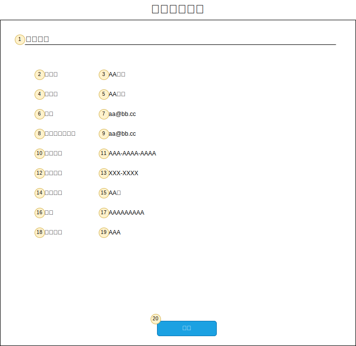
<table>
  <caption></caption>
  <thead>
    <tr>
      <th>No</th>
      <th>ラベル</th>
      <th>コントロール</th>
      <th>表示 桁数</th>
      <th>文字 揃え</th>
      <th>初期値</th>
      <th>説明</th>
    </tr>
  </thead>
  <tbody>
    <tr>
      <td>1</td>
      <td>登録情報</td>
      <td>text</td>
      <td>-</td>
      <td>左</td>
      <td>-</td>
      <td>画面のタイトルを表示する</td>
    </tr>
    <tr>
    <tr>
      <td>2</td>
      <td>会社名</td>
      <td>text</td>
      <td>-</td>
      <td>左</td>
      <td>-</td>
      <td>-</td>
    </tr>
    <tr>
      <td>3</td>
      <td>-</td>
      <td>text</td>
      <td>-</td>
      <td>左</td>
      <td>-</td>
      <td>会社名を表示する。</td>
    </tr>
    <tr>
      <td>4</td>
      <td>部署名</td>
      <td>text</td>
      <td>-</td>
      <td>左</td>
      <td>-</td>
      <td>-</td>
    </tr>
    <tr>
      <td>5</td>
      <td>-</td>
      <td>text</td>
      <td>-</td>
      <td>左</td>
      <td>-</td>
      <td>部署名を表示する。</td>
    </tr>
    <tr>
      <td>6</td>
      <td>氏名</td>
      <td>text</td>
      <td>-</td>
      <td>左</td>
      <td>-</td>
      <td>-</td>
    </tr>
    <tr>
      <td>7</td>
      <td>-</td>
      <td>text</td>
      <td>-</td>
      <td>左</td>
      <td>-</td>
      <td>氏名を表示する。</td>
    </tr>
    <tr>
      <td>8</td>
      <td>メールアドレス</td>
      <td>text</td>
      <td>-</td>
      <td>左</td>
      <td>-</td>
      <td>-</td>
    </tr>
    <tr>
      <td>9</td>
      <td>-</td>
      <td>text</td>
      <td>-</td>
      <td>左</td>
      <td>-</td>
      <td>メールアドレスを表示する。</td>
    </tr>
    <tr>
      <td>10</td>
      <td>電話番号</td>
      <td>text</td>
      <td>-</td>
      <td>左</td>
      <td>-</td>
      <td>-</td>
    </tr>
    <tr>
      <td>11</td>
      <td>-</td>
      <td>text</td>
      <td>-</td>
      <td>左</td>
      <td>-</td>
      <td>電話番号を表示する</td>
    </tr>
    <tr>
      <td>12</td>
      <td>郵便番号</td>
      <td>text</td>
      <td>-</td>
      <td>左</td>
      <td>-</td>
      <td>-</td>
    </tr>
    <tr>
      <td>13</td>
      <td>-</td>
      <td>text</td>
      <td>-</td>
      <td>左</td>
      <td>-</td>
      <td>郵便番号を表示する</td>
    </tr>
    <tr>
      <td>14</td>
      <td>都道府県</td>
      <td>text</td>
      <td>-</td>
      <td>左</td>
      <td>-</td>
      <td>-</td>
    </tr>
    <tr>
      <td>15</td>
      <td>-</td>
      <td>text</td>
      <td>-</td>
      <td>左</td>
      <td>-</td>
      <td>都道府県を表示する</td>
    </tr>
    <tr>
      <td>16</td>
      <td>住所</td>
      <td>text</td>
      <td>-</td>
      <td>左</td>
      <td>-</td>
      <td>-</td>
    </tr>
    <tr>
      <td>17</td>
      <td>-</td>
      <td>text</td>
      <td>-</td>
      <td>左</td>
      <td>-</td>
      <td>住所を表示する</td>
    </tr>
    <tr>
      <td>18</td>
      <td>印影文字</td>
      <td>text</td>
      <td>-</td>
      <td>左</td>
      <td>-</td>
      <td>社内ユーザー（営業・設計者・管理者）のみ表示</td>
    </tr>
    <tr>
      <td>19</td>
      <td>-</td>
      <td>text</td>
      <td>-</td>
      <td>左</td>
      <td>-</td>
      <td>印影文字を表示する。社内ユーザー（営業・設計者・管理者）のみ表示</td>
    </tr>
    <tr>
      <td>20</td>
      <td>戻る</td>
      <td>link</td>
      <td>-</td>
      <td>中央</td>
      <td>-</td>
      <td>前画面に遷移する。</td>
    </tr>
  </tbody>
</table>

### 形式選択画面

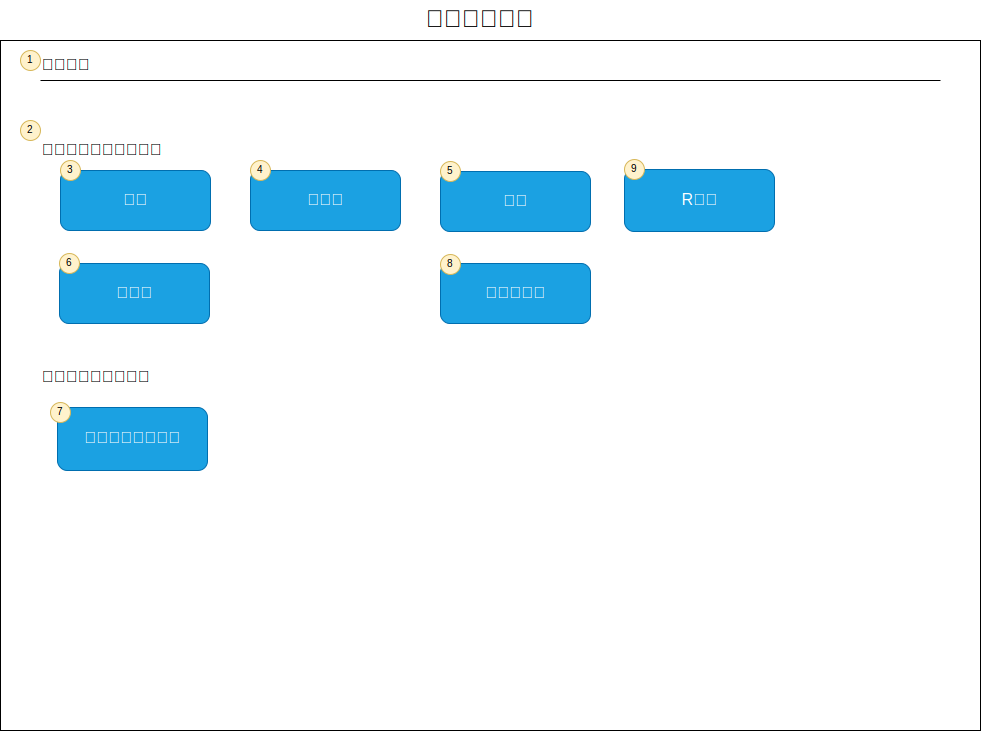

<table>
  <caption>形式選択画面</caption>
  <thead>
    <tr>
      <th>No</th>
      <th>ラベル</th>
      <th>コントロール</th>
      <th>表示桁数</th>
      <th>文字揃え</th>
      <th>初期値</th>
      <th>説明</th>
    </tr>
  </thead>
  <tbody>
    <tr>
      <td>1</td>
      <td>形式選択画面</td>
      <td>text</td>
      <td>-</td>
      <td>左</td>
      <td>-</td>
      <td>画面のタイトルを表示</td>
    </tr>
    <tr>
      <td>2</td>
      <td>ライナープレート立坑</td>
      <td>text</td>
      <td>-</td>
      <td>左</td>
      <td>-</td>
      <td>コンテンツのサブタイトルを表示</td>
    </tr>
    <tr>
      <td>3</td>
      <td>円形立坑</td>
      <td>link</td>
      <td>-</td>
      <td>中央</td>
      <td>-</td>
      <td>クリックで、円形立坑の基礎情報入力画面へ遷移</td>
    </tr>
    <tr>
      <td>4</td>
      <td>小判形立坑</td>
      <td>link</td>
      <td>-</td>
      <td>中央</td>
      <td>-</td>
      <td>クリックで、小判形立坑の基礎情報入力画面へ遷移</td>
    </tr>
    <tr>
      <td>5</td>
      <td>矩形立坑</td>
      <td>link</td>
      <td>-</td>
      <td>中央</td>
      <td>-</td>
      <td>クリックで、矩形立坑の基礎情報入力画面へ遷移</td>
    </tr>
    <tr>
      <td>6</td>
      <td>集水井</td>
      <td>link</td>
      <td>-</td>
      <td>中央</td>
      <td>-</td>
      <td>クリックで、集水井の基礎情報入力画面へ遷移</td>
    </tr>
    <tr>
      <td>7</td>
      <td>カゴ枠・大型カゴ枠</td>
      <td>link</td>
      <td>-</td>
      <td>中央</td>
      <td>-</td>
      <td>クリックで、カゴ枠の基礎情報入力画面へ遷移</td>
    </tr>
    <tr>
      <td>8</td>
      <td>矩形支保工</td>
      <td>link</td>
      <td>-</td>
      <td>中央</td>
      <td>-</td>
      <td>クリックで、矩形支保工の基礎情報入力画面へ遷移</td>
    </tr>
    <tr>
      <td>9</td>
      <td>R矩形立坑</td>
      <td>link</td>
      <td>-</td>
      <td>中央</td>
      <td>-</td>
      <td>クリックで、R矩形立坑の基礎情報入力画面へ遷移</td>
    </tr>
  </tbody>
</table>

### 案件一覧画面

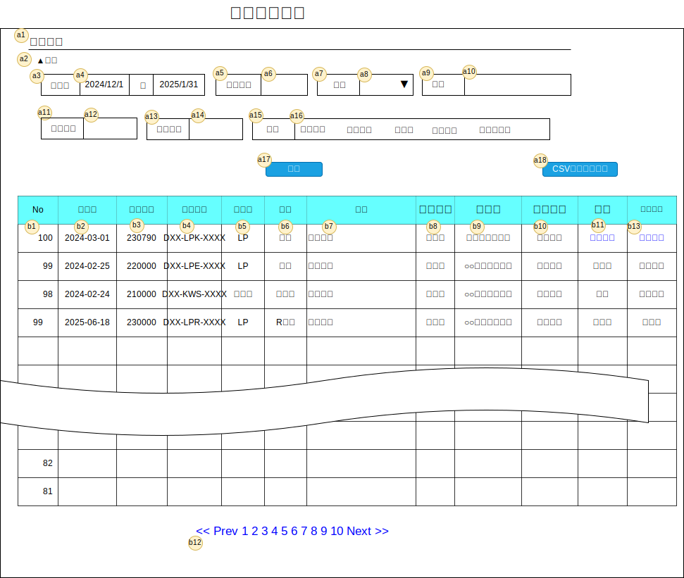

<table>
  <caption>案件一覧画面</caption>
  <thead>
    <tr>
      <th>No</th>
      <th>ラベル</th>
      <th>コントロール</th>
      <th>表示桁数</th>
      <th>文字揃え</th>
      <th>初期値</th>
      <th>説明</th>
    </tr>
  </thead>
  <tbody>
    <tr>
      <td>a1</td>
      <td>案件一覧</td>
      <td>text</td>
      <td>-</td>
      <td>左</td>
      <td>-</td>
      <td>画面のタイトルを表示</td>
    </tr>
    <tr>
      <td>a2</td>
      <td>▲検索</td>
      <td>text</td>
      <td>-</td>
      <td>左</td>
      <td>-</td>
      <td>クリックすると検索項目が隠れる。▼の時にクリックすると検索項目が表示される。</td>
    </tr>
    <tr>
      <td>a3</td>
      <td>作成日</td>
      <td>label</td>
      <td>-</td>
      <td>左</td>
      <td>-</td>
      <td>検索項目:作成日のラベル</td>
    </tr>
    <tr>
      <td>a4</td>
      <td>作成日入力フィールド</td>
      <td>calendar</td>
      <td>-</td>
      <td>-</td>
      <td>-</td>
      <td>検索条件の作成日の期間を入力するフィールド</td>
    </tr>
    <tr>
      <td>a5</td>
      <td>受付番号</td>
      <td>label</td>
      <td>-</td>
      <td>左</td>
      <td>-</td>
      <td>検索項目:受付番号のラベル</td>
    </tr>
    <tr>
      <td>a6</td>
      <td>受付番号入力フィールド</td>
      <td>textfield</td>
      <td>-</td>
      <td>-</td>
      <td>-</td>
      <td>受付番号を入力するテキストフィールド</td>
    </tr>
    <tr>
      <td>a7</td>
      <td>形状</td>
      <td>label</td>
      <td>-</td>
      <td>左</td>
      <td>-</td>
      <td>検索項目:形状のラベル</td>
    </tr>
    <tr>
      <td>a8</td>
      <td>形状入力フィールド</td>
      <td>dropdown</td>
      <td>-</td>
      <td>-</td>
      <td>-</td>
      <td>形状を選択するドロップダウンリスト</td>
    </tr>
    <tr>
      <td>a9</td>
      <td>件名</td>
      <td>label</td>
      <td>-</td>
      <td>左</td>
      <td>-</td>
      <td>検索項目:件名のラベル</td>
    </tr>
    <tr>
      <td>a10</td>
      <td>件名入力フィールド</td>
      <td>textfield</td>
      <td>-</td>
      <td>-</td>
      <td>-</td>
      <td>件名を入力するテキストフィールド</td>
    </tr>
    <tr>
      <td>a11</td>
      <td>設計番号</td>
      <td>label</td>
      <td>-</td>
      <td>左</td>
      <td>-</td>
      <td>検索項目:設計番号のラベル</td>
    </tr>
    <tr>
      <td>a12</td>
      <td>設計番号入力フィールド</td>
      <td>textfield</td>
      <td>-</td>
      <td>-</td>
      <td>-</td>
      <td>設計番号を入力するテキストフィールド</td>
    </tr>
    <tr>
      <td>a13</td>
      <td>作成者名</td>
      <td>label</td>
      <td>-</td>
      <td>左</td>
      <td>-</td>
      <td>検索項目:作成者名のラベル</td>
    </tr>
    <tr>
      <td>a14</td>
      <td>作成者名入力フィールド</td>
      <td>textfield</td>
      <td>-</td>
      <td>-</td>
      <td>-</td>
      <td>作成者名を入力するテキストフィールド</td>
    </tr>
    <tr>
      <td>a15</td>
      <td>権限</td>
      <td>label</td>
      <td>-</td>
      <td>左</td>
      <td>-</td>
      <td>検索項目:権限のラベル</td>
    </tr>
    <tr>
      <td>a16</td>
      <td>作成者の権限チェックボックス</td>
      <td></td>
      <td>-</td>
      <td>-</td>
      <td>-</td>
      <td>権限情報を選択する。選択肢は以下の通り。
        <ul>
          <li>管理者</li>
          <li>設計者</li>
          <li>営業</li>
          <li>ゲスト</li>
          <li>ビジター</li>
        <ul>
      </td>
    </tr>
    <tr>
      <td>a17</td>
      <td>検索</td>
      <td>button</td>
      <td>-</td>
      <td>中央</td>
      <td>-</td>
      <td>クリックで検索条件に一致した案件を表示する</td>
    </tr>
    <tr>
      <td>a18</td>
      <td>CSV出力</td>
      <td>button</td>
      <td>-</td>
      <td>中央</td>
      <td>-</td>
      <td>クリックで案件一覧画面の内容をCSV出力する。管理者権限のみ表示</td>
    </tr>
    <tr>
      <td>b1</td>
      <td>No</td>
      <td>number</td>
      <td>-</td>
      <td>右</td>
      <td>-</td>
      <td>行番号を表示</td>
    </tr>
    <tr>
      <td>b2</td>
      <td>作成日</td>
      <td>text</td>
      <td>10</td>
      <td>中央</td>
      <td>`properties.created_at`</td>
      <td>作成日を `yyyy-mm-dd`形式で表示する</td>
    </tr>
    <tr>
      <td>b3</td>
      <td>受付番号</td>
      <td>number</td>
      <td>-</td>
      <td>右</td>
      <td>`properties.reception_number`</td>
      <td>物件情報の受付番号を表示する</td>
    </tr>
    <tr>
      <td>b4</td>
      <td>設計番号</td>
      <td>number</td>
      <td>-</td>
      <td>右</td>
      <td>`properties.report_number`</td>
      <td>物件情報の設計番号を表示する</td>
    </tr>
    <tr>
      <td>b5</td>
      <td>商品名</td>
      <td>text</td>
      <td>-</td>
      <td>中央</td>
      <td>`designs.calc_type`</td>
      <td>商品名を表示する。LP/カゴ枠</td>
    </tr>
    <tr>
      <td>b6</td>
      <td>形状</td>
      <td>text</td>
      <td>-</td>
      <td>中央</td>
      <td>`designs.calc_type`</td>
      <td>設計の計算タイプを日本語で表示する。</td>
    </tr>
    <tr>
      <td>b7</td>
      <td>件名</td>
      <td>text</td>
      <td>-</td>
      <td>左</td>
      <td>`properties.name1`</td>
      <td>物件情報の物件名を表示する</td>
    </tr>
    <tr>
      <td>b8</td>
      <td>都道府県</td>
      <td>text</td>
      <td>-</td>
      <td>左</td>
      <td>`properties.prefecture`</td>
      <td>物件情報の都道府県を表示する</td>
    </tr>
    <tr>
      <td>b9</td>
      <td>需要家</td>
      <td>text</td>
      <td>-</td>
      <td>左</td>
      <td>`properties.customer`</td>
      <td>物件情報の需要家を表示する</td>
    </tr>
    <tr>
      <td>b10</td>
      <td>作成者名</td>
      <td>text</td>
      <td>-</td>
      <td>中央</td>
      <td>`designs.user`</td>
      <td>案件作成者を表示する</td>
    </tr>
    <tr>
      <td>b11</td>
      <td>権限</td>
      <td>text</td>
      <td>-</td>
      <td>左</td>
      <td>`users.role`</td>
      <td>作成者の権限(管理者,設計者,営業,ゲスト,ビジター)</td>
    </tr>
    <tr>
      <td>b12</td>
      <td>ページへのリンク</td>
      <td>link</td>
      <td>-</td>
      <td>-</td>
      <td>-</td>
      <td>20件以上データがあると、ページネーションのリンクを出力する。20件以下の場合は表示しない。</td>
    </tr>
    <tr>
      <td>b13</td>
      <td>計算状態</td>
      <td>link</td>
      <td>-</td>
      <td>-</td>
      <td>-</td>
      <td>設計計算の進捗を表示する 
      状態が「計算完了」のとき、クリックすると計算結果画面に遷移する。
      </td>
    </tr>
  </tbody>
</table>

#### 特記事項

- 作成日時の降順でソートして表示する
- CSV出力内容は検索によって絞り込んだ内容が出力される
- 計算状態「計算完了」のとき
    - 「計算完了」をクリックすると計算結果画面へ遷移する
    - その他の場所クリックすると基本情報入力画面に遷移する

#### CSV出力内容

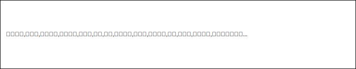{class=resizable width=70% }

<table>
  <thead>
    <tr>
      <th>データ名</th>
      <th>説明</th>
      <th>値</th>
    </tr>
  </thead>
  <tbody>
    <tr>
      <td>案件番号</td>
      <td>案件一覧画面のNo</td>
      <td>`properties.id`</td>
    </tr>
    <tr>
      <td>作成日</td>
      <td>案件が作成された日</td>
      <td>`properties.created_at`</td>
    </tr>
    <tr>
      <td>受付番号</td>
      <td>案件の受付番号</td>
      <td>`properties.reception_number`</td>
    </tr>
    <tr>
      <td>設計番号</td>
      <td>案件の受付番号</td>
      <td>`properties.report_number`</td>
    </tr>
    <tr>
      <td>商品名</td>
      <td>案件の製品名(LP,カゴ枠)</td>
      <td>-</td>
    </tr>
    <tr>
      <td>形状</td>
      <td>案件の形状</td>
      <td>`designs.calc_type`</td>
    </tr>
    <tr>
      <td>件名</td>
      <td>案件の件名</td>
      <td>`properties.name1`</td>
    </tr>
    <tr>
      <td>都道府県</td>
      <td>作成者の都道府県</td>
      <td>`employees.prefecture`</td>
    </tr>
    <tr>
      <td>向け先</td>
      <td>案件の向け先=需要家</td>
      <td>`properties.customer`</td>
    </tr>
    <tr>
      <td>作成者名</td>
      <td>作成者の氏名</td>
      <td>`users.name`</td>
    </tr>
    <tr>
      <td>権限</td>
      <td>作成者の権限(管理者,設計者,営業,ゲスト,ビジター)</td>
      <td>`users.role`</td>
    </tr>
    <tr>
      <td>会社名</td>
      <td>作成者の会社名</td>
      <td>`employees.company`</td>
    </tr>
    <tr>
      <td>電話番号</td>
      <td>作成者の電話番号</td>
      <td>`employees.phone`</td>
    </tr>
    <tr>
      <td>メールアドレス</td>
      <td>作成者のメールアドレス</td>
      <td>`users.email`</td>
    </tr>
  </tbody>
</table>

### ライナープレート編集画面

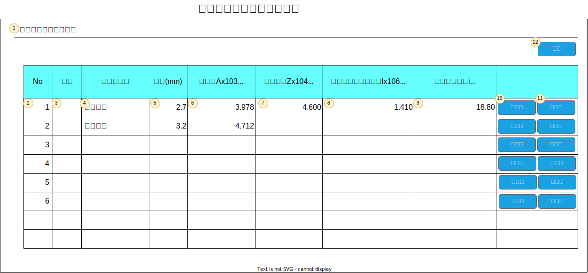{class=resizable width=60% }

<table>
  <caption>ライナープレート編集画面</caption>
  <thead>
    <tr>
      <th>No</th>
      <th>ラベル</th>
      <th>コントロール</th>
      <th>表示桁数</th>
      <th>文字揃え</th>
      <th>初期値</th>
      <th>説明</th>
    </tr>
  </thead>
  <tbody>
    <tr>
      <td>1</td>
      <td>ライナープレート一覧</td>
      <td>text</td>
      <td>-</td>
      <td>左</td>
      <td>-</td>
      <td>画面のタイトルを表示</td>
    </tr>
    <tr>
      <td>2</td>
      <td>No</td>
      <td>number</td>
      <td>-</td>
      <td>右</td>
      <td>-</td>
      <td>行番号を表示</td>
    </tr>
    <tr>
      <td>3</td>
      <td>権限</td>
      <td>dropdown</td>
      <td>-</td>
      <td>左</td>
      <td>`liner_plate_masters.target`</td>
      <td>全部/設計のみ を選択する</td>
    </tr>
    <tr>
      <td>4</td>
      <td>タイプ名称</td>
      <td>text</td>
      <td></td>
      <td>右</td>
      <td>`liner_plate_masters.name`</td>
      <td>ライナープレート名称を表示</td>
    </tr>
    <tr>
      <td>5</td>
      <td>板厚(mm)</td>
      <td>number</td>
      <td>00.000</td>
      <td>右</td>
      <td>`liner_plate_masters.thickness`</td>
      <td>板厚(t)</td>
    </tr>
    <tr>
      <td>6</td>
      <td>断面積Ax103(mm2)</td>
      <td>number</td>
      <td>00.000</td>
      <td>右</td>
      <td>`liner_plate_masters.cross_sectional_area`</td>
      <td>断面積(A)</td>
    </tr>
    <tr>
      <td>7</td>
      <td>断面係数Zx104(mm3)</td>
      <td>number</td>
      <td>00.000</td>
      <td>右</td>
      <td>`liner_plate_masters.section_modulus`</td>
      <td>断面係数(Z)</td>
    </tr>
    <tr>
      <td>8</td>
      <td>断面二次モーメントIx106(mm4)</td>
      <td>number</td>
      <td>00.000</td>
      <td>右</td>
      <td>`liner_plate_masters.second_moment_of_area`</td>
      <td>断面二次モーメント(I)</td>
    </tr>
    <tr>
      <td>9</td>
      <td>断面二次半径i(mm)</td>
      <td>number</td>
      <td>00.000</td>
      <td>右</td>
      <td>`liner_plate_masters.radius_of_gyration_i`</td>
      <td>断面二次半径(i)</td>
    </tr>
    <tr>
      <td>10</td>
      <td>行挿入</td>
      <td>button</td>
      <td>-</td>
      <td>中央</td>
      <td>-</td>
      <td>クリックした行の1行上に行を挿入する。登録を実行するまで行の追加は反映されない。</td>
    </tr>
    <tr>
      <td>11</td>
      <td>行削除</td>
      <td>button</td>
      <td>-</td>
      <td>中央</td>
      <td>-</td>
      <td>クリックした行を削除する。登録を実行するまで削除は反映されない。</td>
    </tr>
    <tr>
      <td>12</td>
      <td>登録</td>
      <td>button</td>
      <td>-</td>
      <td>-</td>
      <td>-</td>
      <td>表示されている内容で、データを更新する。更新後は他に画面に遷移せず、ライナープレート編集画面を表示する</td>
    </tr>
  </tbody>
</table>

### H形鋼編集画面

{class=resizable }

<table>
  <caption></caption>
  <thead>
    <tr>
      <th>No</th>
      <th>ラベル</th>
      <th>コントロール</th>
      <th>表示桁数</th>
      <th>文字揃え</th>
      <th>初期値</th>
      <th>説明</th>
    </tr>
  </thead>
  <tbody>
    <tr>
      <td>1</td>
      <td>H形鋼一覧</td>
      <td>text</td>
      <td>-</td>
      <td>左</td>
      <td>-</td>
      <td>画面のタイトルを表示</td>
    </tr>
    <tr>
      <td>2</td>
      <td>No</td>
      <td>number</td>
      <td>-</td>
      <td>右</td>
      <td>-</td>
      <td>行番号を表示</td>
    </tr>
    <tr>
      <td>3</td>
      <td>権限</td>
      <td>dropdown</td>
      <td>-</td>
      <td>左</td>
      <td>`liner_plate_masters.target`</td>
      <td>全部/設計のみ を選択</td>
    </tr>
    <tr>
      <td>3</td>
      <td>鋼材名</td>
      <td>text</td>
      <td>-</td>
      <td>左</td>
      <td>`h_beam_masters.name`</td>
      <td>鋼材名を表示</td>
    </tr>
    <tr>
      <td>4</td>
      <td>H</td>
      <td>number</td>
      <td>00.000</td>
      <td>右</td>
      <td>`h_beam_masters.height`</td>
      <td>高さ(H)</td>
    </tr>
    <tr>
      <td>5</td>
      <td>B</td>
      <td>number</td>
      <td>00.000</td>
      <td>右</td>
      <td>`h_beam_masters.width`</td>
      <td>幅(B)</td>
    </tr>
    <tr>
      <td>6</td>
      <td>t1</td>
      <td>number</td>
      <td>00.000</td>
      <td>右</td>
      <td>`h_beam_masters.web_thickness1`</td>
      <td>ウェブ厚さ(t1)</td>
    </tr>
    <tr>
      <td>7</td>
      <td>t2</td>
      <td>number</td>
      <td>00.000</td>
      <td>右</td>
      <td>`h_beam_masters.web_thickness`</td>
      <td>ウェブ厚さ(t2)</td>
    </tr>
    <tr>
      <td>8</td>
      <td>断面積Ax103(mm2)</td>
      <td>number</td>
      <td>00.000</td>
      <td>右</td>
      <td>`h_beam_masters.cross_sectional_area`</td>
      <td>断面積(A)</td>
    </tr>
    <tr>
      <td>9</td>
      <td>断面係数Zx104(mm3)</td>
      <td>number</td>
      <td>00.000</td>
      <td>右</td>
      <td>`h_beam_masters.section_modulus`</td>
      <td>断面係数(Z)</td>
    </tr>
    <tr>
      <td>10</td>
      <td>断面二次モーメントIx106(mm4)</td>
      <td>number</td>
      <td>00.000</td>
      <td>右</td>
      <td>`h_beam_masters.second_moment_of_area`</td>
      <td>断面二次モーメント(I)</td>
    </tr>
    <tr>
      <td>11</td>
      <td>断面二次半径-ix(mm)</td>
      <td>number</td>
      <td>00.000</td>
      <td>右</td>
      <td>`h_beam_masters.radius_of_gyration_ix`</td>
      <td>断面二次半径(ix)</td>
    </tr>
    <tr>
      <td>12</td>
      <td>断面二次半径-iy(mm)</td>
      <td>number</td>
      <td>00.000</td>
      <td>右</td>
      <td>`h_beam_masters.radius_of_gyration_iy`</td>
      <td>断面二次半径(iy)</td>
    </tr>
    <tr>
      <td>13</td>
      <td>継手板-幅(mm)</td>
      <td>number</td>
      <td>00.000</td>
      <td>右</td>
      <td>`h_beam_masters.splice_plate_width`</td>
      <td>継手板-幅</td>
    </tr>
    <tr>
      <td>14</td>
      <td>継手板-板厚(mm)</td>
      <td>number</td>
      <td>00.000</td>
      <td>右</td>
      <td>`h_beam_masters.splice_plate_thickness`</td>
      <td>継手板-板厚</td>
    </tr>
    <tr>
      <td>15</td>
      <td>継手板-ボルト孔径(mm)</td>
      <td>number</td>
      <td>00.000</td>
      <td>右</td>
      <td>`h_beam_masters.splice_plate_bolt_hole_diameter`</td>
      <td>継手板-ボルト孔径</td>
    </tr>
    <tr>
      <td>16</td>
      <td>継手板-長さ(mm)</td>
      <td>number</td>
      <td>00.000</td>
      <td>右</td>
      <td>`h_beam_masters.splice_plate_length`</td>
      <td>継手板-長さ</td>
    </tr>
    <tr>
      <td>17</td>
      <td>継手ボルト-1枚当たり(本数)</td>
      <td>number</td>
      <td>00.000</td>
      <td>右</td>
      <td>`h_beam_masters.splice_plate_bolt_quantity_per_sheet`</td>
      <td>継手板ボルト-1枚あたり本数</td>
    </tr>
    <tr>
      <td>18</td>
      <td>継手ボルト-有効断面積(mm2/本)</td>
      <td>number</td>
      <td>00.000</td>
      <td>右</td>
      <td>`h_beam_masters.splice_plate_bolt_effective_cross_sectional_area`</td>
      <td>継手板ボルト-有効断面積</td>
    </tr>
    <tr>
      <td>19</td>
      <td>継手ボルト-サイズ</td>
      <td>number</td>
      <td>00.000</td>
      <td>右</td>
      <td>`h_beam_masters.splice_plate_bolt_size`</td>
      <td>継手板ボルト-サイズ</td>
    </tr>
    <tr>
      <td>20</td>
      <td>継手ボルト-長さ(mm)</td>
      <td>number</td>
      <td>00.000</td>
      <td>右</td>
      <td>`h_beam_masters.splice_plate_bolt_length`</td>
      <td>継手板ボルト-長さ</td>
    </tr>
    <tr>
      <td>21</td>
      <td>行挿入</td>
      <td>button</td>
      <td>-</td>
      <td>中央</td>
      <td>-</td>
      <td>クリックした行の1行上に行を挿入する。登録を実行するまで行の追加は反映されない。</td>
    </tr>
    <tr>
      <td>22</td>
      <td>行削除</td>
      <td>button</td>
      <td>-</td>
      <td>中央</td>
      <td>-</td>
      <td>クリックした行を削除する。登録を実行するまで削除は反映されない。</td>
    </tr>
    <tr>
      <td>23</td>
      <td>登録</td>
      <td>button</td>
      <td>-</td>
      <td>-</td>
      <td>-</td>
      <td>表示されている内容で、データを更新する。更新後は他に画面に遷移せず、H形鋼材編集画面を表示する</td>
    </tr>
  </tbody>
</table>

### SDB案件検索画面

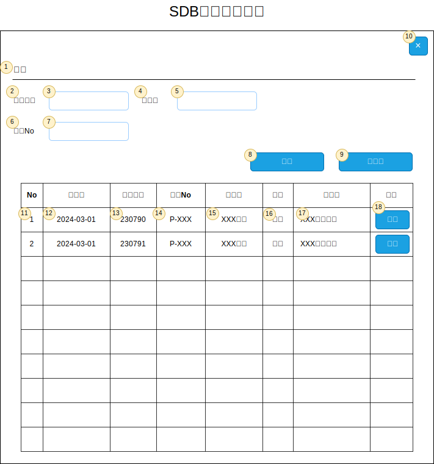

<table>
  <caption>SDB案件検索画面</caption>
  <thead>
    <tr>
      <th>No</th>
      <th>ラベル</th>
      <th>コントロール</th>
      <th>表示桁数</th>
      <th>文字揃え</th>
      <th>初期値</th>
      <th>説明</th>
    </tr>
  </thead>
  <tbody>
    <tr>
      <td>1</td>
      <td>検索</td>
      <td>text</td>
      <td>-</td>
      <td>左</td>
      <td>-</td>
      <td>画面のタイトルを表示</td>
    </tr>
    <tr>
      <td>2</td>
      <td>発信番号</td>
      <td>label</td>
      <td>-</td>
      <td>左</td>
      <td>-</td>
      <td>検索項目:発信番号のラベルを表示</td>
    </tr>
    <tr>
      <td>3</td>
      <td>発信番号検索条件</td>
      <td>textfield</td>
      <td>-</td>
      <td>-</td>
      <td>-</td>
      <td>検索項目:発信番号の入力フィールド</td>
    </tr>
    <tr>
      <td>4</td>
      <td>工事名</td>
      <td>label</td>
      <td>-</td>
      <td>左</td>
      <td>-</td>
      <td>検索項目:工事名のラベルを表示</td>
    </tr>
    <tr>
      <td>5</td>
      <td>工事名検索条件</td>
      <td>textfield</td>
      <td>-</td>
      <td>-</td>
      <td>-</td>
      <td>検索項目:工事名の入力フィールド</td>
    </tr>
    <tr>
      <td>6</td>
      <td>物件No</td>
      <td>label</td>
      <td>-</td>
      <td>左</td>
      <td>-</td>
      <td>検索項目:物件Noのラベルを表示</td>
    </tr>
    <tr>
      <td>7</td>
      <td>物件No検索条件</td>
      <td>textfield</td>
      <td>-</td>
      <td>-</td>
      <td>-</td>
      <td>検索項目:物件Noの入力フィールド</td>
    </tr>
    <tr>
      <td>8</td>
      <td>検索</td>
      <td></td>
      <td>-</td>
      <td>-</td>
      <td>-</td>
      <td>入力された検索条件でSDBに対して検索を実行し、検索結果を表示する</td>
    </tr>
    <tr>
      <td>9</td>
      <td>クリア</td>
      <td>button</td>
      <td>-</td>
      <td>-</td>
      <td>-</td>
      <td>各検索条件の入力フィールドの値をクリアする</td>
    </tr>
    <tr>
      <td>10</td>
      <td>No</td>
      <td>text</td>
      <td>-</td>
      <td>右</td>
      <td>-</td>
      <td>行数を表示する</td>
    </tr>
    <tr>
      <td>10</td>
      <td>✖️ボタン</td>
      <td>button</td>
      <td>-</td>
      <td>-</td>
      <td>-</td>
      <td>SDB案件検索画面を閉じる</td>
    </tr>
    <tr>
      <td>11</td>
      <td>No</td>
      <td>text</td>
      <td>-</td>
      <td>右</td>
      <td>-</td>
      <td>行数を表示する</td>
    </tr>
    <tr>
      <td>12</td>
      <td>作成日</td>
      <td>text</td>
      <td>yyyy-mm-dd</td>
      <td>左</td>
      <td>-</td>
      <td>検索結果の作成日を表示する</td>
    </tr>
    <tr>
      <td>13</td>
      <td>発信番号</td>
      <td>number</td>
      <td>-</td>
      <td>右</td>
      <td>-</td>
      <td>検索結果の発信番号を表示する</td>
    </tr>
    <tr>
      <td>14</td>
      <td>物件No</td>
      <td>text</td>
      <td>-</td>
      <td>左</td>
      <td>-</td>
      <td>検索結果の物件Noを表示する</td>
    </tr>
    <tr>
      <td>15</td>
      <td>工事名</td>
      <td>text</td>
      <td>-</td>
      <td>左</td>
      <td>-</td>
      <td>検索結果の工事名を表示する</td>
    </tr>
    <tr>
      <td>16</td>
      <td>形状</td>
      <td>text</td>
      <td>-</td>
      <td>左</td>
      <td>-</td>
      <td>検索結果の形状を表示する</td>
    </tr>
    <tr>
      <td>17</td>
      <td>需要家</td>
      <td>text</td>
      <td>-</td>
      <td>左</td>
      <td>-</td>
      <td>検索結果の需要家を表示する。</td>
    </tr>
    <tr>
      <td>18</td>
      <td>選択</td>
      <td>link</td>
      <td>-</td>
      <td></td>
      <td>-</td>
      <td>選択した検索結果の内容を反映した状態で、基本情報入力画面を開く</td>
    </tr>
  </tbody>
</table>

### カゴ枠情報入力画面

{class=resizable height=560px}

<table>
  <caption></caption>
  <thead>
    <tr>
      <th>No</th>
      <th>ラベル</th>
      <th>コントロール</th>
      <th>表示桁数</th>
      <th>文字揃え</th>
      <th>初期値</th>
      <th>説明</th>
    </tr>
  </thead>
  <tbody>
    <tr>
      <td>1</td>
      <td>カゴ枠</td>
      <td>text</td>
      <td>-</td>
      <td>左</td>
      <td>-</td>
      <td>画面のタイトルを表示</td>
    </tr>
    <tr>
      <td>a6</td>
      <td>施主(需要家)</td>
      <td>text</td>
      <td>-</td>
      <td>左</td>
      <td>-</td>
      <td>施主(需要家)</td>
    </tr>
    <tr>
      <td>a7</td>
      <td>施主(需要家) 入力フィールド</td>
      <td>textfield</td>
      <td>-</td>
      <td>左</td>
      <td>`properties.customer`</td>
      <td>最大50文字。`properties.customer`へ保存</td>
    </tr>
    <tr>
      <td>2</td>
      <td>設計条件</td>
      <td>text</td>
      <td>-</td>
      <td>左</td>
      <td>-</td>
      <td>入力項目:土圧計算式のラベルを表示</td>
    </tr>
    <tr>
      <td>3</td>
      <td>土圧計算式</td>
      <td>label</td>
      <td>-</td>
      <td>左</td>
      <td>-</td>
      <td></td>
    </tr>
    <tr>
      <td>4</td>
      <td>土圧計算式ドロップダウン</td>
      <td>dropdown</td>
      <td>-</td>
      <td>左</td>
      <td>新規:選択してください。 
      編集時: `reinforcement_cage_inputs.earth_pressure_calc_formula`</td>
      <td>以下の選択肢から1つを選択選択
        <ul>
          <li>選択してください</li>
          <li>クーロン土圧</li>
          <li>試行くさび法</li>
        </ul>
      </td>
    </tr>
    <tr>
      <td>5</td>
      <td>カゴ枠形式</td>
      <td>label</td>
      <td>-</td>
      <td>左</td>
      <td>-</td>
      <td></td>
    </tr>
    <tr>
      <td>6</td>
      <td>カゴ枠形式ドロップダウン</td>
      <td>dropdown</td>
      <td>-</td>
      <td>左</td>
      <td>新規:選択してください。 
      編集時: `reinforcement_cage_inputs.frame_type`</td>
      <td>以下の選択肢から1つを選択選択
        <ul class="horizontal">
          <li>選択してください</li>
          <li>K08</li>
          <li>K10</li>
          <li>K12</li>
          <li>K200</li>
          <li>K2500</li>
          <li>K3000</li>
        </ul>
      </td>
    </tr>
    <tr>
      <td>7</td>
      <td>擁壁幅 B</td>
      <td>label</td>
      <td>-</td>
      <td>左</td>
      <td>-</td>
      <td></td>
    </tr>
    <tr>
      <td>8</td>
      <td>擁壁幅 B 表示</td>
      <td>number</td>
      <td>-</td>
      <td>右</td>
      <td>-</td>
      <td>表示のみ
        かご枠形式の選択に応じて以下の値を表示する。
        <ul class="horizontal">
          <li>K08：0.80m</li>
          <li>K10：1.00m</li>
          <li>K12：1.20m</li>
          <li>K2000：2.00m</li>
          <li>K2500：2.50m</li>
          <li>K3000：3.00m</li>
        </ul>
      </td>
    </tr>
    <tr>
      <td>9</td>
      <td>擁壁幅 H</td>
      <td>label</td>
      <td>-</td>
      <td>左</td>
      <td>-</td>
      <td></td>
    </tr>
    <tr>
      <td>10</td>
      <td>擁壁幅 H ドロップダウン</td>
      <td>dropdown</td>
      <td>-</td>
      <td>右</td>
      <td>5.0</td>
      <td>
        以下の選択肢から一つを選択
        <ul class="horizontal">
          <li>1.0</li>
          <li>1.5</li>
          <li>2.0</li>
          <li>2.5</li>
          <li>3.0</li>
          <li>3.5</li>
          <li>4.0</li>
          <li>4.5</li>
          <li>5.0</li>
          <li>5.5</li>
          <li>6.0</li>
          <li>6.5</li>
          <li>7.0</li>
          <li>7.5</li>
          <li>8.0</li>
        </ul>
      </td>
    </tr>
    <tr>
      <td>11</td>
      <td>擁壁勾配 1:N</td>
      <td>label</td>
      <td>-</td>
      <td>左</td>
      <td>-</td>
      <td></td>
    </tr>
    <tr>
      <td>12</td>
      <td>擁壁勾配 1:N ドロップダウン</td>
      <td>dropdown</td>
      <td>-</td>
      <td>右</td>
      <td>0.3</td>
      <td>
        以下の選択肢から一つを選択
        <dl>
        <dt>カゴ枠形式がK08</dt>
        <dd>
          <ul class="horizontal">
            <li>0.3</li>
            <li>0.4</li>
            <li>0.5</li>
            <li>0.6</li>
            <li>0.7</li>
            <li>0.8</li>
          </ul>
        </dd>
        <dt>カゴ枠形式がK08以外</dt>
        <dd>
          <ul class="horizontal">
            <li>0.3</li>
            <li>0.4</li>
            <li>0.5</li>
            <li>0.6</li>
            <li>0.7</li>
            <li>0.8</li>
            <li>0.9</li>
            <li>1.0</li>
          </ul>
        </dd>
      </td>
    </tr>
    <tr>
      <td>13</td>
      <td>背面盛土勾配</td>
      <td>label</td>
      <td>-</td>
      <td>左</td>
      <td>-</td>
      <td></td>
    </tr>
    <tr>
      <td>14</td>
      <td>背面盛土勾配の入力形式選択</td>
      <td>dropdown</td>
      <td>-</td>
      <td>右</td>
      <td>1:No</td>
      <td>
        以下の選択肢から一つを選択
        <ul>
          <li>1:No</li>
          <li>角度(β)</li>
          <li>％(I)</li>
        </ul>
      </td>
    </tr>
    <tr>
      <td>15</td>
      <td>背面盛土勾配の入力形式</td>
      <td>label</td>
      <td>-</td>
      <td>左</td>
      <td>-</td>
      <td></td>
    </tr>
    <tr>
      <td>16</td>
      <td>背面盛土勾配の値</td>
      <td>number</td>
      <td>-</td>
      <td>右</td>
      <td>0.00</td>
      <td>0.0 から 99.99 までの数値 
          土圧式が試行くさびのときは、Noだけ</td>
    </tr>
    <tr>
      <td>17</td>
      <td>試行くさび法の設定</td>
      <td>label</td>
      <td>-</td>
      <td>左</td>
      <td>-</td>
      <td></td>
    </tr>
    <tr>
      <td>18</td>
      <td>背面盛土高 Ho</td>
      <td>label</td>
      <td>-</td>
      <td>左</td>
      <td>-</td>
      <td></td>
    </tr>
    <tr>
      <td>19</td>
      <td>背面盛土高 Ho 入力フィールド</td>
      <td>number</td>
      <td>-</td>
      <td>右</td>
      <td>0.00 or `reinforcement_cage_inputs.backfill_height`</td>
      <td>0.0 から 99.99 までの数値。クーロン土圧の場合はdisable。</td>
    </tr>
    <tr>
      <td>20</td>
      <td>天端の土被り or 平場 b</td>
      <td>label</td>
      <td>-</td>
      <td>左</td>
      <td>-</td>
      <td></td>
    </tr>
    <tr>
      <td>21</td>
      <td>天端の土被り or 平場 b 入力フィールド</td>
      <td>number</td>
      <td>-</td>
      <td>右</td>
      <td>0.00 or `reinforcement_cage_inputs.soil_cover`</td>
      <td>0.0 から 99.99 までの数値。クーロン土圧の場合はdisable。

      </td>
    </tr>
    <tr>
      <td>22</td>
      <td>上載荷重 Q</td>
      <td>label</td>
      <td>-</td>
      <td>左</td>
      <td>-</td>
      <td></td>
    </tr>
    <tr>
      <td>23</td>
      <td>上載荷重 Q 入力フィールド</td>
      <td>number</td>
      <td>-</td>
      <td>右</td>
      <td>10.00 or `reinforcement_cage_inputs.overburden`</td>
      <td>0.0 から 99.99 までの数値。クーロン土圧の場合はdisable。

    </tr>
    <tr>
      <td>24</td>
      <td>計算方式の絵</td>
      <td>image</td>
      <td>-</td>
      <td>-</td>
      <td>土圧計算式の選択に対応する絵</td>
      <td>
        土圧計算式の選択によって表示する絵を切り替える
        <dl>
          <dt>選択してください</dt>
          <dd>表示なし</dd>
          <dt>クーロン土圧</dt>
          <dd>クーロン土圧の絵</dd>
          <dt>試行くさび法</dt>
          <dd>試行くさび法の絵</dd>
      </td>
    </tr>
    <tr>
      <td>25</td>
      <td>中詰材の種類</td>
      <td>label</td>
      <td>-</td>
      <td>左</td>
      <td>-</td>
      <td></td>
    </tr>
    <tr>
      <td>26</td>
      <td>中詰材の種類ドロップダウン</td>
      <td>dropdown</td>
      <td>-</td>
      <td>左</td>
      <td>土砂詰め or `reinforcement_cage_inputs.infill_material`</td>
      <td>
        <ul>
        <li>カゴ枠形式が[K8]、[K10]、[K12]の場合</li>
        <ul>
          <li>土砂詰め</li>
          <li>石詰め</li>
        </ul>
        <li>カゴ枠形式が[K2000]、[K2500]、[K3000]の場合</li>
        <ul>
          <li>石詰め</li>
        </ul>
        </ul>
      </td>
    </tr>
    <tr>
      <td>27</td>
      <td>中詰材の単位体積重量 γk</td>
      <td>label</td>
      <td>-</td>
      <td>左</td>
      <td>-</td>
      <td></td>
    </tr>
    <tr>
      <td>28</td>
      <td>中詰材の単位体積重量 γk入力フィールド</td>
      <td>number</td>
      <td>00.00</td>
      <td>右</td>
      <td>18.00 or `reinforcement_cage_inputs.infill_material_unit_weight`</td>
      <td>0.00 から 18.00 までの数値</td>
    </tr>
    <tr>
      <td>29</td>
      <td>背面土のせん断抵抗角 Φ</td>
      <td>label</td>
      <td>-</td>
      <td>左</td>
      <td>-</td>
      <td></td>
    </tr>
    <tr>
      <td>30</td>
      <td>背面土のせん断抵抗角 Φ入力フィールド</td>
      <td>number</td>
      <td>00.00</td>
      <td>右</td>
      <td>30.00 or `reinforcement_cage_inputs.backfill_soil_angle_of_shear_resistance`</td>
      <td>0.00 から 35.00 までの数値</td>
    </tr>
    <tr>
      <td>31</td>
      <td>背面土の単位体積重量 γ</td>
      <td>label</td>
      <td>-</td>
      <td>左</td>
      <td>-</td>
      <td></td>
    </tr>
    <tr>
      <td>32</td>
      <td>背面土の単位体積重量 γ入力フィールド</td>
      <td>number</td>
      <td>-</td>
      <td>右</td>
      <td>19.00 or `reinforcement_cage_inputs.backfill_soil_unit_weight`</td>
      <td>0.0 から 45.00 までの数値</td>
    </tr>
    <tr>
      <td>33</td>
      <td>底面のすべり摩擦係数 f</td>
      <td>label</td>
      <td>-</td>
      <td>左</td>
      <td>-</td>
      <td></td>
    </tr>
    <tr>
      <td>34</td>
      <td>底面のすべり摩擦係数 f入力フィールド</td>
      <td>number</td>
      <td>0.0</td>
      <td>右</td>
      <td>0.6 or `reinforcement_cage_inputs.base_sliding_friction_coefficient`</td>
      <td>0.0 から 0.6 までの数値</td>
    </tr>
    <tr>
      <td>35</td>
      <td>許容地盤支持力 qa</td>
      <td>label</td>
      <td>-</td>
      <td>左</td>
      <td>-</td>
      <td></td>
    </tr>
    <tr>
      <td>36</td>
      <td></td>
      <td>number</td>
      <td>000</td>
      <td>右</td>
      <td>300 or `reinforcement_cage_inputs.allowable_soil_bearing_capacity`</td>
      <td>0 から 9999 までの数値

      </td>
    </tr>
    <tr>
      <td>37</td>
      <td>戻る</td>
      <td>link</td>
      <td>-</td>
      <td>-</td>
      <td>-</td>
      <td>入力内容を破棄し、遷移元の画面に遷移する。
        <dl>
          <dt>遷移元が形式選択画面の時</dt>
          <dd>形式選択画面へ遷移</dd>
          <dt>案件一覧画面の時</dt>
          <dd>案件一覧画面へ遷移</dd>
        </dl>
      </td>
    </tr>
    <tr>
      <td>38</td>
      <td>次へ</td>
      <td>button</td>
      <td>-</td>
      <td>-</td>
      <td>-</td>
      <td>入力情報を`reinforcement_cage_inputs`へ保存し、カゴ枠計算結果画面へ遷移する</td>
    </tr>
    <tr>
      <td>39</td>
      <td>SDB連携</td>
      <td>link</td>
      <td>-</td>
      <td>-</td>
      <td>-</td>
      <td>形式:カゴ枠の情報と共にSDB検索画面をダイアログとして表示する</td>
    </tr>
  </tbody>
</table>

#### クーロン土圧が選択されたときの絵

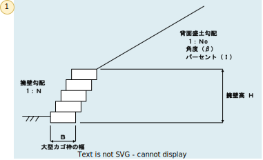

土圧計算式の選択肢で、クーロン土圧を選択した場合に表示する。

#### 試行くさび法が選択されたときの絵

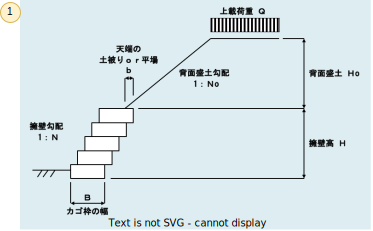

土圧計算式の選択肢で、試行くさび法を選択した場合に表示する。

### 基本情報入力画面

#### 基本情報入力画面-共通

{class=resizable height=560px}

<table>
  <caption>基本情報入力画面-共通</caption>
  <thead>
    <tr>
      <th>No</th>
      <th>ラベル</th>
      <th>コントロール</th>
      <th>表示桁数</th>
      <th>文字揃え</th>
      <th>初期値</th>
      <th>説明</th>
    </tr>
  </thead>
  <tbody>
    <tr>
      <td>1</td>
      <td>画面タイトル</td>
      <td>text</td>
      <td>-</td>
      <td>左</td>
      <td>-</td>
      <td>画面のタイトルを表示</td>
    </tr>
    <tr>
      <td>2</td>
      <td>SDB連携ボタン</td>
      <td>button</td>
      <td>-</td>
      <td>-</td>
      <td>-</td>
      <td>技術SDB検索画面をダイアログとして開く</td>
    </tr>
    <tr>
      <td>3</td>
      <td>戻る</td>
      <td>link</td>
      <td>-</td>
      <td>-</td>
      <td>-</td>
      <td></td>
    </tr>
    <tr>
      <td>4</td>
      <td>次へ</td>
      <td>text</td>
      <td>-</td>
      <td>-</td>
      <td>-</td>
      <td>入力内容を`liner_plate_inputs`、`properties`、`deisigns`に保存する。`designs.is_done`はfalseに設定する。外枠・支保工設定画面へ遷移する</td>
    </tr>
    <tr>
      <td>a1</td>
      <td>物件情報</td>
      <td>text</td>
      <td>-</td>
      <td>左</td>
      <td>-</td>
      <td></td>
    </tr>
    <tr>
      <td>a2</td>
      <td>件名</td>
      <td>text</td>
      <td>-</td>
      <td>左</td>
      <td>-</td>
      <td></td>
    </tr>
    <tr>
      <td>a3</td>
      <td>件名入力フィールド</td>
      <td>textfield</td>
      <td>-</td>
      <td>左</td>
      <td>`properties.name1`</td>
      <td>最大50文字。</td>
    </tr>
    <tr>
      <td>a4</td>
      <td>都道府県</td>
      <td>text</td>
      <td>-</td>
      <td>左</td>
      <td>-</td>
      <td></td>
    </tr>
    <tr>
      <td>a5</td>
      <td>都道府県ドロップダウン</td>
      <td>dropdown</td>
      <td>-</td>
      <td>左</td>
      <td>`properties.prefecture`</td>
      <td>`properties.prefecture`へ保存</td>
    </tr>
    <tr>
      <td>a6</td>
      <td>発注者</td>
      <td>text</td>
      <td>-</td>
      <td>左</td>
      <td>-</td>
      <td></td>
    </tr>
    <tr>
      <td>a7</td>
      <td>発注者入力フィールド</td>
      <td>textfield</td>
      <td>-</td>
      <td>左</td>
      <td>`properties.orderer`</td>
      <td>最大50文字。`properties.orderer`へ保存</td>
    </tr>
    <tr>
      <td>a8</td>
      <td>発注時期</td>
      <td>text</td>
      <td>-</td>
      <td>左</td>
      <td>-</td>
      <td></td>
    </tr>
    <tr>
      <td>a9</td>
      <td>発注時期入力フィールド</td>
      <td>textfield</td>
      <td>-</td>
      <td>左</td>
      <td>`properites.order_schedule`</td>
      <td>最大50文字。</td>
    </tr>
    <tr>
      <td>a10</td>
      <td>施工期間</td>
      <td>text</td>
      <td>-</td>
      <td>左</td>
      <td>-</td>
      <td></td>
    </tr>
    <tr>
      <td>a11</td>
      <td>施工期間入力フィールド</td>
      <td>textfield</td>
      <td>-</td>
      <td>左</td>
      <td>`properties.construction_period`</td>
      <td>最大50文字。`properties.construction_period`へ保存</td>
    </tr>
    <tr>
      <td>a12</td>
      <td>需要家</td>
      <td>text</td>
      <td>-</td>
      <td>左</td>
      <td>-</td>
      <td></td>
    </tr>
    <tr>
      <td>a13</td>
      <td>需要家入力フィールド</td>
      <td>textfield</td>
      <td>-</td>
      <td>左</td>
      <td>`properties.customer`</td>
      <td>最大50文字。`properties.customer`へ保存</td>
    </tr>
    <tr>
      <td>b1</td>
      <td>設計条件</td>
      <td>text</td>
      <td>-</td>
      <td>左</td>
      <td></td>
      <td>サブタイトル</td>
    </tr>
    <tr>
      <td>b2</td>
      <td>形式ごとの設計条件</td>
      <td>-</td>
      <td>-</td>
      <td>左</td>
      <td>-</td>
      <td></td>
    </tr>
    <tr>
      <td>b3</td>
      <td>上載荷重 W</td>
      <td>label</td>
      <td>-</td>
      <td>左</td>
      <td>-</td>
      <td></td>
    </tr>
    <tr>
      <td>b3</td>
      <td>上載荷重 W</td>
      <td>label</td>
      <td>-</td>
      <td>左</td>
      <td>`liner_plate_inptuts.overburden`</td>
      <td>`liner_plate_inptuts.overburden`へ保存する</td>
    </tr>
    <tr>
      <td>b4</td>
      <td>地下水位を考慮する</td>
      <td>checkbox</td>
      <td>-</td>
      <td>左</td>
      <td>`liner_plate_inptuts.has_groundwater_level`</td>
      <td>`liner_plate_inptuts.has_groundwater_level`へ保存する</td>
    </tr>
    <tr>
      <td>b5</td>
      <td>地下水位の深度 Hw</td>
      <td>checkbox</td>
      <td>-</td>
      <td>左</td>
      <td>-</td>
      <td></td>
    </tr>
    <tr>
      <td>b6</td>
      <td>地下水位の深度 Hw 入力フィールド</td>
      <td>textfield</td>
      <td>-</td>
      <td>右</td>
      <td>`liner_plate_inptuts.groundwater_level`</td>
      <td>`liner_plate_inptuts.groundwater_level`へ保存する</td>
    </tr>
    <tr>
      <td>b7</td>
      <td>水の単位堆積重量 yw</td>
      <td>label</td>
      <td>-</td>
      <td>左</td>
      <td>-</td>
      <td></td>
    </tr>
    <tr>
      <td>b8</td>
      <td>水の単位堆積重量 yw 入力フィールド</td>
      <td>textfield</td>
      <td>-</td>
      <td>右</td>
      <td>`liner_plate_inptuts.water_unit_weight`</td>
      <td>`liner_plate_inptuts.water_unit_weight`へ保存する</td>
    </tr>
    <tr>
      <td>c1</td>
      <td>許容応力度</td>
      <td>text</td>
      <td>-</td>
      <td>左</td>
      <td></td>
      <td>サブタイトル</td>
    </tr>
    <tr>
      <td>c2</td>
      <td>ライナープレート oca</td>
      <td>label</td>
      <td>-</td>
      <td>左</td>
      <td>-</td>
      <td></td>
    </tr>
    <tr>
      <td>c3</td>
      <td>ライナープレート oca 入力フィールド</td>
      <td>textfield</td>
      <td>-</td>
      <td>右</td>
      <td>`liner_plate_inptuts.lp_allowable_stress`</td>
      <td>`liner_plate_inptuts.lp_allowable_stress`へ保存する</td>
    </tr>
    <tr>
      <td>c4</td>
      <td>補強リング osa</td>
      <td>label</td>
      <td>-</td>
      <td>左</td>
      <td>-</td>
      <td></td>
    </tr>
    <tr>
      <td>c5</td>
      <td>補強リング osa 入力フィールド</td>
      <td>textfield</td>
      <td>-</td>
      <td>右</td>
      <td>`liner_plate_inptuts.h_beam_allowable_stress`</td>
      <td>`liner_plate_inptuts.h_beam_allowable_stress`へ保存する</td>
    </tr>
    <tr>
      <td>c6</td>
      <td>継手ボルト  τa</td>
      <td>label</td>
      <td>-</td>
      <td>左</td>
      <td>-</td>
      <td></td>
    </tr>
    <tr>
      <td>c7</td>
      <td>継手ボルト  τa 入力フィールド</td>
      <td>textfield</td>
      <td>-</td>
      <td>右</td>
      <td>`liner_plate_inptuts.joint_bolt_allowable_stress`</td>
      <td>矩形のみ入力可。`liner_plate_inptuts.joint_bolt_allowable_stress`へ保存する</td>
    </tr>
    <tr>
      <td>c8</td>
      <td>H250, H300, H350の継手板</td>
      <td>label</td>
      <td>-</td>
      <td>左</td>
      <td>-</td>
      <td></td>
    </tr>
    <tr>
      <td>c9</td>
      <td>継手板  σsa</td>
      <td>label</td>
      <td>-</td>
      <td>左</td>
      <td>-</td>
      <td></td>
    </tr>
    <tr>
      <td>c10</td>
      <td>継手板  σsa 入力フィールド</td>
      <td>textfield</td>
      <td>-</td>
      <td>右</td>
      <td>`liner_plate_inptuts.splice_plate_SM490_allowable_stress`</td>
      <td>矩形のみ入力可。</td>
    </tr>
    <tr>
      <td>c11</td>
      <td>継手ボルト  τa</td>
      <td>label</td>
      <td>-</td>
      <td>左</td>
      <td>-</td>
      <td></td>
    </tr>
    <tr>
      <td>c12</td>
      <td>継手ボルト  τa 入力フィールド</td>
      <td>textfield</td>
      <td>-</td>
      <td>右</td>
      <td>`liner_plate_inptuts.joint_bolt_10_9_allowable_stress`</td>
      <td>矩形のみ入力可。</td>
    </tr>
    <tr>
      <td>c13</td>
      <td>許容座屈荷重の安全率 f</td>
      <td>label</td>
      <td>-</td>
      <td>左</td>
      <td>-</td>
      <td></td>
    </tr>
    <tr>
      <td>c14</td>
      <td>許容座屈荷重の安全率 f 入力フィールド</td>
      <td>dropdown or number</td>
      <td>-</td>
      <td>右</td>
      <td>`liner_plate_inptuts.bucklink_load_sf`</td>
      <td>集水井のみ入力可。 
        以下の選択肢から選択
        <ul>
          <li>1.5</li>
          <li>2.0</li>
          <li>手動で入力</li>
        </ul>
        手動で入力を選択した場合は、dropdownからnumberフィールドへ変更する。
        1.0 - 3.0 の間で入力可。
      </td>
    </tr>
    <tr>
      <td>d1</td>
      <td>土質条件</td>
      <td>text</td>
      <td>-</td>
      <td>左</td>
      <td></td>
      <td>サブタイトル</td>
    </tr>
    <tr>
      <td>e1</td>
      <td>地すべり土圧</td>
      <td>text</td>
      <td>-</td>
      <td>左</td>
      <td></td>
      <td>サブタイトル</td>
    </tr>
    <tr>
      <td>f1</td>
      <td>土層設定</td>
      <td>text</td>
      <td>-</td>
      <td>左</td>
      <td></td>
      <td>サブタイトル</td>
    </tr>
  </tbody>
</table>

#### 基本情報入力画面(円形)

{class=resizable height=480}

<table>
  <caption>基本情報入力画面(円形)</caption>
  <thead>
    <tr>
      <th>No</th>
      <th>ラベル</th>
      <th>コントロール</th>
      <th>表示桁数</th>
      <th>文字揃え</th>
      <th>初期値</th>
      <th>説明</th>
    </tr>
  </thead>
  <tbody>
    <tr>
      <td>1</td>
      <td>円形立坑</td>
      <td>text</td>
      <td>-</td>
      <td>-</td>
      <td>-</td>
      <td>画面のタイトル</td>
    </tr>
    <tr>
      <td>b2</td>
      <td>円形の設計条件</td>
      <td>image</td>
      <td>-</td>
      <td>-</td>
      <td>-</td>
      <td>円形の設計条件の画像を表示</td>
    </tr>
    <tr>
      <td>b9</td>
      <td>立坑直径 D</td>
      <td>label</td>
      <td>-</td>
      <td>左</td>
      <td>-</td>
      <td>入力項目のラベル</td>
    </tr>
    <tr>
      <td>b10</td>
      <td>立坑直径 D 入力フィールド</td>
      <td>textfield</td>
      <td>00.000</td>
      <td>右</td>
      <td>0.000 or `liner_plate_inputs.diameter`</td>
      <td>`liner_plate_inputs.diameter`へ保存
        <dl>
          <dt>権限：営業・社外</dt>
          <dd>1.2 から 10.0 まで かつ 0.1ピッチ<dd>
          <dt>権限：設計</dt>
          <dd>1.0 から 99.999 まで<dd>
        </dl>
      </td>
    </tr>
    <tr>
      <td>b11</td>
      <td>LP上面の深さ Ht</td>
      <td>dropdown</td>
      <td>-</td>
      <td>左</td>
      <td>-</td>
      <td>LP上面の深さ/LP突き出し高さ　のいずれかを選択。LP突出し高さを設定した場合、マイナスで保存</td>
    </tr>
    <tr>
      <td>b12</td>
      <td>LP上面の深さ Ht 入力フィールド</td>
      <td>textfied</td>
      <td>00.000</td>
      <td>右</td>
      <td>0.000 or `liner_plate_inputs.top_surface_depth`</td>
      <td>`liner_plate_inputs.top_surface_depth`へ保存
        <dl>
          <dt>権限：営業・社外<dt>
          <dd>0.0から5.0 まで</dd>
          <dt>権限：設計</dt>
          <dd>0.000 から 99.999 まで</dd>
        </dl>
      </td>
    </tr>
    <tr>
      <td>b13</td>
      <td>LP深さ H</td>
      <td>label</td>
      <td>-</td>
      <td>左</td>
      <td>-</td>
      <td></td>
    </tr>
    <tr>
      <td>b14</td>
      <td>LP深さ H 入力フィールド</td>
      <td>textfied</td>
      <td>00.000</td>
      <td>右</td>
      <td>0.000 or `liner_plate_inputs.depth`</td>
      <td>`liner_plate_inputs.depth`へ保存
        <dl>
          <dt>権限：営業・社外<dt>
          <dd>1.0.から99.999まで、かつ0.5の倍数</dd>
          <dt>権限：設計</dt>
          <dd>1.0から99.999まで、かつ0.5の倍数</dd>
        </dl>
      </td>
    </tr>
  </tbody>
</table>

#### 基本情報入力画面(矩形)

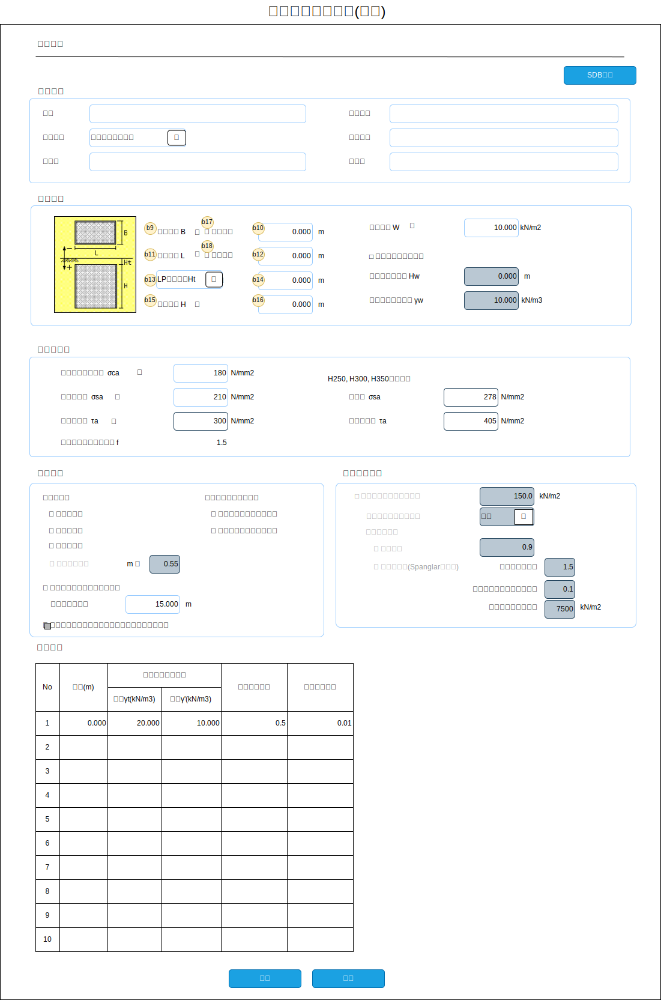{class=resizable height=480}

<table>
  <caption></caption>
  <thead>
    <tr>
      <th>No</th>
      <th>ラベル</th>
      <th>コントロール</th>
      <th>表示桁数</th>
      <th>文字揃え</th>
      <th>初期値</th>
      <th>説明</th>
    </tr>
  </thead>
  <tbody>
    <tr>
      <td>1</td>
      <td>矩形立坑</td>
      <td>text</td>
      <td>-</td>
      <td>-</td>
      <td>-</td>
      <td>画面のタイトル</td>
    </tr>
    <tr>
      <td>b2</td>
      <td>矩形の設計条件</td>
      <td>image</td>
      <td>-</td>
      <td>-</td>
      <td>-</td>
      <td>矩形の設計条件の画像を表示</td>
    </tr>
    <tr>
      <td>b9</td>
      <td>立坑短径 B</td>
      <td>label</td>
      <td>-</td>
      <td>左</td>
      <td>-</td>
      <td>入力項目のラベル</td>
    </tr>
    <tr>
      <td>b10</td>
      <td>立坑短径 B 入力フィールド</td>
      <td>textfield</td>
      <td>00.000</td>
      <td>右</td>
      <td>`liner_plate_inputs.diameter`</td>
      <td>`liner_plate_inputs.diameter`へ保存
        <dl>
          <dt>権限：営業・社外</dt>
          <dd>1.0 から 10.0 まで</dd>
          <dd>0.157の倍数(ボルト数) + 0.08</dd>
          <dt>権限：設計</dt>
          <dd>1.0 から 99.999 まで</dd>
        </dl>
      </td>
    </tr>
    <tr>
      <td>b11</td>
      <td>立坑長径 L</td>
      <td>label</td>
      <td>-</td>
      <td>左</td>
      <td>-</td>
      <td>入力項目のラベル</td>
    </tr>
    <tr>
      <td>b12</td>
      <td>立坑長径 L 入力フィールド</td>
      <td>textfield</td>
      <td>00.000</td>
      <td>右</td>
      <td>`liner_plate_inputs.long_diameter`</td>
      <td>
        <dl>
          <dt>権限：営業・社外</dt>
          <dd>1.0 から 10.0 まで</dd>
          <dd>0.157の倍数(ボルト数) + 0.08</dd>
          <dt>権限：設計</dt>
          <dd>1.0 から 99.999 まで</dd>
        </dl>
      </td>
    </tr>
    <tr>
      <td>b13</td>
      <td>LP上面の深さ Ht</td>
      <td>dropdown</td>
      <td>-</td>
      <td>左</td>
      <td>-</td>
      <td>LP上面の深さ/LP突き出し高さ　のいずれかを選択。LP突出し高さを設定した場合、マイナスで保存</td>
    </tr>
    <tr>
      <td>b14</td>
      <td>LP上面の深さ Ht 入力フィールド</td>
      <td>textfied</td>
      <td>00.000</td>
      <td>右</td>
      <td>0.000 or `liner_plate_inputs.top_surface_depth`</td>
      <td>`liner_plate_inputs.top_surface_depth`へ保存
      <dl>
          <dt>権限：営業・社外<dt>
          <dd>0.0から5.0 まで</dd>
          <dt>権限：設計</dt>
          <dd>0.000 から 99.999 まで</dd>
        </dl>
      </td>
    </tr>
    <tr>
      <td>b15</td>
      <td>LP深さ H</td>
      <td>label</td>
      <td>-</td>
      <td>左</td>
      <td>-</td>
      <td></td>
    </tr>
    <tr>
      <td>b16</td>
      <td>LP深さ H 入力フィールド</td>
      <td>textfied</td>
      <td>00.000</td>
      <td>右</td>
      <td>0.000 or `liner_plate_inputs.depth`</td>
      <td>`liner_plate_inputs.depth`へ保存
        <dl>
          <dt>権限：営業・社外<dt>
          <dd>1.0.から99.999まで、かつ0.5の倍数</dd>
          <dt>権限：設計</dt>
          <dd>1.0.から99.999まで、かつ0.5の倍数</dd>
        </dl>
      </td>
    </tr>
    <tr>
      <td>b17</td>
      <td>立坑短径 B 特殊寸法チェックボックス</td>
      <td>checkbox</td>
      <td>-</td>
      <td>左</td>
      <td>-</td>
      <td>
        権限が設計者・管理者のみ表示
        <dl>
          <dt>ONの場合<dt>
          <dd>寸法を自由入力できる</dd>
          <dt>OFFの場合</dt>
          <dd>確定時に、入力値に最も近い設計可能な値に更新される</dd>
        </dl>
      </td>
    </tr>
    <tr>
      <td>b18</td>
      <td>立坑長径 L 特殊寸法チェックボックス</td>
      <td>checkbox</td>
      <td>-</td>
      <td>左</td>
      <td>-</td>
      <td>
        権限が設計者・管理者のみ表示
        <dl>
          <dt>ONの場合<dt>
          <dd>寸法を自由入力できる</dd>
          <dt>OFFの場合</dt>
          <dd>確定時に、入力値に最も近い設計可能な値に更新される</dd>
        </dl>
      </td>
    </tr>
  </tbody>
</table>

#### 基本情報入力画面(矩形支保工)

ライナープレート計算結果画面(矩形)と同じ。

#### 基本情報入力画面(R矩形)

{class=resizable height=480}

<table>
  <caption></caption>
  <thead>
    <tr>
      <th>No</th>
      <th>ラベル</th>
      <th>コントロール</th>
      <th>表示桁数</th>
      <th>文字揃え</th>
      <th>初期値</th>
      <th>説明</th>
    </tr>
  </thead>
  <tbody>
    <tr>
      <td>1</td>
      <td>R矩形立坑</td>
      <td>text</td>
      <td>-</td>
      <td>-</td>
      <td>-</td>
      <td>画面のタイトル</td>
    </tr>
    <tr>
      <td>b2</td>
      <td>R矩形の設計条件</td>
      <td>image</td>
      <td>-</td>
      <td>-</td>
      <td>-</td>
      <td>R矩形の設計条件の画像を表示</td>
    </tr>
    <tr>
      <td>b9</td>
      <td>立坑短径 B</td>
      <td>label</td>
      <td>-</td>
      <td>左</td>
      <td>-</td>
      <td>入力項目のラベル</td>
    </tr>
    <tr>
      <td>b10</td>
      <td>立坑短径 B 入力フィールド</td>
      <td>textfield</td>
      <td>00.000</td>
      <td>右</td>
      <td>`liner_plate_inputs.diameter`</td>
      <td>`liner_plate_inputs.diameter`へ保存
        <dl>
          <dt>権限：営業・社外</dt>
          <dd>1.0 から 10.0 まで</dd>
          <dd>R部半径 * 2 + 0.157の倍数(ボルト数)</dd>
          <dt>権限：設計</dt>
          <dd>1.0 から 99.999 まで</dd>
          <dd>R部半径 * 2 より大きい値</dd>
        </dl>
      </td>
    </tr>
    <tr>
      <td>b11</td>
      <td>立坑長径 L</td>
      <td>label</td>
      <td>-</td>
      <td>左</td>
      <td>-</td>
      <td>入力項目のラベル</td>
    </tr>
    <tr>
      <td>b12</td>
      <td>立坑長径 L 入力フィールド</td>
      <td>textfield</td>
      <td>00.000</td>
      <td>右</td>
      <td>`liner_plate_inputs.long_diameter`</td>
      <td>
        <dl>
          <dt>権限：営業・社外</dt>
          <dd>1.0 から 10.0 まで</dd>
          <dd>0.157の倍数(ボルト数) + 0.08</dd>
          <dt>権限：設計</dt>
          <dd>1.0 から 99.999 まで</dd>
        </dl>
      </td>
    </tr>
    <tr>
      <td>b13</td>
      <td>LP上面の深さ Ht</td>
      <td>dropdown</td>
      <td>-</td>
      <td>左</td>
      <td>-</td>
      <td>LP上面の深さ/LP突き出し高さ　のいずれかを選択。LP突出し高さを設定した場合、マイナスで保存</td>
    </tr>
    <tr>
      <td>b14</td>
      <td>LP上面の深さ Ht 入力フィールド</td>
      <td>textfied</td>
      <td>00.000</td>
      <td>右</td>
      <td>0.000 or `liner_plate_inputs.top_surface_depth`</td>
      <td>`liner_plate_inputs.top_surface_depth`へ保存
      <dl>
          <dt>権限：営業・社外<dt>
          <dd>0.0から5.0 まで</dd>
          <dt>権限：設計</dt>
          <dd>0.000 から 99.999 まで</dd>
        </dl>
      </td>
    </tr>
    <tr>
      <td>b15</td>
      <td>LP深さ H</td>
      <td>label</td>
      <td>-</td>
      <td>左</td>
      <td>-</td>
      <td></td>
    </tr>
    <tr>
      <td>b16</td>
      <td>LP深さ H 入力フィールド</td>
      <td>textfied</td>
      <td>00.000</td>
      <td>右</td>
      <td>0.000 or `liner_plate_inputs.depth`</td>
      <td>`liner_plate_inputs.depth`へ保存
        <dl>
          <dt>権限：営業・社外<dt>
          <dd>1.0.から99.999まで、かつ0.5の倍数</dd>
          <dt>権限：設計</dt>
          <dd>1.0.から99.999まで、かつ0.5の倍数</dd>
        </dl>
      </td>
    </tr>
    <tr>
      <td>b17</td>
      <td>立坑短径 B 特殊寸法チェックボックス</td>
      <td>checkbox</td>
      <td>-</td>
      <td>左</td>
      <td>-</td>
      <td>
        権限が設計者・管理者のみ表示
        <dl>
          <dt>ONの場合<dt>
          <dd>寸法を自由入力できる</dd>
          <dt>OFFの場合</dt>
          <dd>確定時に、入力値に最も近い設計可能な値に更新される</dd>
        </dl>
      </td>
    </tr>
    <tr>
      <td>b18</td>
      <td>立坑長径 L 特殊寸法チェックボックス</td>
      <td>checkbox</td>
      <td>-</td>
      <td>左</td>
      <td>-</td>
      <td>
        権限が設計者・管理者のみ表示
        <dl>
          <dt>ONの場合<dt>
          <dd>寸法を自由入力できる</dd>
          <dt>OFFの場合</dt>
          <dd>確定時に、入力値に最も近い設計可能な値に更新される</dd>
        </dl>
      </td>
    </tr>
    <tr>
      <td>b19</td>
      <td>R部半径 R</td>
      <td>label</td>
      <td>-</td>
      <td>左</td>
      <td>-</td>
      <td>入力項目のラベル</td>
    </tr>
    <tr>
      <td>b20</td>
      <td>R部半径 R 特殊寸法チェックボックス</td>
      <td>checkbox</td>
      <td>-</td>
      <td>左</td>
      <td>-</td>
      <td>
        権限が設計者・管理者のみ表示
        <dl>
          <dt>ONの場合<dt>
          <dd>寸法を自由入力できる</dd>
          <dt>OFFの場合</dt>
          <dd>1.0m または 1.5m</dd>
        </dl>
      </td>
    </tr>
    <tr>
      <td>b21</td>
      <td>R部半径 R 入力フィールド</td>
      <td>textfield</td>
      <td>00.000</td>
      <td>右</td>
      <td>`liner_plate_inputs.radius`</td>
      <td>
        <dl>
          <dt>権限：営業・社外</dt>
            <dd>1.0 または 1.5</dd>
            <dd>短径より大きい値を選択</dd>
          <dt>権限：設計</dt>
            <!--TODO: R部分の上限について確認が必要、標準品は1500mmがMAXだが、設計者向けには条件いくつにしたらよいか -->
            <!-- TODO: 管理者・設計以外は標準品の円弧部材のみ使用するか確認 -->
            <dd>0.1 から 1.5 まで</dd>
            <dd>0.1 の倍数で入力</dd>
          <dd>短径より大きい値を選択</dd>
        </dl>
      </td>
    </tr>
  </tbody>
</table>

#### 基本情報入力画面(集水井)

{class=resizable height=480}

<table>
  <caption>基本情報入力画面(集水井)</caption>
  <thead>
    <tr>
      <th>No</th>
      <th>ラベル</th>
      <th>コントロール</th>
      <th>表示桁数</th>
      <th>文字揃え</th>
      <th>初期値</th>
      <th>説明</th>
    </tr>
  </thead>
  <tbody>
    <tr>
      <td>1</td>
      <td>集水井</td>
      <td>text</td>
      <td>-</td>
      <td>-</td>
      <td>-</td>
      <td>画面のタイトル</td>
    </tr>
    <tr>
      <td>b2</td>
      <td>集水井の設計条件</td>
      <td>image</td>
      <td>-</td>
      <td>-</td>
      <td>-</td>
      <td>集水井の設計条件の画像を表示</td>
    </tr>
    <tr>
      <td>b9</td>
      <td>立坑直径 D</td>
      <td>label</td>
      <td>-</td>
      <td>左</td>
      <td>-</td>
      <td>入力項目のラベル</td>
    </tr>
    <tr>
      <td>b10</td>
      <td>立坑直径 D 入力フィールド</td>
      <td>textfield</td>
      <td>00.000</td>
      <td>右</td>
      <td>0.000 or `liner_plate_inputs.diameter`</td>
      <td>`liner_plate_inputs.diameter`へ保存
      <dl>
        <dt>権限：営業・社外</dt>
        <dd>3.0または3.5<dd>
        <dt>権限：設計</dt>
        <dd>1.0 から 99.999 まで<dd>
      </td>
    </tr>
    <tr>
      <td>b11</td>
      <td>LP上面の深さ Ht</td>
      <td>dropdown</td>
      <td>-</td>
      <td>左</td>
      <td>-</td>
      <td>LP上面の深さ/LP突き出し高さ　のいずれかを選択。LP突出し高さを設定した場合、マイナスで保存</td>
    </tr>
    <tr>
      <td>b12</td>
      <td>LP上面の深さ Ht 入力フィールド</td>
      <td>textfied</td>
      <td>00.000</td>
      <td>右</td>
      <td>0.000 or `liner_plate_inputs.top_surface_depth`</td>
      <td>`liner_plate_inputs.top_surface_depth`へ保存
      <dl>
          <dt>権限：営業・社外<dt>
          <dd>0.0から5.0 まで</dd>
          <dt>権限：設計</dt>
          <dd>0.000 から 99.999 まで</dd>
        </dl>
      </td>
    </tr>
    <tr>
      <td>b13</td>
      <td>LP深さ H</td>
      <td>label</td>
      <td>-</td>
      <td>左</td>
      <td>-</td>
      <td></td>
    </tr>
    <tr>
      <td>b14</td>
      <td>LP深さ H 入力フィールド</td>
      <td>textfied</td>
      <td>00.000</td>
      <td>右</td>
      <td>0.000 or `liner_plate_inputs.depth`</td>
      <td>`liner_plate_inputs.depth`へ保存
      <dl>
          <dt>権限：営業・社外<dt>
          <dd>1.0.から99.999まで、かつ0.5の倍数</dd>
          <dt>権限：設計</dt>
          <dd>1.0.から99.999まで、かつ0.5の倍数</dd>
        </dl>
      </td>
    </tr>
  </tbody>
</table>

#### 基本情報入力画面(小判形)

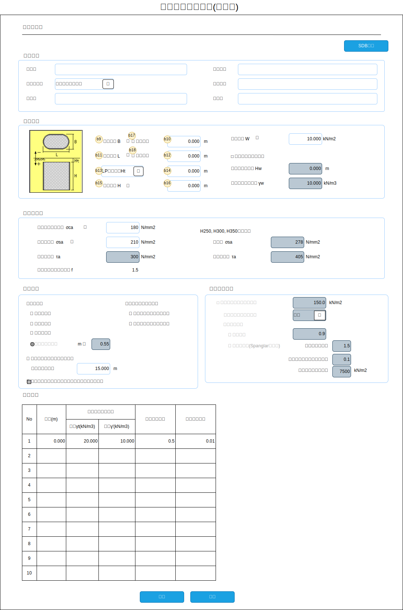{class=resizable height=480}

<table>
  <caption>基本情報入力画面(小判形)</caption>
  <thead>
    <tr>
      <th>No</th>
      <th>ラベル</th>
      <th>コントロール</th>
      <th>表示桁数</th>
      <th>文字揃え</th>
      <th>初期値</th>
      <th>説明</th>
    </tr>
  </thead>
  <tbody>
    <tr>
      <td>1</td>
      <td>小判形立坑</td>
      <td>text</td>
      <td>-</td>
      <td>-</td>
      <td>-</td>
      <td>画面のタイトル</td>
    </tr>
    <tr>
      <td>b2</td>
      <td>小判形の設計条件</td>
      <td>image</td>
      <td>-</td>
      <td>-</td>
      <td>-</td>
      <td>小判形の設計条件の画像を表示</td>
    </tr>
    <tr>
      <td>b9</td>
      <td>立坑短径 B</td>
      <td>label</td>
      <td>-</td>
      <td>左</td>
      <td>-</td>
      <td>入力項目のラベル</td>
    </tr>
    <tr>
      <td>b10</td>
      <td>立坑短径 B 入力フィールド</td>
      <td>textfield</td>
      <td>00.000</td>
      <td>右</td>
      <td>0.000 or `liner_plate_inputs.diameter`</td>
      <td>`liner_plate_inputs.diameter`へ保存
        <dl>
        <dt>権限：営業・社外<dt>
        <dd>1.2 から 6.5 まで かつ 0.1ピッチ</dd>
        <dt>権限：設計<dt>
        <dd>1.0 から 99.999 まで</dd>
        </dl>
      </td>
    </tr>
    <tr>
      <td>b11</td>
      <td>立坑長径 L</td>
      <td>label</td>
      <td>-</td>
      <td>左</td>
      <td>-</td>
      <td>入力項目のラベル</td>
    </tr>
    <tr>
      <td>b12</td>
      <td>立坑長径 L 入力フィールド</td>
      <td>textfield</td>
      <td>00.000</td>
      <td>右</td>
      <td>`liner_plate_inputs.long_diameter`</td>
      <td>`liner_plate_inputs.long_diameter`へ保存
        <dl>
          <dt>権限：営業・社外<dt>
          <dd>1.0 から 99.999 まで</dd>
          <dd>長径 - 短径 = 0.157の倍数(ボルト数)</dd>
          <dt>権限：設計<dt>
          <dd>1.0 から 99.999 まで</dd>
        </dl>
      </td>
    </tr>
    <tr>
      <td>b13</td>
      <td>LP上面の深さ Ht</td>
      <td>dropdown</td>
      <td>-</td>
      <td>左</td>
      <td>-</td>
      <td>LP上面の深さ/LP突き出し高さ　のいずれかを選択。LP突出し高さを設定した場合、マイナスで保存</td>
    </tr>
    <tr>
      <td>b14</td>
      <td>LP上面の深さ Ht 入力フィールド</td>
      <td>textfied</td>
      <td>00.000</td>
      <td>右</td>
      <td>0.000 or `liner_plate_inputs.top_surface_depth`</td>
      <td>`liner_plate_inputs.top_surface_depth`へ保存
    　　<dl>
          <dt>権限：営業・社外<dt>
          <dd>0.0から5.0 まで</dd>
          <dt>権限：設計</dt>
          <dd>0.000 から 99.999 まで</dd>
        </dl>
      </td>
    </tr>
    <tr>
      <td>b15</td>
      <td>LP深さ H</td>
      <td>label</td>
      <td>-</td>
      <td>左</td>
      <td>-</td>
      <td></td>
    </tr>
    <tr>
      <td>b16</td>
      <td>LP深さ H 入力フィールド</td>
      <td>textfied</td>
      <td>00.000</td>
      <td>右</td>
      <td>0.000 or `liner_plate_inputs.depth`</td>
      <td>`liner_plate_inputs.depth`へ保存
        <dl>
          <dt>権限：営業・社外<dt>
          <dd>1.0.から99.999まで、かつ0.5の倍数</dd>
          <dt>権限：設計</dt>
          <dd>1.0.から99.999まで、かつ0.5の倍数</dd>
        </dl>
      </td>
    </tr>
    <tr>
      <td>b17</td>
      <td>立坑短径 B 特殊寸法チェックボックス</td>
      <td>checkbox</td>
      <td>-</td>
      <td>左</td>
      <td>-</td>
      <td>
        権限が設計者・管理者のみ表示
        <dl>
          <dt>ONの場合<dt>
          <dd>寸法を自由入力できる</dd>
          <dt>OFFの場合</dt>
          <dd>確定時に、入力値に最も近い設計可能な値に更新される</dd>
        </dl>
      </td>
    </tr>
    <tr>
      <td>b18</td>
      <td>立坑長径 L 特殊寸法チェックボックス</td>
      <td>checkbox</td>
      <td>-</td>
      <td>左</td>
      <td>-</td>
      <td>
        権限が設計者・管理者のみ表示
        <dl>
          <dt>ONの場合<dt>
          <dd>寸法を自由入力できる</dd>
          <dt>OFFの場合</dt>
          <dd>確定時に、入力値に最も近い設計可能な値に更新される</dd>
        </dl>
      </td>
    </tr>
  </tbody>
</table>

### 土質・土層条件

#### 静止土圧・楕円変化率を入力する場合

<table>
  <caption>静止土圧・楕円変化率を入力する場合</caption>
  <thead>
    <tr>
      <th>No</th>
      <th>ラベル</th>
      <th>コントロール</th>
      <th>表示桁数</th>
      <th>文字揃え</th>
      <th>初期値</th>
      <th>説明</th>
    </tr>
  </thead>
  <tbody>
    <tr>
      <td>a1</td>
      <td>土質条件</td>
      <td>label</td>
      <td>-</td>
      <td>左</td>
      <td>-</td>
      <td></td>
    </tr>
    <tr>
      <td>a2</td>
      <td>土圧算出式</td>
      <td>label</td>
      <td>-</td>
      <td>左</td>
      <td>集水井:テルツァーギ式、 円形・小判・矩形: 静止土圧式 or `liner/pate_inputs.earth_pressure_calc_type`</td>
      <td>以下の選択肢から一つを選ぶ。円形・小判形・矩形は、テルツァギ式の選択不可
        <ul>
          <li>静止土圧式</li>
          <li>ランキン式</li>
          <li>クーロン式</li>
          <li>テルツァギ式</li>
        </ul>
      </td>
    </tr>
    <tr>
      <td>a3</td>
      <td>土圧合力の作用位置の割合入力フィールド</td>
      <td>textfield</td>
      <td>-</td>
      <td>右</td>
      <td>0.55 or `liner_plate_inputs.earth_pressure_force_location_ratio`</td>
      <td>テルツァギ式を選択した時のみ入力可。(=集水井以外は入力不可)</ul>
      </td>
    </tr>
    <tr>
      <td>a4</td>
      <td>ある深度から土圧強度は一定チェックボックス</td>
      <td>checkbox</td>
      <td>-</td>
      <td>左</td>
      <td>OFF or `liner_plate_inputs.is_earth_pressure_strength_constant_depth`</td>
      <td></td>
    </tr>
    <tr>
      <td>a5</td>
      <td>一定となる深度</td>
      <td>label</td>
      <td>-</td>
      <td>左</td>
      <td>-</td>
      <td></td>
    </tr>
    <tr>
      <td>a6</td>
      <td>一定となる深度 入力フィールド</td>
      <td>textfield</td>
      <td>00.000</td>
      <td>右</td>
      <td>15.000 or `liner_plate_inputs.earth_pressure_strength_constant_depth`</td>
      <td>ある深度から土圧強度は一定チェックボックス が ON の時のみ入力可。
      0.001 から 99.999 まで</td>
    </tr>
    <tr>
      <td>a7</td>
      <td>最大土圧以深は安全側を考慮して最大土圧とする</td>
      <td>checkbox</td>
      <td>-</td>
      <td>左</td>
      <td>OFF かつ disable</td>
      <td></td>
    </tr>
    <tr>
      <td>a8</td>
      <td>楕円化変位率・変位量</td>
      <td>label</td>
      <td></td>
      <td></td>
      <td><ul class="horizontal"><li>新規:楕円化変位率を入力する</li><li>編集:`liner_plate_inputs.elliptical_deformation_type` の値</li></ul></td>
      <td>以下の選択肢から選択
        <ul>
          <li>楕円化変位率を入力する</li>
          <li>楕円化変位量を入力する</li>
          <li>楕円化変位量を計算する</li>
        </ul>
      </td>
    </tr>
    <tr>
      <td>a9</td>
      <td>安全率</td>
      <td>label</td>
      <td>-</td>
      <td>-</td>
      <td>-</td>
      <td></td>
    </tr>
    <tr>
      <td>a10</td>
      <td>安全率 入力フィールド</td>
      <td>label</td>
      <td>-</td>
      <td>-</td>
      <td>1.5 or `liner_plate_inputs.elliptical_deformation_amount_sf`</td>
      <td>`楕円化変化量を計算する`を選択した時のみ入力可能。 
      1.0から2.0の値で入力</td>
    </tr>
    <tr>
      <td>b1</td>
      <td>土層設定</td>
      <td></td>
      <td>-</td>
      <td>-</td>
      <td>-</td>
      <td></td>
    </tr>
    <tr>
      <td>b2</td>
      <td>No</td>
      <td>行数を表示</td>
      <td>-</td>
      <td>-</td>
      <td>-</td>
      <td></td>
    </tr>
    <tr>
      <td>b3</td>
      <td>深度(m)</td>
      <td></td>
      <td>-</td>
      <td>-</td>
      <td>No.1が0.000: 上面深度(liner_plate_inputs.top_surface_depth)+深度(liner_plate_inputs.depth) or `soil_layers.depth`</td>
      <td>
        0.001 から 99.999 まで 
        また、入力が有効な最終行の深度が、立坑上面(liner_plate_inputs.top_surface_depth)+立坑深度(liner_plate_inputs.depth)より深い
      </td>
    </tr>
    <tr>
      <td>b4</td>
      <td>土の単位体積重量-湿潤湿γt(kN/m3)</td>
      <td></td>
      <td>-</td>
      <td>-</td>
      <td>20.000 or `soil_layers.moisture_unit_weight`</td>
      <td>0.1 から 30.000 まで</td>
    </tr>
    <tr>
      <td>b5</td>
      <td>土の単位体積重量-水中 γ'(kN/m3)</td>
      <td></td>
      <td>-</td>
      <td>-</td>
      <td>10.000 or `soil_layers.underwater_unit_weight`</td>
      <td>0.1 から 30.000 まで</td>
    </tr>
    <tr>
      <td>b6</td>
      <td>静止土圧係数</td>
      <td></td>
      <td>-</td>
      <td>-</td>
      <td>0.5 or `soil_layers.static_earth_pressure_coefficient`</td>
      <td>0.0 から 1.0 まで</td>
    </tr>
    <tr>
      <td>b7</td>
      <td>楕円化変化率</td>
      <td></td>
      <td>-</td>
      <td>-</td>
      <td>0.01 or `soil_layers.elliptical_deformation_rate`</td>
      <td>0.0 から 0.10 まで</td>
    </tr>
  </tbody>
</table>

#### 静止土圧・楕円変化量を入力する場合

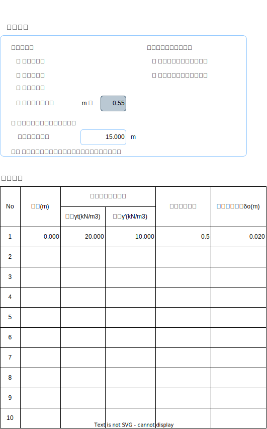

土質条件は[静止土圧・楕円変化率を入力する場合](#静止土圧・楕円変化率を入力する場合)と同じ。

<table>
  <caption>静止土圧・楕円変化量を入力する場合</caption>
  <thead>
    <tr>
      <th>No</th>
      <th>ラベル</th>
      <th>コントロール</th>
      <th>表示桁数</th>
      <th>文字揃え</th>
      <th>初期値</th>
      <th>説明</th>
    </tr>
  </thead>
  <tbody>
    <tr>
      <td>b1</td>
      <td>土層設定</td>
      <td></td>
      <td>-</td>
      <td>-</td>
      <td>-</td>
      <td></td>
    </tr>
    <tr>
      <td>b2</td>
      <td>No</td>
      <td>行数を表示</td>
      <td>-</td>
      <td>-</td>
      <td>-</td>
      <td></td>
    </tr>
    <tr>
      <td>b3</td>
      <td>深度(m)</td>
      <td></td>
      <td>-</td>
      <td>-</td>
      <td>No.1が0.000: 上面深度(liner_plate_inputs.top_surface_depth)+深度(liner_plate_inputs.depth) or `soil_layers.depth`</td>
      <td>
        0.001 から 99.999 まで 
        また、入力が有効な最終行の深度が、立坑上面(liner_plate_inputs.top_surface_depth)+立坑深度(liner_plate_inputs.depth)より深い
      </td>
    </tr>
    <tr>
      <td>b4</td>
      <td>土の単位体積重量-湿潤湿γt(kN/m3)</td>
      <td></td>
      <td>-</td>
      <td>-</td>
      <td>20.000 or `soil_layers.moisture_unit_weight`</td>
      <td>0.1 から 30.000 まで</td>
    </tr>
    <tr>
      <td>b5</td>
      <td>土の単位体積重量-水中 γ'(kN/m3)</td>
      <td></td>
      <td>-</td>
      <td>-</td>
      <td>10.000 or `soil_layers.underwater_unit_weight`</td>
      <td>0.1 から 30.000 まで</td>
    </tr>
    <tr>
      <td>b6</td>
      <td>静止土圧係数</td>
      <td></td>
      <td>-</td>
      <td>-</td>
      <td>0.5 or `soil_layers.static_earth_pressure_coefficient`</td>
      <td>0.0 から 1.0 まで</td>
    </tr>
    <tr>
      <td>b7</td>
      <td>楕円化変化量</td>
      <td></td>
      <td>-</td>
      <td>-</td>
      <td>0.020 or `soil_layers.elliptical_deformation_amount`</td>
      <td>0.000 から 0.500 まで</td>
    </tr>
  </tbody>
</table>

#### ランキン土圧・楕円変化率を入力する場合

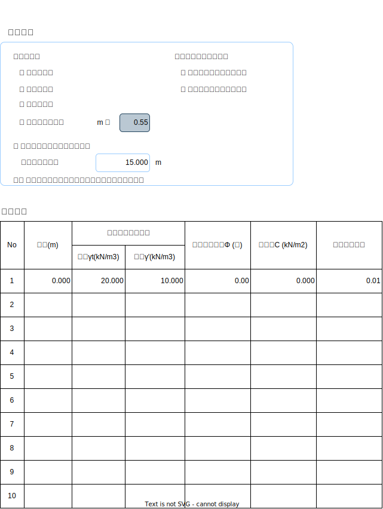

<table>
  <caption>ランキン土圧・楕円変化率を入力する場合</caption>
  <thead>
    <tr>
      <th>No</th>
      <th>ラベル</th>
      <th>コントロール</th>
      <th>表示桁数</th>
      <th>文字揃え</th>
      <th>初期値</th>
      <th>説明</th>
    </tr>
  </thead>
  <tbody>
    <tr>
      <td>b1</td>
      <td>土層設定</td>
      <td></td>
      <td>-</td>
      <td>-</td>
      <td>-</td>
      <td></td>
    </tr>
    <tr>
      <td>b2</td>
      <td>No</td>
      <td>行数を表示</td>
      <td>-</td>
      <td>-</td>
      <td>-</td>
      <td></td>
    </tr>
    <tr>
      <td>b3</td>
      <td>深度(m)</td>
      <td></td>
      <td>-</td>
      <td>-</td>
      <td>No.1が0.000: 上面深度(liner_plate_inputs.top_surface_depth)+深度(liner_plate_inputs.depth) or `soil_layers.depth`</td>
      <td>
        0.001 から 99.999 まで 
        また、入力が有効な最終行の深度が、立坑上面(liner_plate_inputs.top_surface_depth)+立坑深度(liner_plate_inputs.depth)より深い
      </td>
    </tr>
    <tr>
      <td>b4</td>
      <td>土の単位体積重量-湿潤湿γt(kN/m3)</td>
      <td></td>
      <td>-</td>
      <td>-</td>
      <td>20.000 or `soil_layers.moisture_unit_weight`</td>
      <td>0.1 から 30.000 まで</td>
    </tr>
    <tr>
      <td>b5</td>
      <td>土の単位体積重量-水中 γ'(kN/m3)</td>
      <td></td>
      <td>-</td>
      <td>-</td>
      <td>10.000 or `soil_layers.underwater_unit_weight`</td>
      <td>0.1 から 30.000 まで</td>
    </tr>
    <tr>
      <td>b6</td>
      <td>せん断抵抗角Φ (度)</td>
      <td></td>
      <td>-</td>
      <td>-</td>
      <td>0.00 or `soil_layers.shear_resistance_angle`</td>
      <td>0.0 から 45.0 まで</td>
    </tr>
    <tr>
      <td>b7</td>
      <td>粘着力C (kN/m2)</td>
      <td></td>
      <td>-</td>
      <td>-</td>
      <td>0.00 or `soil_layers.adhesion_force`</td>
      <td>0.0 から 999.0 まで</td>
    </tr>
    <tr>
      <td>b8</td>
      <td>楕円化変化量</td>
      <td></td>
      <td>-</td>
      <td>-</td>
      <td>0.020 or `soil_layers.elliptical_deformation_amount`</td>
      <td>0.000 から 0.500 まで</td>
    </tr>
  </tbody>
</table>

#### ランキン土圧・楕円変化量を入力する場合

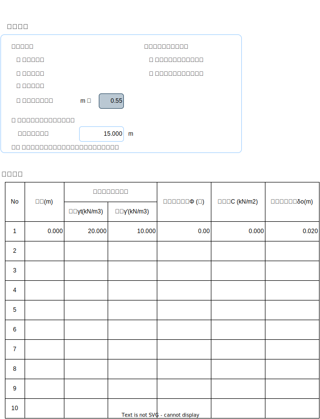

土質条件は[静止土圧・楕円変化率を入力する場合](#静止土圧・楕円変化率を入力する場合)と同じ。

<table>
  <caption>ランキン土圧・楕円変化量を入力する場合</caption>
  <thead>
    <tr>
      <th>No</th>
      <th>ラベル</th>
      <th>コントロール</th>
      <th>表示桁数</th>
      <th>文字揃え</th>
      <th>初期値</th>
      <th>説明</th>
    </tr>
  </thead>
  <tbody>
    <tr>
      <td>b1</td>
      <td>土層設定</td>
      <td></td>
      <td>-</td>
      <td>-</td>
      <td>-</td>
      <td></td>
    </tr>
    <tr>
      <td>b2</td>
      <td>No</td>
      <td>行数を表示</td>
      <td>-</td>
      <td>-</td>
      <td>-</td>
      <td></td>
    </tr>
    <tr>
      <td>b3</td>
      <td>深度(m)</td>
      <td></td>
      <td>-</td>
      <td>-</td>
      <td>No.1が0.000: 上面深度(liner_plate_inputs.top_surface_depth)+深度(liner_plate_inputs.depth) or `soil_layers.depth`</td>
      <td>
    　　0.001 から 99.999 まで 
    　　また、入力が有効な最終行の深度が、立坑上面(liner_plate_inputs.top_surface_depth)+立坑深度(liner_plate_inputs.depth)より深い
      </td>
    </tr>
    <tr>
      <td>b4</td>
      <td>土の単位体積重量-湿潤湿γt(kN/m3)</td>
      <td></td>
      <td>-</td>
      <td>-</td>
      <td>20.000 or `soil_layers.moisture_unit_weight`</td>
      <td>0.1 から 30.000 まで</td>
    </tr>
    <tr>
      <td>b5</td>
      <td>土の単位体積重量-水中 γ'(kN/m3)</td>
      <td></td>
      <td>-</td>
      <td>-</td>
      <td>10.000 or `soil_layers.underwater_unit_weight`</td>
      <td>0.1 から 30.000 まで</td>
    </tr>
    <tr>
      <td>b6</td>
      <td>せん断抵抗角Φ (度)</td>
      <td></td>
      <td>-</td>
      <td>-</td>
      <td>0.00 or `soil_layers.shear_resistance_angle`</td>
      <td>0.0 から 45.0 まで</td>
    </tr>
    <tr>
      <td>b7</td>
      <td>粘着力C (kN/m2)</td>
      <td></td>
      <td>-</td>
      <td>-</td>
      <td>0.00 or `soil_layers.adhesion_force`</td>
      <td>0.0 から 999.0 まで</td>
    </tr>
    <tr>
      <td>b8</td>
      <td>楕円化変化率</td>
      <td></td>
      <td>-</td>
      <td>-</td>
      <td>0.01 or `soil_layers.elliptical_deformation_rate`</td>
      <td>0.0 から 0.10 まで</td>
    </tr>
  </tbody>
</table>

#### クーロン土圧・楕円変化率を入力する場合

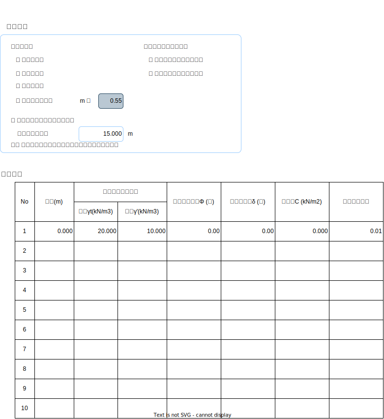

土質条件は[静止土圧・楕円変化率を入力する場合](#静止土圧・楕円変化率を入力する場合)と同じ。

<table>
  <caption>クーロン土圧・楕円変化率を入力する場合</caption>
  <thead>
    <tr>
      <th>No</th>
      <th>ラベル</th>
      <th>コントロール</th>
      <th>表示桁数</th>
      <th>文字揃え</th>
      <th>初期値</th>
      <th>説明</th>
    </tr>
  </thead>
  <tbody>
    <tr>
      <td>b1</td>
      <td>土層設定</td>
      <td></td>
      <td>-</td>
      <td>-</td>
      <td>-</td>
      <td></td>
    </tr>
    <tr>
      <td>b2</td>
      <td>No</td>
      <td>行数を表示</td>
      <td>-</td>
      <td>-</td>
      <td>-</td>
      <td></td>
    </tr>
    <tr>
      <td>b3</td>
      <td>深度(m)</td>
      <td></td>
      <td>-</td>
      <td>-</td>
      <td>No.1が0.000: 上面深度(liner_plate_inputs.top_surface_depth)+深度(liner_plate_inputs.depth) or `soil_layers.depth`</td>
      <td>
        0.001 から 99.999 まで 
        また、入力が有効な最終行の深度が、立坑上面(liner_plate_inputs.top_surface_depth)+立坑深度(liner_plate_inputs.depth)より深い
      </td>
    </tr>
    <tr>
      <td>b4</td>
      <td>土の単位体積重量-湿潤湿γt(kN/m3)</td>
      <td></td>
      <td>-</td>
      <td>-</td>
      <td>20.000 or `soil_layers.moisture_unit_weight`</td>
      <td>0.1 から 30.000 まで</td>
    </tr>
    <tr>
      <td>b5</td>
      <td>土の単位体積重量-水中 γ'(kN/m3)</td>
      <td></td>
      <td>-</td>
      <td>-</td>
      <td>10.000 or `soil_layers.underwater_unit_weight`</td>
      <td>0.1 から 30.000 まで</td>
    </tr>
    <tr>
      <td>b6</td>
      <td>せん断抵抗角Φ (度)</td>
      <td></td>
      <td>-</td>
      <td>-</td>
      <td>0.00 or `soil_layers.shear_resistance_angle`</td>
      <td>0.0 から 45.0 まで</td>
    </tr>
    <tr>
      <td>b7</td>
      <td>壁面摩擦角δ (度)</td>
      <td></td>
      <td>-</td>
      <td>-</td>
      <td>0.00 or `soil_layers.wall_friction_angle`</td>
      <td>0.0 から 45.0 まで</td>
    </tr>
    <tr>
      <td>b8</td>
      <td>粘着力C (kN/m2)</td>
      <td></td>
      <td>-</td>
      <td>-</td>
      <td>0.00 or `soil_layers.adhesion_force`</td>
      <td>0.0 から 999.0 まで</td>
    </tr>
    <tr>
      <td>b9</td>
      <td>楕円化変化量</td>
      <td></td>
      <td>-</td>
      <td>-</td>
      <td>0.020 or `soil_layers.elliptical_deformation_amount`</td>
      <td>0.000 から 0.500 まで</td>
    </tr>
  </tbody>
</table>

#### クーロン土圧・楕円変化量を入力する場合

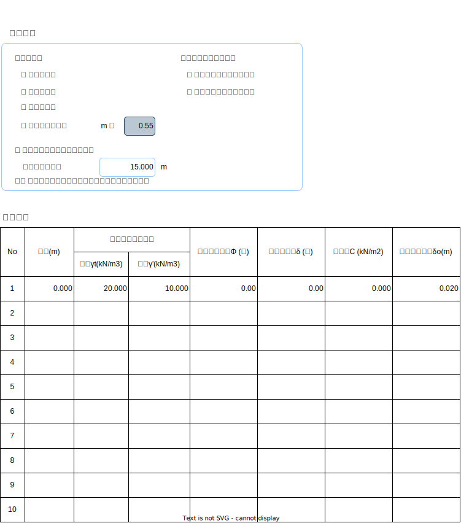

土質条件は[静止土圧・楕円変化率を入力する場合](#静止土圧・楕円変化率を入力する場合)と同じ。

<table>
  <caption>クーロン土圧・楕円変化量を入力する場合</caption>
  <thead>
    <tr>
      <th>No</th>
      <th>ラベル</th>
      <th>コントロール</th>
      <th>表示桁数</th>
      <th>文字揃え</th>
      <th>初期値</th>
      <th>説明</th>
    </tr>
  </thead>
  <tbody>
    <tr>
      <td>b1</td>
      <td>土層設定</td>
      <td></td>
      <td>-</td>
      <td>-</td>
      <td>-</td>
      <td></td>
    </tr>
    <tr>
      <td>b2</td>
      <td>No</td>
      <td>行数を表示</td>
      <td>-</td>
      <td>-</td>
      <td>-</td>
      <td></td>
    </tr>
    <tr>
      <td>b3</td>
      <td>深度(m)</td>
      <td></td>
      <td>-</td>
      <td>-</td>
      <td>No.1が0.000: 上面深度(liner_plate_inputs.top_surface_depth)+深度(liner_plate_inputs.depth) or `soil_layers.depth`</td>
      <td>
        0.001 から 99.999 まで 
        また、入力が有効な最終行の深度が、立坑上面(liner_plate_inputs.top_surface_depth)+立坑深度(liner_plate_inputs.depth)より深い
      </td>
    </tr>
    <tr>
      <td>b4</td>
      <td>土の単位体積重量-湿潤湿γt(kN/m3)</td>
      <td></td>
      <td>-</td>
      <td>-</td>
      <td>20.000 or `soil_layers.moisture_unit_weight`</td>
      <td>0.1 から 30.000 まで</td>
    </tr>
    <tr>
      <td>b5</td>
      <td>土の単位体積重量-水中 γ'(kN/m3)</td>
      <td></td>
      <td>-</td>
      <td>-</td>
      <td>10.000 or `soil_layers.underwater_unit_weight`</td>
      <td>0.1 から 30.000 まで</td>
    </tr>
    <tr>
      <td>b6</td>
      <td>せん断抵抗角Φ (度)</td>
      <td></td>
      <td>-</td>
      <td>-</td>
      <td>0.00 or `soil_layers.shear_resistance_angle`</td>
      <td>0.0 から 45.0 まで</td>
    </tr>
    <tr>
      <td>b7</td>
      <td>粘着力C (kN/m2)</td>
      <td></td>
      <td>-</td>
      <td>-</td>
      <td>0.00 or `soil_layers.adhesion_force`</td>
      <td>0.0 から 999.0 まで</td>
    </tr>
    <tr>
      <td>b8</td>
      <td>楕円化変化率</td>
      <td></td>
      <td>-</td>
      <td>-</td>
      <td>0.01 or `soil_layers.elliptical_deformation_rate`</td>
      <td>0.0 から 0.10 まで</td>
    </tr>
  </tbody>
</table>

#### テルツァギ土圧・楕円変化率を入力する場合



- 土質条件は以下を除き、[静止土圧・楕円変化率を入力する場合](#静止土圧・楕円変化率を入力する場合)と同じ
    - 「ある深度から土圧強度は一定」はチェックOFF
    - 「一定となる深度」の入力はdisableとし、入力不可とする
    - 「最大土圧以深は安全側を考慮して最大土圧とする」のチェックボックスがenable
- 土層条件は[ランキン土圧・楕円変化率を入力する場合](#ランキン土圧・楕円変化率を入力する場合)と同じ

#### テルツァギ土圧・楕円変化量を入力する場合

- 土質条件は[静止土圧・楕円変化率を入力する場合](#静止土圧・楕円変化率を入力する場合)と同じ
    - 「ある深度から土圧強度は一定」はチェックOFF
    - 「一定となる深度」の入力はdisableとし、入力不可とする
    - 「最大土圧以深は安全側を考慮して最大土圧とする」のチェックボックスがenable
- 土層条件は[ランキン土圧・楕円変化量を入力する場合](#ランキン土圧・楕円変化量を入力する場合)と同じ

### 外枠・支保工画面

#### 外枠・支保工画面(円形立坑)

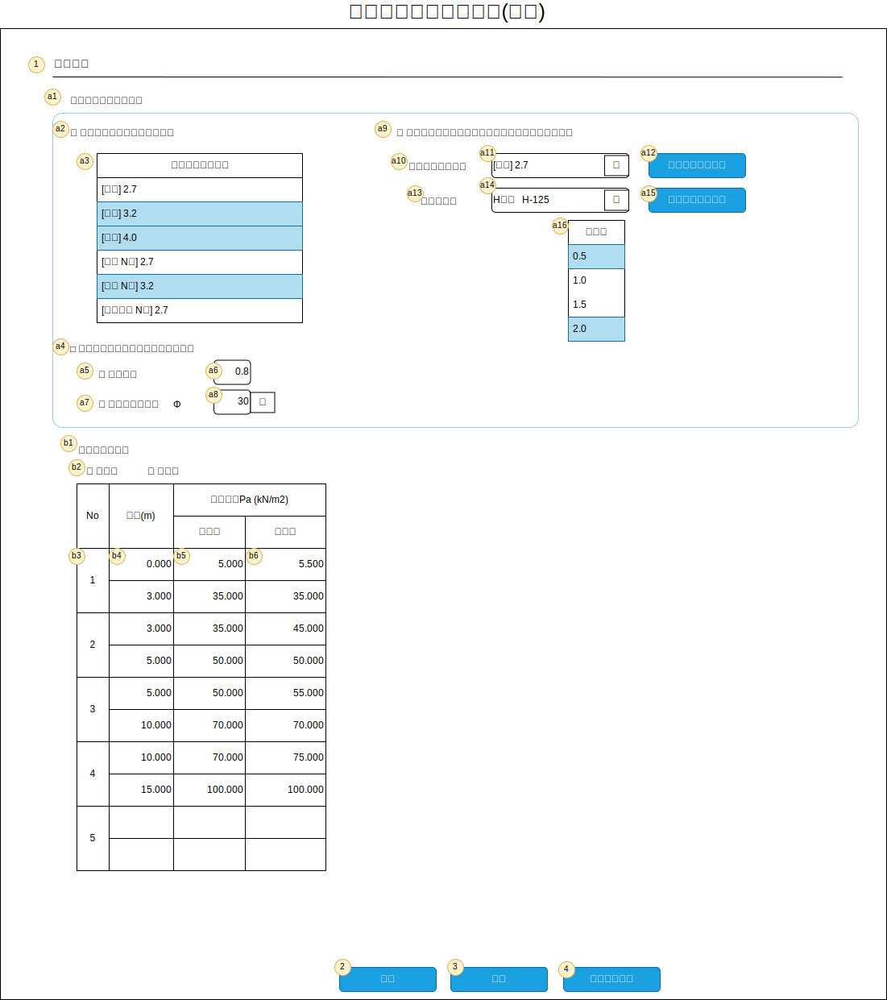{class=resizable height=480}

<table>
  <caption>外枠・支保工画面(円形立坑)</caption>
  <thead>
    <tr>
      <th>No</th>
      <th>ラベル</th>
      <th>コントロール</th>
      <th>表示桁数</th>
      <th>文字揃え</th>
      <th>初期値</th>
      <th>説明</th>
    </tr>
  </thead>
  <tbody>
    <tr>
      <td>1</td>
      <td>円形立坑</td>
      <td></td>
      <td>-</td>
      <td>-</td>
      <td>-</td>
      <td></td>
    </tr>
    <tr>
      <td>2</td>
      <td>戻る</td>
      <td>link</td>
      <td>-</td>
      <td>-</td>
      <td>-</td>
      <td>入力内容を破棄し、LP基礎入力画面に戻る。</td>
    </tr>
    <tr>
      <td>3</td>
      <td>次へ</td>
      <td>buton</td>
      <td>-</td>
      <td>-</td>
      <td>-</td>
      <td>入力内容を`liner_plate_inputs`、`shorings`、`outer_frame_patterns`に保存する。計算結果画面に遷移する</td>
    </tr>
    <tr>
      <td>4</td>
      <td>別構成提案</td>
      <td>button</td>
      <td>-</td>
      <td>-</td>
      <td>-</td>
      <td>入力内容を`liner_plate_inputs`、`shorings`、`outer_frame_patterns`に保存する。別構成提案画面に遷移する</td>
    </tr>
    <tr>
      <td>a1</td>
      <td>外枠の自動計算の設定</td>
      <td>label</td>
      <td>-</td>
      <td>-</td>
      <td>-</td>
      <td></td>
    </tr>
    <tr>
      <td>a2</td>
      <td>ライナープレートのみを使用</td>
      <td>radio</td>
      <td>-</td>
      <td>-</td>
      <td>-</td>
      <td></td>
    </tr>
    <tr>
      <td>a3</td>
      <td>ライナープレート リスト</td>
      <td>listbox</td>
      <td>-</td>
      <td>-</td>
      <td>-</td>
      <td></td>
    </tr>
    <tr>
      <td>a4</td>
      <td>集水孔のライナープレート低減係数</td>
      <td>checkbox</td>
      <td>-</td>
      <td>-</td>
      <td>集水井の場合チェックON。集水井以外。チェックOFFでdisable</td>
      <td></td>
    </tr>
    <tr>
      <td>a5</td>
      <td>入力する</td>
      <td>label</td>
      <td>-</td>
      <td>-</td>
      <td>-</td>
      <td></td>
    </tr>
    <tr>
      <td>a6</td>
      <td>入力する 入力フィールド</td>
      <td>textfield</td>
      <td>-</td>
      <td>-</td>
      <td>-</td>
      <td></td>
    </tr>
    <tr>
      <td>a7</td>
      <td>集水孔直径入力 aΦ</td>
      <td>radio</td>
      <td>-</td>
      <td>-</td>
      <td>-</td>
      <td></td>
    </tr>
    <tr>
      <td>a8</td>
      <td>集水孔直径入力 aΦ ドロップダウン</td>
      <td>dropdown</td>
      <td>-</td>
      <td>-</td>
      <td>-</td>
      <td></td>
    </tr>
    <tr>
      <td>a9</td>
      <td>ライナープレートと補強リングを併用（鋼材固定）</td>
      <td>radio</td>
      <td>-</td>
      <td>-</td>
      <td>-</td>
      <td></td>
    </tr>
    <tr>
      <td>a10</td>
      <td>ライナープレート</td>
      <td>label</td>
      <td>-</td>
      <td>-</td>
      <td>-</td>
      <td></td>
    </tr>
    <tr>
      <td>a11</td>
      <td>ライナープレート ドロップダウン</td>
      <td>dropdown</td>
      <td>-</td>
      <td>-</td>
      <td>-</td>
      <td></td>
    </tr>
    <tr>
      <td>a12</td>
      <td>計算用マスタ編集 - ライナープレート</td>
      <td>button</td>
      <td>-</td>
      <td>-</td>
      <td>-</td>
      <td></td>
    </tr>
    <tr>
      <td>a13</td>
      <td>補強リング</td>
      <td>lable</td>
      <td>-</td>
      <td>-</td>
      <td>-</td>
      <td></td>
    </tr>
    <tr>
      <td>a14</td>
      <td>補強リング ドロップダウン</td>
      <td>dropdown</td>
      <td>-</td>
      <td>-</td>
      <td>-</td>
      <td></td>
    </tr>
    <tr>
      <td>a15</td>
      <td>計算用マスタ編集 - 補強リング</td>
      <td>button</td>
      <td>-</td>
      <td>-</td>
      <td>-</td>
      <td></td>
    </tr>
    <tr>
      <td>a16</td>
      <td>ピッチ リスト</td>
      <td>listbox</td>
      <td>-</td>
      <td>-</td>
      <td>-</td>
      <td></td>
    </tr>
  </tbody>
</table>

#### 外枠・支保工画面(矩形立坑)

{class=resizable height=480}

継手位置の編集 以外は外枠・支保工画面(矩形立坑)と同じ。

<table>
  <caption>外枠・支保工画面(矩形支保工立坑)</caption>
  <thead>
    <tr>
      <th>No</th>
      <th>ラベル</th>
      <th>コントロール</th>
      <th>表示桁数</th>
      <th>文字揃え</th>
      <th>初期値</th>
      <th>説明</th>
    </tr>
  </thead>
  <tbody>
    <tr>
      <td>d1</td>
      <td>継手位置</td>
      <td>label</td>
      <td>-</td>
      <td>-</td>
      <td>-</td>
      <td>継手位置編集のラベル</td>
    </tr>
    <tr>
      <td>d2</td>
      <td>継手位置を編集</td>
      <td>button</td>
      <td>-</td>
      <td>-</td>
      <td>-</td>
      <td>クリックすると継手位置入力画面がモーダルで開く</td>
    </tr>
  </tbody>
</table>

#### 外枠・支保工画面(矩形支保工立坑)

{class=resizable height=480}

次の内容以外は外枠・支保工画面(矩形立坑)と同じ。
- 別構成提案ボタンが無い
- 矩形支保工の設定

<table>
  <caption>外枠・支保工画面(矩形支保工立坑)</caption>
  <thead>
    <tr>
      <th>No</th>
      <th>ラベル</th>
      <th>コントロール</th>
      <th>表示桁数</th>
      <th>文字揃え</th>
      <th>初期値</th>
      <th>説明</th>
    </tr>
  </thead>
  <tbody>
    <tr>
      <td>c1</td>
      <td>矩形支保工の設定</td>
      <td>label</td>
      <td>-</td>
      <td>-</td>
      <td>-</td>
      <td>コンテンツのタイトル</td>
    </tr>
    <tr>
      <td>c2</td>
      <td>縦梁鋼材</td>
      <td>label</td>
      <td>-</td>
      <td>左</td>
      <td>-</td>
      <td></td>
    </tr>
    <tr>
      <td>c3</td>
      <td>縦梁鋼材ドロップダウン</td>
      <td>dropdown</td>
      <td>-</td>
      <td>-</td>
      <td>リース材</td>
      <td>選択肢は以下の通り
        <ul class="horizontal">
          <li>生材</li>
          <li>リース材</li>
        </ul>
      </td>
    </tr>
    <tr>
      <td>c4</td>
      <td>切梁鋼材</td>
      <td>label</td>
      <td>-</td>
      <td>左</td>
      <td>-</td>
      <td></td>
    </tr>
    <tr>
      <td>c5</td>
      <td>切梁鋼材ドロップダウン</td>
      <td>dropdown</td>
      <td>-</td>
      <td>-</td>
      <td>-</td>
      <td>選択肢は以下の通り
        <ul class="horizontal">
          <li>使用しない</li>
          <li>生材</li>
          <li>リース材</li>
        </ul>
      </td>
    </tr>
    <tr>
      <td>c6</td>
      <td>縦梁・切梁本数</td>
      <td>label</td>
      <td>-</td>
      <td>-</td>
      <td>-</td>
      <td></td>
    </tr>
    <tr>
      <td>c7</td>
      <td>縦梁・切梁本数ドロップダウン</td>
      <td>dropdown</td>
      <td>-</td>
      <td>-</td>
      <td>2</td>
      <td>選択肢は以下の通り
        <ul class="horizontal">
          <li>1</li>
          <li>2</li>
          <li>3</li>
          <li>4</li>
          <li>5</li>
          <li>6</li>
          <li>7</li>
          <li>8</li>
          <li>9</li>
        </ul>
      </td>
    </tr>
    <tr>
      <td>c8</td>
      <td>切梁深度の設定</td>
      <td></td>
      <td>-</td>
      <td>-</td>
      <td>-</td>
      <td></td>
    </tr>
    <tr>
      <td>c9</td>
      <td>行番号</td>
      <td></td>
      <td>-</td>
      <td>-</td>
      <td>-</td>
      <td>1-10</td>
    </tr>
    <tr>
      <td>c10</td>
      <td>深度</td>
      <td>number</td>
      <td>00.000</td>
      <td>右</td>
      <td>最終深度まで2.0間隔で初期設定する。 但し、立坑上面の深度が負の場合は0.000mから、正の場合は最も近い(0.5の倍数)mから開始する。</td>
      <td>制限　0.000から99.999</td>
    </tr>
    <tr>
      <td>c11</td>
      <td>切梁間隔</td>
      <td></td>
      <td>-</td>
      <td>-</td>
      <td>立坑長径-立坑短径 を等間隔で割った値</td>
      <td></td>
    </tr>
    <tr>
      <td>c12</td>
      <td>行番号</td>
      <td>text</td>
      <td>-</td>
      <td>-</td>
      <td>-</td>
      <td>1-8</td>
    </tr>
    <tr>
      <td>c13</td>
      <td>切梁間隔</td>
      <td>number</td>
      <td>0.00000</td>
      <td>右</td>
      <td>切梁本数と矩形直線部の寸法と連動して等間隔で、少数3桁に四捨五入した値を表示。 但し、数値がまるめによって、合計値と合わない場合は、どれか減らして表示。</td>
      <td>制限　0.001から99.999だが、有効な間隔のみチェック 
          合計値=矩形直線部寸法 
          合計値が切梁間隔の合計と一致
      </td>
    </tr>
  </tbody>
</table>

#### 外枠・支保工画面(R矩形立坑)

{class=resizable height=480}

次の内容以外は外枠・支保工画面(矩形立坑)と同じ。
- 別構成提案ボタンが無い
- 補強リング ドロップダウンで選択できる補強リング

<table>
  <caption>外枠・支保工画面(R矩形立坑)</caption>
  <thead>
    <tr>
      <th>No</th>
      <th>ラベル</th>
      <th>コントロール</th>
      <th>表示桁数</th>
      <th>文字揃え</th>
      <th>初期値</th>
      <th>説明</th>
    </tr>
  </thead>
  <tbody>
    <tr>
      <td>a14</td>
      <td>補強リング ドロップダウン</td>
      <td>dropdown</td>
      <td>-</td>
      <td>-</td>
      <td>-</td>
      <td>基本情報入力画面で入力したR部半径に応じて選択可能範囲が変わる 
        R部半径が1.0mのとき
        <ul>
          <li>H100</li>
          <li>H125</li>
          <li>H200</li>
        </ul>
        R部半径が1.5mのとき
        <ul>
          <li>H250</li>
          <li>H300</li>
          <li>H350</li>
        </ul>
    </tr>
  </tbody>
</table>

#### 外枠・支保工画面(集水井)

外枠・支保工画面(円形)と同じ。

#### 外枠・支保工画面(小判形立坑)

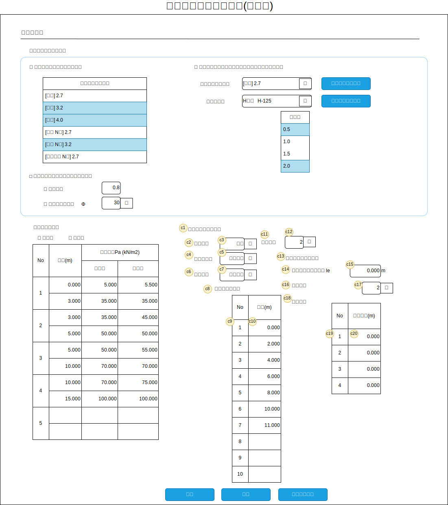{class=resizable height=480}

小判形支保工の設定 以外は外枠・支保工画面(円形)と同じ。

<table>
  <caption>外枠・支保工画面(小判形立坑)</caption>
  <thead>
    <tr>
      <th>No</th>
      <th>ラベル</th>
      <th>コントロール</th>
      <th>表示桁数</th>
      <th>文字揃え</th>
      <th>初期値</th>
      <th>説明</th>
    </tr>
  </thead>
  <tbody>
    <tr>
      <td>c1</td>
      <td>小判形支保工の設定</td>
      <td>label</td>
      <td>-</td>
      <td>-</td>
      <td>-</td>
      <td>コンテンツのタイトル</td>
    </tr>
    <tr>
      <td>c2</td>
      <td>縦梁鋼材</td>
      <td>label</td>
      <td>-</td>
      <td>左</td>
      <td>-</td>
      <td></td>
    </tr>
    <tr>
      <td>c3</td>
      <td>縦梁鋼材ドロップダウン</td>
      <td>dropdown</td>
      <td>-</td>
      <td>-</td>
      <td>リース材</td>
      <td>選択肢は以下の通り
        <ul class="horizontal">
          <li>生材</li>
          <li>リース材</li>
        </ul>
      </td>
    </tr>
    <tr>
      <td>c4</td>
      <td>腹起し鋼材</td>
      <td>label</td>
      <td>-</td>
      <td>左</td>
      <td>-</td>
      <td></td>
    </tr>
    <tr>
      <td>c5</td>
      <td>腹起し鋼材ドロップダウン</td>
      <td>dropdown</td>
      <td>-</td>
      <td>-</td>
      <td>使用しない</td>
      <td>縦梁と切梁の本数が同じでかつ芯ズレが0.000の時、disable。 
      選択肢は以下の通り
        <ul class="horizontal">
          <li>使用しない</li>
          <li>生材</li>
          <li>リース材</li>
        </ul>
      </td>
    </tr>
    <tr>
      <td>c6</td>
      <td>切梁鋼材</td>
      <td>label</td>
      <td>-</td>
      <td>左</td>
      <td>-</td>
      <td></td>
    </tr>
    <tr>
      <td>c7</td>
      <td>切梁鋼材ドロップダウン</td>
      <td>dropdown</td>
      <td>-</td>
      <td>-</td>
      <td>-</td>
      <td>選択肢は以下の通り
        <ul class="horizontal">
          <li>使用しない</li>
          <li>生材</li>
          <li>リース材</li>
        </ul>
      </td>
    </tr>
    <tr>
      <td>c8</td>
      <td>切梁深度の設定</td>
      <td></td>
      <td>-</td>
      <td>-</td>
      <td>-</td>
      <td></td>
    </tr>
    <tr>
      <td>c9</td>
      <td>行番号</td>
      <td></td>
      <td>-</td>
      <td>-</td>
      <td>-</td>
      <td>1-10</td>
    </tr>
    <tr>
      <td>c10</td>
      <td>深度</td>
      <td>number</td>
      <td>00.000</td>
      <td>右</td>
      <td>最終深度まで2.0間隔で初期設定する。 但し、立坑上面の深度が負の場合は0.000mから、正の場合は最も近い(0.5の倍数)mから開始する。</td>
      <td>制限　0.000から99.999</td>
    </tr>
    <tr>
      <td>c11</td>
      <td>縦梁本数</td>
      <td>label</td>
      <td>-</td>
      <td>-</td>
      <td>-</td>
      <td></td>
    </tr>
    <tr>
      <td>c12</td>
      <td>縦梁本数ドロップダウン</td>
      <td>dropdown</td>
      <td>-</td>
      <td>-</td>
      <td>2</td>
      <td>選択肢は以下の通り
        <ul class="horizontal">
          <li>2</li>
          <li>3</li>
          <li>4</li>
          <li>5</li>
          <li>6</li>
          <li>7</li>
        </ul>
      </td>
    </tr>
    <tr>
      <td>c13</td>
      <td>腹起し・切梁の設定</td>
      <td>label</td>
      <td>-</td>
      <td>-</td>
      <td>-</td>
      <td></td>
    </tr>
    <tr>
      <td>c14</td>
      <td>縦梁と切梁の芯ズレ le</td>
      <td>label</td>
      <td>-</td>
      <td>-</td>
      <td>-</td>
      <td></td>
    </tr>
    <tr>
      <td>c15</td>
      <td>縦梁と切梁の芯ズレ le 入力フィールド</td>
      <td>textfied</td>
      <td>-</td>
      <td>-</td>
      <td>0.000</td>
      <td></td>
    </tr>
    <tr>
      <td>c16</td>
      <td>切梁本数</td>
      <td>label</td>
      <td>-</td>
      <td>-</td>
      <td>-</td>
      <td></td>
    </tr>
    <tr>
      <td>c17</td>
      <td>切梁本数ドロップダウン</td>
      <td>dropdown</td>
      <td>-</td>
      <td>-</td>
      <td>2</td>
      <td>選択肢は以下の通り
        <ul class="horizontal">
          <li>2</li>
          <li>3</li>
          <li>4</li>
          <li>5</li>
        </ul>
      </td>
    </tr>
    <tr>
      <td>c18</td>
      <td>切梁間隔</td>
      <td></td>
      <td>-</td>
      <td>-</td>
      <td>立坑長径-立坑短径 + (2x芯ズレ) を等間隔で割った値</td>
      <td></td>
    </tr>
    <tr>
      <td>c19</td>
      <td>行番号</td>
      <td>text</td>
      <td>-</td>
      <td>-</td>
      <td>-</td>
      <td>1-4</td>
    </tr>
    <tr>
      <td>c20</td>
      <td>切梁間隔</td>
      <td>number</td>
      <td>0.00000</td>
      <td>右</td>
      <td>切梁本数の3本-5本が選択された場合に、芯ズレの値と切梁本数と小判形直線部の寸法と連動して等間隔で、少数3桁に四捨五入した値を表示。 但し、数値がまるめによって、合計値と合わない場合は、どれか減らして表示。</td>
      <td>制限　0.001から99.999だが、有効な間隔のみチェック 
          合計値=小判形直線部寸法＋芯ズレx2 
          合計値が切梁間隔の合計と一致
      </td>
    </tr>
  </tbody>
</table>

### カゴ枠計算結果画面

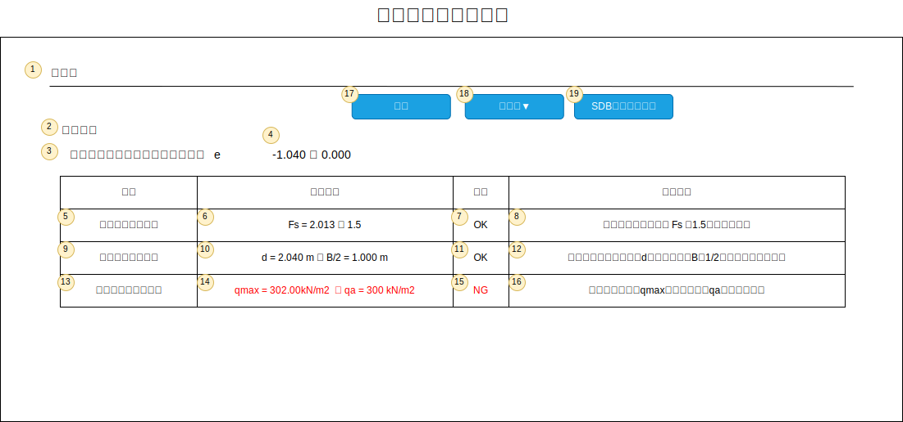{class=resizable height=400}

<table>
  <caption>カゴ枠計算結果画面</caption>
  <thead>
    <tr>
      <th>No</th>
      <th>ラベル</th>
      <th>コントロール</th>
      <th>表示桁数</th>
      <th>文字揃え</th>
      <th>初期値</th>
      <th>説明</th>
    </tr>
  </thead>
  <tbody>
    <tr>
      <td>1</td>
      <td>カゴ枠</td>
      <td>text</td>
      <td>-</td>
      <td>左</td>
      <td>-</td>
      <td>画面のタイトル</td>
    </tr>
    <tr>
      <td>2</td>
      <td>計算結果</td>
      <td>text</td>
      <td>-</td>
      <td>左</td>
      <td>-</td>
      <td></td>
    </tr>
    <tr>
      <td>3</td>
      <td>合力の基礎部中心からの偏心距離　e</td>
      <td>label</td>
      <td>-</td>
      <td>左</td>
      <td>-</td>
      <td></td>
    </tr>
    <tr>
      <td>4</td>
      <td>偏心距離</td>
      <td>text</td>
      <td>-</td>
      <td>-</td>
      <td>`reinforcement_cage_calc_results.eccentricity` ＜ 0.000 or
       `reinforcement_cage_calc_results.eccentricity` ≧ 0.000</td>
      <td>OKのときは ＜、NGのときは ≧</td>
    </tr>
    <tr>
      <td>5</td>
      <td>項目</td>
      <td>text</td>
      <td>-</td>
      <td>中央</td>
      <td>滑動に対する照査</td>
      <td>固定文字列を表示</td>
    </tr>
    <tr>
      <td>6</td>
      <td>計算結果</td>
      <td>text</td>
      <td>-</td>
      <td>中央</td>
      <td>Fs = [滑動] [判定文字] 1.5</td>
      <td>
        <dl>
          <dt>[滑動]</dt>
          <dd>`reinforcement_cage_calc_results.sliding_calc_value`</dd>
          <dt>[判定文字]</dt>
          <dd>OK のときは ≧、NG のときは ＜</dd>
        </dl>
      </td>
    </tr>
    <tr>
      <td>7</td>
      <td>判定</td>
      <td>text</td>
      <td>-</td>
      <td>中央</td>
      <td>`reinforcement_cage_calc_results.is_sliding_ok`</td>
      <td>NGの場合は文字を赤くする</td>
    </tr>
    <tr>
      <td>8</td>
      <td>判定条件</td>
      <td>text</td>
      <td>-</td>
      <td>中央</td>
      <td>滑動に対する安全率 Fs が1.5以上あること</td>
      <td>固定文字列を表示</td>
    </tr>
    <tr>
      <td>9</td>
      <td>項目</td>
      <td>text</td>
      <td>-</td>
      <td>中央</td>
      <td>転倒に対する照査</td>
      <td>固定文字列を表示</td>
    </tr>
    <tr>
      <td>10</td>
      <td>計算結果</td>
      <td>text</td>
      <td>-</td>
      <td>中央</td>
      <td>d = [転倒] m [判定文字] B/2 = [B/2した数値:計算] m</td>
      <td>
        <dl>
          <dt>[転倒]</dt>
          <dd>`reinforcement_cage_calc_results.overturning_calc_value`</dd>
          <dt>[判定文字]</dt>
          <dd>OK のときは ＞、NG のときは ≦</dd>
          <dt>[B/2した数値:計算]</dt>
          <dd>`reinforcement_cage_inputs.retaining_wall_width / 2`</dd>
        </dl>
      </td>
    </tr>
    <tr>
      <td>11</td>
      <td>判定</td>
      <td>text</td>
      <td>-</td>
      <td>中央</td>
      <td>`reinforcement_cage_calc_results.is_overturning_ok`</td>
      <td>NGの場合は文字を赤くする</td>
    </tr>
    <tr>
      <td>12</td>
      <td>判定条件</td>
      <td>text</td>
      <td>-</td>
      <td>中央</td>
      <td>荷重の剛力の作用位置dが擁壁底面幅Bの1/2より後方にあること</td>
      <td>固定文字列を表示</td>
    </tr>
    <tr>
      <td>13</td>
      <td>項目</td>
      <td>text</td>
      <td>-</td>
      <td>中央</td>
      <td>転倒に対する照査</td>
      <td>固定文字列を表示</td>
    </tr>
    <tr>
      <td>14</td>
      <td>計算結果</td>
      <td>text</td>
      <td>-</td>
      <td>中央</td>
      <td>qmax = [支持力] kN/m2 [判定文字] qa = [最大地盤反力度] kN/m2</td>
      <td>
        <dl>
          <dt>[支持力]</dt>
          <dd>`reinforcement_cage_calc_results.bearing_capacity_calc_value`</dd>
          <dt>[判定文字]</dt>
          <dd>OKのときは ≦、NGのときは ＞</dd>
          <dt>[最大地盤反力度]</dt>
          <dd>`reinforcement_cage_inputs.allowable_soil_bearing_capacity`</dd>
        </dl>
      </td>
    </tr>
    <tr>
      <td>15</td>
      <td>判定</td>
      <td>text</td>
      <td>-</td>
      <td>中央</td>
      <td>`reinforcement_cage_calc_results.is_bearing_capacity_ok`</td>
      <td>NGの場合は文字を赤くする</td>
    </tr>
    <tr>
      <td>16</td>
      <td>判定条件</td>
      <td>text</td>
      <td>-</td>
      <td>中央</td>
      <td>最大地盤反力度qmaxが許容支持力qa内であること</td>
      <td>固定文字列を表示</td>
    </tr>
    <tr>
      <td>17</td>
      <td>戻る</td>
      <td>link</td>
      <td>-</td>
      <td>-</td>
      <td>-</td>
      <td>カゴ枠情報入力画面に遷移する</td>
    </tr>
    <tr>
      <td>18</td>
      <td>計算書ボタン</td>
      <td>dropdown</td>
      <td>-</td>
      <td>-</td>
      <td>-</td>
      <td>クリックすると、設計計算書用のリンクが表示される。内容については計算結果画面上部メニューの計算書ボタンと同様</td>
    </tr>
    <tr>
      <td>19</td>
      <td>SDBアップロードボタン</td>
      <td>button</td>
      <td>-</td>
      <td>-</td>
      <td>-</td>
      <td>計算書をアップロードする</td>
    </tr>
  </tbody>
</table>

### ライナープレート計算結果画面

#### ライナープレート計算結果画面上部メニュー

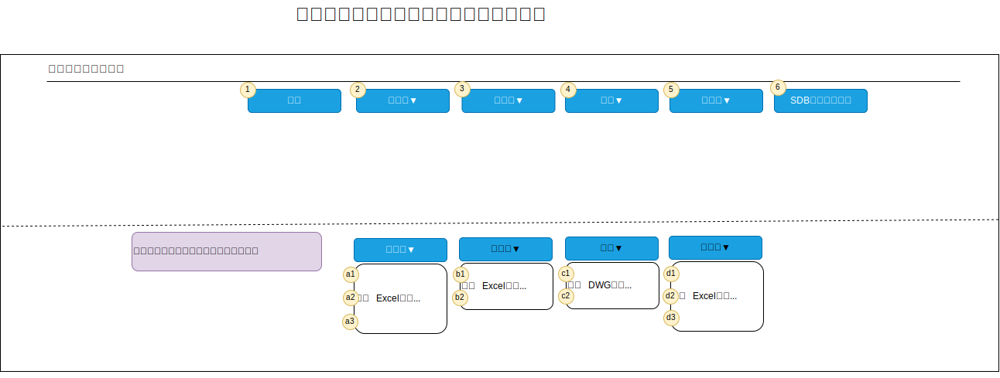{class=resizable height=480px}

<table>
  <caption>ライナープレート計算結果画面上部メニュー</caption>
  <thead>
    <tr>
      <th>No</th>
      <th>ラベル</th>
      <th>コントロール</th>
      <th>表示桁数</th>
      <th>文字揃え</th>
      <th>初期値</th>
      <th>説明</th>
    </tr>
  </thead>
  <tbody>
    <tr>
      <td>1</td>
      <td>戻る</td>
      <td>link</td>
      <td>-</td>
      <td>-</td>
      <td>-</td>
      <td>外枠・支保工画面に遷移する</td>
    </tr>
    <tr>
      <td>2</td>
      <td>計算書ボタン</td>
      <td>dropdown</td>
      <td>-</td>
      <td>-</td>
      <td>-</td>
      <td>クリックすると設計計算書の出力に関わるメニューリンクが表示される</td>
    </tr>
    <tr>
      <td>3</td>
      <td>材料表ボタン</td>
      <td>dropdown</td>
      <td>-</td>
      <td>-</td>
      <td>-</td>
      <td>クリックすると材料表の出力に関わるメニューリンクが表示される</td>
    </tr>
    <tr>
      <td>4</td>
      <td>図面ボタン</td>
      <td>dropdown</td>
      <td>-</td>
      <td>-</td>
      <td>-</td>
      <td>クリックすると図面の出力に関わるメニューリンクが表示される</td>
    </tr>
    <tr>
      <td>5</td>
      <td>見積書ボタン</td>
      <td>dropdown</td>
      <td>-</td>
      <td>-</td>
      <td>-</td>
      <td>クリックすると見積書の出力に関わるメニューリンクが表示される</td>
    </tr>
    <tr>
      <td>6</td>
      <td>SDBアップロードボタン</td>
      <td>button</td>
      <td>-</td>
      <td>-</td>
      <td>-</td>
      <td>計算書・見積書・材料表・図面をアップロードする</td>
    </tr>
    <tr>
      <td>a1</td>
      <td>設定リンク</td>
      <td>link</td>
      <td>-</td>
      <td>-</td>
      <td>-</td>
      <td>設計計算書情報入力画面へ遷移する</td>
    </tr>
    <tr>
      <td>a2</td>
      <td>Excel出力リンク</td>
      <td>link</td>
      <td>-</td>
      <td>-</td>
      <td>-</td>
      <td>設計計算書をExcel形式でダウンロード</td>
    </tr>
    <tr>
      <td>d3</td>
      <td>PDF出力リンク</td>
      <td>link</td>
      <td>-</td>
      <td>-</td>
      <td>-</td>
      <td>設計計算書をPDF形式でダウンロード</td>
    </tr>
    <tr>
      <td>b1</td>
      <td>設定リンク</td>
      <td>link</td>
      <td>-</td>
      <td>-</td>
      <td>-</td>
      <td>材料・図面情報入力画面へ遷移する</td>
    </tr>
    <tr>
      <td>b2</td>
      <td>Excel出力ボタン</td>
      <td>link</td>
      <td>-</td>
      <td>-</td>
      <td>-</td>
      <td>材料表をExcel形式でダウンロード</td>
    </tr>
    <tr>
      <td>c1</td>
      <td>設定リンク</td>
      <td>link</td>
      <td>-</td>
      <td>-</td>
      <td>-</td>
      <td>材料・図面情報入力画面へ遷移する</td>
    </tr>
    <tr>
      <td>c2</td>
      <td>DWG出力ボタン</td>
      <td>link</td>
      <td>-</td>
      <td>-</td>
      <td>-</td>
      <td>図面をDWG形式でダウンロード</td>
    </tr>
    <tr>
      <td>d1</td>
      <td>設定リンク</td>
      <td>link</td>
      <td>-</td>
      <td>-</td>
      <td>-</td>
      <td>見積書入力へ遷移する</td>
    </tr>
    <tr>
      <td>d2</td>
      <td>Excel出力リンク</td>
      <td>link</td>
      <td>-</td>
      <td>-</td>
      <td>-</td>
      <td>見積書をExcel形式でダウンロード</td>
    </tr>
    <tr>
      <td>d3</td>
      <td>PDF出力リンク</td>
      <td>link</td>
      <td>-</td>
      <td>-</td>
      <td>-</td>
      <td>見積書をPDF形式でダウンロード</td>
    </tr>
  </tbody>
</table>

#### ライナープレート計算結果画面(円形立坑)

{class=resizable height=480px}

<table>
  <caption>ライナープレート計算結果画面(円形立坑)</caption>
  <thead>
    <tr>
      <th>No</th>
      <th>ラベル</th>
      <th>コントロール</th>
      <th>表示桁数</th>
      <th>文字揃え</th>
      <th>初期値</th>
      <th>説明</th>
    </tr>
  </thead>
  <tbody>
    <tr>
      <td>1</td>
      <td>計算結果-円形立坑</td>
      <td></td>
      <td>-</td>
      <td>-</td>
      <td>-</td>
      <td></td>
    </tr>
    <tr>
      <td>2</td>
      <td>一番上へ戻るリンク</td>
      <td>link</td>
      <td>-</td>
      <td>-</td>
      <td>-</td>
      <td>クリックすると画面が一番上へスクロールする</td>
    </tr>
    <tr>
      <td>a1</td>
      <td>外枠</td>
      <td>label</td>
      <td>-</td>
      <td>-</td>
      <td>-</td>
      <td></td>
    </tr>
    <tr>
      <td>a2</td>
      <td>手動計算</td>
      <td>button</td>
      <td>-</td>
      <td>-</td>
      <td>-</td>
      <td>外枠の手動計算画面をダイアログとして表示する</td>
    </tr>
    <tr>
      <td>a3</td>
      <td>No</td>
      <td>number</td>
      <td>-</td>
      <td>右</td>
      <td>-</td>
      <td>行番号を表示</td>
    </tr>
    <tr>
      <td>a4</td>
      <td>深度(m)</td>
      <td>number</td>
      <td>00.000</td>
      <td>-</td>
      <td>`circular_outer_frame_calc_results.depth`</td>
      <td></td>
    </tr>
    <tr>
      <td>a5</td>
      <td>板厚</td>
      <td>number</td>
      <td>0.0</td>
      <td>右</td>
      <td>`circular_outer_frame_calc_results.liner_plate_calc_masters.thickness`</td>
      <td></td>
    </tr>
    <tr>
      <td>a6</td>
      <td>補強リング-鋼材名</td>
      <td>text</td>
      <td>-</td>
      <td>左</td>
      <td>`circular_outer_frame_calc_results.h_beam_calc_masters.name`</td>
      <td></td>
    </tr>
    <tr>
      <td>a7</td>
      <td>補強リング-呼称</td>
      <td>text</td>
      <td>-</td>
      <td>左</td>
      <td>"H-" + `circular_outer_frame_calc_results.h_beam_calc_masters.height`</td>
      <td></td>
    </tr>
    <tr>
      <td>a8</td>
      <td>補強リング-間隔(m)</td>
      <td>number</td>
      <td>0.0-</td>
      <td>右</td>
      <td>`circular_outer_frame_calc_results.reinforcing_ring_pitch`</td>
      <td></td>
    </tr>
    <tr>
      <td>a09</td>
      <td>座屈結果</td>
      <td>text</td>
      <td></td>
      <td>中央</td>
      <td>
        <ul>
          <li>OKの場合</li>
          <ul>
            <li>`circular_outer_frame_calc_results.allowable_external_pressure`  ≦ `circular_outer_frame_calc_results.design_lateral_pressure` + (OK)</li>
          </ul>
          <li>NGの場合</li>
          <ul>
            <li>`circular_outer_frame_calc_results.allowable_external_pressure` > `circular_outer_frame_calc_results.design_lateral_pressure` + (NG)</li>
          </ul>
        </ul>
      </td>
      <td>判定結果NGの場合は文字を赤くする</td>
    </tr>
    <tr>
      <td>a10</td>
      <td>曲げ圧縮力結果-ライナープレート判定</td>
      <td>text</td>
      <td></td>
      <td>中央</td>
      <td>
        <ul>
        <li>OKの場合</li>
          <ul>
          <li>`circular_outer_frame_calc_results.lp_induced_stress`  ≦ `circular_outer_frame_calc_results.lp_allowable_stress` + (OK)</li>
          </ul>
        <li>NGの場合</li>
          <ul>
          <li>`circular_outer_frame_calc_results.lp_induced_stress` > `circular_outer_frame_calc_results.lp_allowable_stress` + (NG)</li>
          </ul>
        </ul>
       </td>
      <td>判定結果NGの場合は文字を赤くする</td>
    </tr>
    <tr>
      <td>a11</td>
      <td>曲げ圧縮力結果-補強リング判定</td>
      <td>text</td>
      <td></td>
      <td>中央</td>
      <td>
        <ul>
          <li>OKの場合</li>
          <ul>
            <li>`circular_outer_frame_calc_results.reinforcing_ring_induced_stress`  ≦ `circular_outer_frame_calc_results.reinforcing_ring_allowable_stress` + (OK)</li>
          </ul>
          <li>NGの場合</li>
            <ul>
            <li>`circular_outer_frame_calc_results.reinforcing_ring_induced_stress` > `circular_outer_frame_calc_results.reinforcing_ring_allowable_stress` + (NG)</li>
            </ul>
        </ul>
      </td>
      <td>判定結果NGの場合は文字を赤くする</td>
    </tr>
    <tr>
      <td>b1</td>
      <td>形状図</td>
      <td>label</td>
      <td>-</td>
      <td>左</td>
      <td>-</td>
      <td></td>
    </tr>
    <tr>
      <td>b2</td>
      <td>形状図</td>
      <td>image</td>
      <td>-</td>
      <td>-</td>
      <td>-</td>
      <td>画像クリックで、形状図画面をダイアログとして表示する</td>
    </tr>
  </tbody>
</table>

#### ライナープレート計算結果画面(矩形立坑)

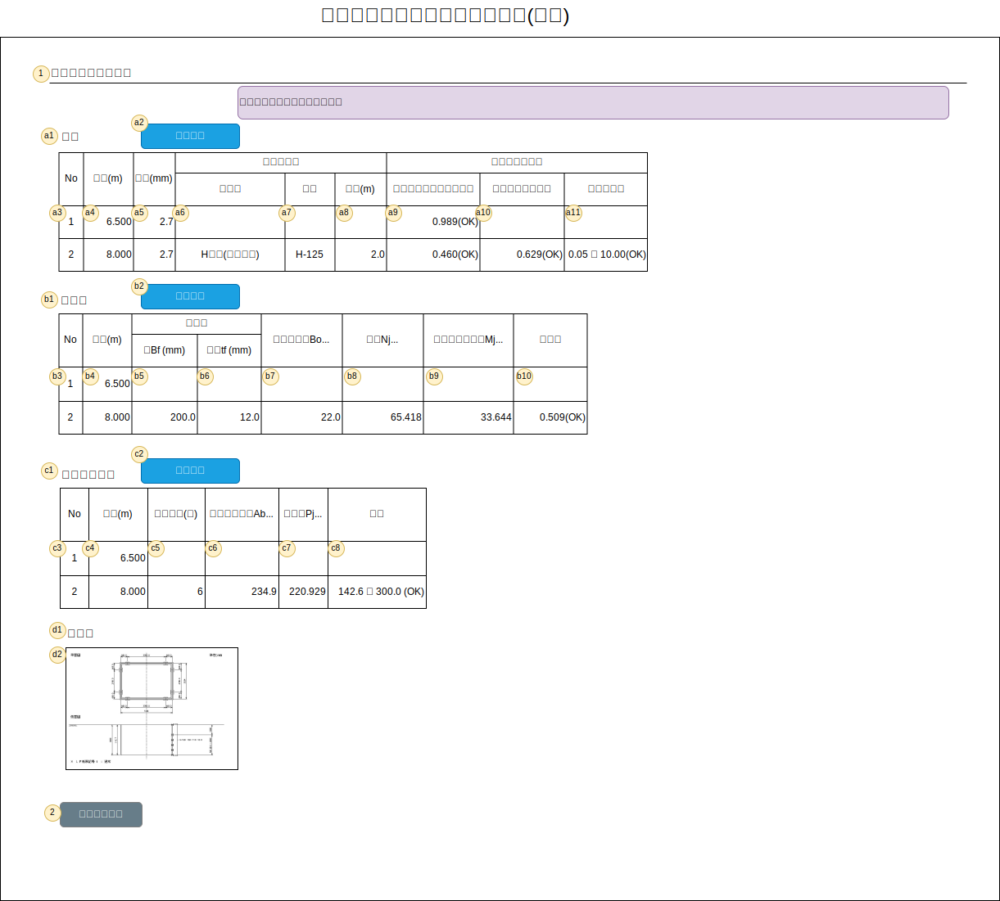{class=resizable height=600px}
<table>
  <caption>ライナープレート計算結果画面(矩形立坑)</caption>
  <thead>
    <tr>
      <th>No</th>
      <th>ラベル</th>
      <th>コントロール</th>
      <th>表示桁数</th>
      <th>文字揃え</th>
      <th>初期値</th>
      <th>説明</th>
    </tr>
  </thead>
  <tbody>
    <tr>
      <td>1</td>
      <td>計算結果-矩形立坑</td>
      <td></td>
      <td>-</td>
      <td>-</td>
      <td>-</td>
      <td></td>
    </tr>
    <tr>
      <td>2</td>
      <td>一番上へ戻るリンク</td>
      <td>link</td>
      <td>-</td>
      <td>-</td>
      <td>-</td>
      <td>クリックすると画面が一番上へスクロールする</td>
    </tr>
    <tr>
      <td>a1</td>
      <td>外枠</td>
      <td>label</td>
      <td>-</td>
      <td>-</td>
      <td>-</td>
      <td></td>
    </tr>
    <tr>
      <td>a2</td>
      <td>手動計算</td>
      <td>button</td>
      <td>-</td>
      <td>-</td>
      <td>-</td>
      <td>外枠の手動計算画面をダイアログとして表示する</td>
    </tr>
    <tr>
      <td>a3</td>
      <td>No</td>
      <td>number</td>
      <td>-</td>
      <td>右</td>
      <td>-</td>
      <td>行番号を表示</td>
    </tr>
    <tr>
      <td>a4</td>
      <td>深度(m)</td>
      <td>number</td>
      <td>00.000</td>
      <td>右</td>
      <td>`rectangle_outer_frame_calc_results.depth`</td>
      <td></td>
    </tr>
    <tr>
      <td>a5</td>
      <td>板厚</td>
      <td>number</td>
      <td>0.0</td>
      <td>右</td>
      <td>`circular_outer_frame_calc_results.liner_plate_calc_masters.thickness`</td>
      <td></td>
    </tr>
    <tr>
      <td>a6</td>
      <td>補強リング-鋼材名</td>
      <td>text</td>
      <td>-</td>
      <td>左</td>
      <td>`rectangle_outer_frame_calc_results.h_beam_calc_masters.name`</td>
      <td></td>
    </tr>
    <tr>
      <td>a7</td>
      <td>補強リング-呼称</td>
      <td>text</td>
      <td>-</td>
      <td>左</td>
      <td>"H-" + `rectangle_outer_frame_calc_results.h_beam_calc_masters.height`</td>
      <td></td>
    </tr>
    <tr>
      <td>a8</td>
      <td>補強リング-間隔(m)</td>
      <td>number</td>
      <td>0.0-</td>
      <td>右</td>
      <td>`rectangle_outer_frame_calc_results.reinforcing_ring_pitch`</td>
      <td></td>
    </tr>
    <tr>
      <td>a9</td>
      <td>曲げ圧縮力結果-ライナープレート判定値</td>
      <td>text</td>
      <td>00.000(結果)</td>
      <td>右</td>
      <td>`circular_outer_frame_calc_results.lp_bending_compressive_force_check_value`  + "(" `circular_outer_frame_calc_results.is_lp_bending_compressive_force_check` ")"</td>
      <td>判定結果NGの場合は文字を赤くする</td>
    </tr>
    <tr>
      <td>a10</td>
      <td>曲げ圧縮力結果-補強リング判定値</td>
      <td>text</td>
      <td>00.000(結果)</td>
      <td>右</td>
      <td>`circular_outer_frame_calc_results.reinforcing_ring_bending_compressive_force_check_value`  + "(" `circular_outer_frame_calc_results.is_reinforcing_ring_bending_compressive_force_check_ok` ")"</td>
      <td>判定結果NGの場合は文字を赤くする</td>
    </tr>
    <tr>
      <td>a11</td>
      <td>曲げ圧縮力結果-たわみ判定値</td>
      <td>text</td>
      <td></td>
      <td>中央</td>
      <td>
        <ul>
        <li>OKの場合</li>
          <ul><li>`rectangle_outer_frame_calc_results.deflection`  ≦ `rectangle_outer_frame_calc_results.allowable_deflection` + (OK)</li></ul>
        <li>NGの場合</li>
          <ul><li>``rectangle_outer_frame_calc_results.deflection` > `rectangle_outer_frame_calc_results.allowable_deflection` + (NG)</li></ul>
        </ul>
      </td>
      <td>判定結果NGの場合は文字を赤くする</td>
    </tr>
    <tr>
      <td>b1</td>
      <td>継手板</td>
      <td>label</td>
      <td>-</td>
      <td></td>
      <td>-</td>
      <td></td>
    </tr>
    <tr>
      <td>b2</td>
      <td>手動計算</td>
      <td>button</td>
      <td>-</td>
      <td>-</td>
      <td>-</td>
      <td>継手板の手動計算画面をダイアログとして表示する</td>
    </tr>
    <tr>
      <td>b3</td>
      <td>No</td>
      <td>number</td>
      <td>-</td>
      <td>右</td>
      <td>-</td>
      <td>行番号を表示</td>
    </tr>
    <tr>
      <td>b4</td>
      <td>深度</td>
      <td>number</td>
      <td>00.000</td>
      <td>右</td>
      <td>`rectangle_outer_frame_calc_results.depth`</td>
      <td></td>
    </tr>
    <tr>
      <td>b5</td>
      <td>継手板-幅 Bf(mm)</td>
      <td>number</td>
      <td>00.000</td>
      <td>右</td>
      <td>`rectangle_outer_frame_calc_results.splice_plate_width`</td>
      <td></td>
    </tr>
    <tr>
      <td>b6</td>
      <td>継手板-板厚 tf(mm)</td>
      <td>number</td>
      <td>00.000</td>
      <td>右</td>
      <td>`rectangle_outer_frame_calc_results.splice_plate_thickness`</td>
      <td></td>
    </tr>
    <tr>
      <td>b7</td>
      <td>ボルト孔径 Bo (mm)</td>
      <td>number</td>
      <td>00.000</td>
      <td>右</td>
      <td>`rectangle_outer_frame_calc_results.`</td>
      <td></td>
    </tr>
    <tr>
      <td>b8</td>
      <td>軸力 Nj (KN)</td>
      <td>number</td>
      <td>00.000</td>
      <td>右</td>
      <td>`rectangle_outer_frame_calc_results.splice_plate_axial_force`</td>
      <td></td>
    </tr>
    <tr>
      <td>b9</td>
      <td>曲げモーメント Mj (kN･m)</td>
      <td>number</td>
      <td>00.000</td>
      <td>右</td>
      <td>`rectangle_outer_frame_calc_results.splice_plate_bending_moment`</td>
      <td></td>
    </tr>
    <tr>
      <td>b10</td>
      <td>判定値</td>
      <td>text</td>
      <td>00.000(結果)</td>
      <td>右</td>
      <td>`rectangle_outer_frame_calc_results.splice_plate_check_value`  + "(" `rectangle_outer_frame_calc_results.is_splice_plate_check_ok` ")"</td>
      <td></td>
    </tr>
    <tr>
      <td>c1</td>
      <td>継手用ボルト</td>
      <td>text</td>
      <td>-</td>
      <td>左</td>
      <td>-</td>
      <td></td>
    </tr>
    <tr>
      <td>c2</td>
      <td>手動計算</td>
      <td>button</td>
      <td>-</td>
      <td>-</td>
      <td>-</td>
      <td>外枠の手動計算画面をダイアログとして表示する</td>
    </tr>
    <tr>
      <td>c3</td>
      <td>No</td>
      <td>number</td>
      <td>右</td>
      <td></td>
      <td>-</td>
      <td>行番号を表示</td>
    </tr>
    <tr>
      <td>c4</td>
      <td>深度 (m)</td>
      <td>number</td>
      <td>00.000</td>
      <td>右</td>
      <td>`rectangle_outer_frame_calc_results.depth`</td>
      <td></td>
    </tr>
    <tr>
      <td>c5</td>
      <td>片側本数 (本)</td>
      <td>number</td>
      <td>0</td>
      <td>右</td>
      <td>`rectangle_outer_frame_calc_results.number_of_bolts_per_side`</td>
      <td></td>
    </tr>
    <tr>
      <td>c6</td>
      <td>ねじ谷断面積 Ab (mm2/本)</td>
      <td>number</td>
      <td>00.0</td>
      <td>右</td>
      <td>`rectangle_outer_frame_calc_results.thread_root_cross_sectional_area`</td>
      <td></td>
    </tr>
    <tr>
      <td>c7</td>
      <td>作用力 Pj (kN)</td>
      <td>number</td>
      <td>00.000</td>
      <td>右</td>
      <td>`rectangle_outer_frame_calc_results.joint_bolt_applied_force`</td>
      <td></td>
    </tr>
    <tr>
      <td>c10</td>
      <td>判定値</td>
      <td>text</td>
      <td></td>
      <td>中央</td>
      <td>
        <ul>
        <li>OKの場合</li>
          <ul>
            <li>`rectangle_outer_frame_calc_results.joint_bolt_induced_shear_stress` ≦ `rectangle_outer_frame_calc_results.joint_bolt_allowable_shear_stress` + (OK)</li>
          </ul>
        <li>NGの場合</li>
          <ul>
            <li>`rectangle_outer_frame_calc_results.joint_bolt_induced_shear_stress` > `rectangle_outer_frame_calc_results.joint_bolt_allowable_shear_stress` + (NG)</li>
          </ul>
        </li>
      </td>
      <td>判定結果NGの場合は文字を赤くする</td>
    </tr>
    <tr>
      <td>d1</td>
      <td>形状図</td>
      <td>label</td>
      <td>-</td>
      <td>左</td>
      <td>-</td>
      <td></td>
    </tr>
    <tr>
      <td>d2</td>
      <td>形状図</td>
      <td>image</td>
      <td>-</td>
      <td>-</td>
      <td>-</td>
      <td>画像クリックで、形状図画面をダイアログとして表示する</td>
    </tr>
  </tbody>
</table>

#### ライナープレート計算結果画面(矩形支保工立坑)

##### 計算待ちのとき

{class=resizable height=600px}

<table>
  <caption>計算待ち画面</caption>
  <thead>
    <tr>
      <th>No</th>
      <th>ラベル</th>
      <th>コントロール</th>
      <th>表示桁数</th>
      <th>文字揃え</th>
      <th>初期値</th>
      <th>説明</th>
    </tr>
  </thead>
  <tbody>
    <tr>
      <td>1</td>
      <td>説明</td>
      <td>text</td>
      <td>-</td>
      <td>-</td>
      <td>-</td>
      <td>計算待ちである事の説明を記載</td>
    </tr>
  </tbody>
</table>

##### 計算が完了しているとき

{class=resizable height=600px}

<table>
  <caption>ライナープレート計算結果画面(矩形支保工立坑)</caption>
  <thead>
    <tr>
      <th>No</th>
      <th>ラベル</th>
      <th>コントロール</th>
      <th>表示桁数</th>
      <th>文字揃え</th>
      <th>初期値</th>
      <th>説明</th>
    </tr>
  </thead>
  <tbody>
    <tr>
      <td>1</td>
      <td>計算結果-矩形支保工立坑</td>
      <td></td>
      <td>-</td>
      <td>-</td>
      <td>-</td>
      <td></td>
    </tr>
    <tr>
      <td>2</td>
      <td>一番上へ戻るリンク</td>
      <td>link</td>
      <td>-</td>
      <td>-</td>
      <td>-</td>
      <td>クリックすると画面が一番上へスクロールする</td>
    </tr>
    <tr>
      <td>a1</td>
      <td>外枠</td>
      <td>label</td>
      <td>-</td>
      <td>-</td>
      <td>-</td>
      <td></td>
    </tr>
    <tr>
      <td>a2</td>
      <td>手動計算</td>
      <td>button</td>
      <td>-</td>
      <td>-</td>
      <td>-</td>
      <td>外枠の手動計算画面をダイアログとして表示する</td>
    </tr>
    <tr>
      <td>a3</td>
      <td>No</td>
      <td>number</td>
      <td>-</td>
      <td>右</td>
      <td>-</td>
      <td>行番号を表示</td>
    </tr>
    <tr>
      <td>a4</td>
      <td>深度(m)</td>
      <td>number</td>
      <td>00.000</td>
      <td>右</td>
      <td>`rectangle_outer_frame_calc_results.depth`</td>
      <td></td>
    </tr>
    <tr>
      <td>a5</td>
      <td>板厚</td>
      <td>number</td>
      <td>0.0</td>
      <td>右</td>
      <td>`rectangle_outer_frame_calc_results.liner_plate_calc_masters.thickness`</td>
      <td></td>
    </tr>
    <tr>
      <td>a6</td>
      <td>補強リング-鋼材名</td>
      <td>text</td>
      <td>-</td>
      <td>左</td>
      <td>`rectangle_outer_frame_calc_results.h_beam_calc_masters.name`</td>
      <td></td>
    </tr>
    <tr>
      <td>a7</td>
      <td>補強リング-呼称</td>
      <td>text</td>
      <td>-</td>
      <td>左</td>
      <td>"H-" + `rectangle_outer_frame_calc_results.h_beam_calc_masters.height`</td>
      <td></td>
    </tr>
    <tr>
      <td>a8</td>
      <td>補強リング-間隔(m)</td>
      <td>number</td>
      <td>0.0-</td>
      <td>右</td>
      <td>`rectangle_outer_frame_calc_results.reinforcing_ring_pitch`</td>
      <td></td>
    </tr>
    <tr>
      <td>a9</td>
      <td>曲げ圧縮力結果-ライナープレート判定値</td>
      <td>text</td>
      <td>00.000(結果)</td>
      <td>右</td>
      <td>`rectangle_outer_frame_calc_results.lp_bending_compressive_force_check_value`  + "(" `rectangle_outer_frame_calc_results.is_lp_bending_compressive_force_check` ")"</td>
      <td>判定結果NGの場合は文字を赤くする</td>
    </tr>
    <tr>
      <td>a10</td>
      <td>曲げ圧縮力結果-補強リング判定値</td>
      <td>text</td>
      <td>00.000(結果)</td>
      <td>右</td>
      <td>`rectangle_outer_frame_calc_results.reinforcing_ring_bending_compressive_force_check_value`  + "(" `rectangle_outer_frame_calc_results.is_reinforcing_ring_bending_compressive_force_check_ok` ")"</td>
      <td>判定結果NGの場合は文字を赤くする</td>
    </tr>
    <tr>
      <td>a11</td>
      <td>曲げ圧縮力結果-たわみ判定値</td>
      <td>text</td>
      <td></td>
      <td>中央</td>
      <td>
        <ul>
        <li>OKの場合</li>
          <ul><li>`rectangle_outer_frame_calc_results.deflection`  ≦ `rectangle_outer_frame_calc_results.allowable_deflection` + (OK)</li></ul>
        <li>NGの場合</li>
          <ul><li>``rectangle_outer_frame_calc_results.deflection` > `rectangle_outer_frame_calc_results.allowable_deflection` + (NG)</li></ul>
        </ul>
      </td>
      <td>判定結果NGの場合は文字を赤くする</td>
    </tr>
    <tr>
      <td>b1</td>
      <td>継手板</td>
      <td>label</td>
      <td>-</td>
      <td></td>
      <td>-</td>
      <td></td>
    </tr>
    <tr>
      <td>b2</td>
      <td>手動計算</td>
      <td>button</td>
      <td>-</td>
      <td>-</td>
      <td>-</td>
      <td>継手板の手動計算画面をダイアログとして表示する</td>
    </tr>
    <tr>
      <td>b3</td>
      <td>No</td>
      <td>number</td>
      <td>-</td>
      <td>右</td>
      <td>-</td>
      <td>行番号を表示</td>
    </tr>
    <tr>
      <td>b4</td>
      <td>深度</td>
      <td>number</td>
      <td>00.000</td>
      <td>右</td>
      <td>`rectangle_outer_frame_calc_results.depth`</td>
      <td></td>
    </tr>
    <tr>
      <td>b5</td>
      <td>継手板-幅 Bf(mm)</td>
      <td>number</td>
      <td>00.000</td>
      <td>右</td>
      <td>`rectangle_outer_frame_calc_results.splice_plate_width`</td>
      <td></td>
    </tr>
    <tr>
      <td>b6</td>
      <td>継手板-板厚 tf(mm)</td>
      <td>number</td>
      <td>00.000</td>
      <td>右</td>
      <td>`rectangle_outer_frame_calc_results.splice_plate_thickness`</td>
      <td></td>
    </tr>
    <tr>
      <td>b7</td>
      <td>ボルト孔径 Bo (mm)</td>
      <td>number</td>
      <td>00.000</td>
      <td>右</td>
      <td>`rectangle_outer_frame_calc_results.`</td>
      <td></td>
    </tr>
    <tr>
      <td>b8</td>
      <td>軸力 Nj (KN)</td>
      <td>number</td>
      <td>00.000</td>
      <td>右</td>
      <td>`rectangle_outer_frame_calc_results.splice_plate_axial_force`</td>
      <td></td>
    </tr>
    <tr>
      <td>b9</td>
      <td>曲げモーメント Mj (kN･m)</td>
      <td>number</td>
      <td>00.000</td>
      <td>右</td>
      <td>`rectangle_outer_frame_calc_results.splice_plate_bending_moment`</td>
      <td></td>
    </tr>
    <tr>
      <td>b10</td>
      <td>判定値</td>
      <td>text</td>
      <td>00.000(結果)</td>
      <td>右</td>
      <td>`rectangle_outer_frame_calc_results.splice_plate_check_value`  + "(" `rectangle_outer_frame_calc_results.is_splice_plate_check_ok` ")"</td>
      <td></td>
    </tr>
    <tr>
      <td>c1</td>
      <td>継手用ボルト</td>
      <td>text</td>
      <td>-</td>
      <td>左</td>
      <td>-</td>
      <td></td>
    </tr>
    <tr>
      <td>c2</td>
      <td>手動計算</td>
      <td>button</td>
      <td>-</td>
      <td>-</td>
      <td>-</td>
      <td>外枠の手動計算画面をダイアログとして表示する</td>
    </tr>
    <tr>
      <td>c3</td>
      <td>No</td>
      <td>number</td>
      <td>右</td>
      <td></td>
      <td>-</td>
      <td>行番号を表示</td>
    </tr>
    <tr>
      <td>c4</td>
      <td>深度 (m)</td>
      <td>number</td>
      <td>00.000</td>
      <td>右</td>
      <td>`rectangle_outer_frame_calc_results.depth`</td>
      <td></td>
    </tr>
    <tr>
      <td>c5</td>
      <td>片側本数 (本)</td>
      <td>number</td>
      <td>0</td>
      <td>右</td>
      <td>`rectangle_outer_frame_calc_results.number_of_bolts_per_side`</td>
      <td></td>
    </tr>
    <tr>
      <td>c6</td>
      <td>ねじ谷断面積 Ab (mm2/本)</td>
      <td>number</td>
      <td>00.0</td>
      <td>右</td>
      <td>`rectangle_outer_frame_calc_results.thread_root_cross_sectional_area`</td>
      <td></td>
    </tr>
    <tr>
      <td>c7</td>
      <td>作用力 Pj (kN)</td>
      <td>number</td>
      <td>00.000</td>
      <td>右</td>
      <td>`rectangle_outer_frame_calc_results.joint_bolt_applied_force`</td>
      <td></td>
    </tr>
    <tr>
      <td>c10</td>
      <td>判定値</td>
      <td>text</td>
      <td></td>
      <td>中央</td>
      <td>
        <ul>
        <li>OKの場合</li>
          <ul>
            <li>`rectangle_outer_frame_calc_results.joint_bolt_induced_shear_stress` ≦ `rectangle_outer_frame_calc_results.joint_bolt_allowable_shear_stress` + (OK)</li>
          </ul>
        <li>NGの場合</li>
          <ul>
            <li>`rectangle_outer_frame_calc_results.joint_bolt_induced_shear_stress` > `rectangle_outer_frame_calc_results.joint_bolt_allowable_shear_stress` + (NG)</li>
          </ul>
        </li>
      </td>
      <td>判定結果NGの場合は文字を赤くする</td>
    </tr>
    <tr>
      <td>d1</td>
      <td>縦梁</td>
      <td>label</td>
      <td>-</td>
      <td>左</td>
      <td>-</td>
      <td></td>
    </tr>
    <tr>
      <td>d2</td>
      <td>手動計算</td>
      <td>button</td>
      <td>-</td>
      <td>-</td>
      <td>-</td>
      <td>縦梁の手動計算画面をダイアログとして表示する</td>
    </tr>
    <tr>
      <td>d3</td>
      <td>No</td>
      <td>number</td>
      <td>-</td>
      <td>右</td>
      <td>-</td>
      <td>行番号を表示</td>
    </tr>
    <tr>
      <td>d4</td>
      <td>補強リング-鋼材名</td>
      <td>text</td>
      <td>-</td>
      <td>左</td>
      <td>`vertical_beam_calc_results.h_beam_calc_masters.name`</td>
      <td></td>
    </tr>
    <tr>
      <td>d5</td>
      <td>補強リング-呼称</td>
      <td>text</td>
      <td>-</td>
      <td>左</td>
      <td>"H-" + `vertical_beam_calc_results.h_beam_calc_masters.height`</td>
      <td></td>
    </tr>
    <tr>
      <td>d6</td>
      <td>支点反力 RSmax (KN)</td>
      <td>number</td>
      <td>00.000</td>
      <td>右</td>
      <td>`vertical_beam_calc_results.support_reaction`</td>
      <td></td>
    </tr>
    <tr>
      <td>d7</td>
      <td>曲げモーメント MSmax (kN･m)</td>
      <td>number</td>
      <td>00.000</td>
      <td>右</td>
      <td>`vertical_beam_calc_results.bending_moment`</td>
      <td></td>
    </tr>
    <tr>
      <td>d8</td>
      <td>判定</td>
      <td>text</td>
      <td></td>
      <td>中央</td>
      <td>
        <ul>
          <li>OKの場合</li>
          <ul>
            <li>`vertical_beam_calc_results.induced_stress` ≦ `vertical_beam_calc_results.allowable_stress` + (OK)</li>
          </ul>
          <li>NGの場合</li>
          <ul>
            <li>`vertical_beam_calc_results.induced_stress` > `vertical_beam_calc_results.allowable_stress` + (NG)</li>
          </ul>
        </ul>
      </td>
      <td>判定結果NGの場合は文字を赤くする</td>
    </tr>
    <tr>
      <td>e1</td>
      <td>切梁</td>
      <td>label</td>
      <td>-</td>
      <td>左</td>
      <td>-</td>
      <td></td>
    </tr>
    <tr>
      <td>e2</td>
      <td>手動計算</td>
      <td>button</td>
      <td>-</td>
      <td>-</td>
      <td>-</td>
      <td>支保工の手動計算画面をダイアログとして表示する</td>
    </tr>
    <tr>
      <td>e3</td>
      <td>No</td>
      <td>number</td>
      <td>-</td>
      <td>右</td>
      <td>-</td>
      <td>行番号を表示</td>
    </tr>
    <tr>
      <td>e4</td>
      <td>深度(m)</td>
      <td>number</td>
      <td>00.000</td>
      <td>右</td>
      <td>`strut_calc_results.depth`</td>
      <td></td>
    </tr>
    <tr>
      <td>e5</td>
      <td>補強リング-鋼材名</td>
      <td>text</td>
      <td>-</td>
      <td>左</td>
      <td>`strut_calc_results.h_beam_calc_masters.name`</td>
      <td></td>
    </tr>
    <tr>
      <td>e6</td>
      <td>補強リング-呼称</td>
      <td>text</td>
      <td>-</td>
      <td>左</td>
      <td>"H-" + `strut_calc_results.h_beam_calc_masters.height`</td>
      <td></td>
    </tr>
    <tr>
      <td>e7</td>
      <td>本数 (本)</td>
      <td>number</td>
      <td>00</td>
      <td>右</td>
      <td>`strut_calc_results.quantity`</td>
      <td></td>
    </tr>
    <tr>
      <td>e8</td>
      <td>軸力 Ns (KN)</td>
      <td>number</td>
      <td>00.000</td>
      <td>右</td>
      <td>`strut_calc_results.axial_force`</td>
      <td></td>
    </tr>
    <tr>
      <td>e9</td>
      <td>判定値</td>
      <td>text</td>
      <td></td>
      <td>中央</td>
      <td>
        <ul>
          <li>OKの場合</li>
          <ul>
            <li>`strut_calc_results.induced_stress` ≦ `strut_calc_results.allowable_stress` + (OK)</li>
          </ul>
          <li>NGの場合</li>
          <ul>
            <li>`strut_calc_results.induced_stress` > `strut_calc_results.allowable_stress` + (NG)</li>
          </ul>
        </ul>
      </td>
      <td>判定結果NGの場合は文字を赤くする</td>
    </tr>
    <tr>
      <td>f1</td>
      <td>形状図</td>
      <td>label</td>
      <td>-</td>
      <td>左</td>
      <td>-</td>
      <td></td>
    </tr>
    <tr>
      <td>f2</td>
      <td>形状図</td>
      <td>image</td>
      <td>-</td>
      <td>-</td>
      <td>-</td>
      <td>画像クリックで、形状図画面をダイアログとして表示する</td>
    </tr>
  </tbody>
</table>

#### ライナープレート計算結果画面(R矩形立坑)

##### 計算待ちのとき

{class=resizable height=600px}

<table>
  <caption>計算待ち画面</caption>
  <thead>
    <tr>
      <th>No</th>
      <th>ラベル</th>
      <th>コントロール</th>
      <th>表示桁数</th>
      <th>文字揃え</th>
      <th>初期値</th>
      <th>説明</th>
    </tr>
  </thead>
  <tbody>
    <tr>
      <td>1</td>
      <td>説明</td>
      <td>text</td>
      <td>-</td>
      <td>-</td>
      <td>-</td>
      <td>計算待ちである事の説明を記載</td>
    </tr>
  </tbody>
</table>

##### 計算が完了しているとき

{class=resizable height=600px}

<table>
  <caption>ライナープレート計算結果画面(R矩形立坑)</caption>
  <thead>
    <tr>
      <th>No</th>
      <th>ラベル</th>
      <th>コントロール</th>
      <th>表示桁数</th>
      <th>文字揃え</th>
      <th>初期値</th>
      <th>説明</th>
    </tr>
  </thead>
  <tbody>
    <tr>
      <td>1</td>
      <td>計算結果-R矩形立坑</td>
      <td></td>
      <td>-</td>
      <td>-</td>
      <td>-</td>
      <td></td>
    </tr>
    <tr>
      <td>2</td>
      <td>一番上へ戻るリンク</td>
      <td>link</td>
      <td>-</td>
      <td>-</td>
      <td>-</td>
      <td>クリックすると画面が一番上へスクロールする</td>
    </tr>
    <tr>
      <td>a1</td>
      <td>外枠</td>
      <td>label</td>
      <td>-</td>
      <td>-</td>
      <td>-</td>
      <td></td>
    </tr>
    <tr>
      <td>a2</td>
      <td>手動計算</td>
      <td>button</td>
      <td>-</td>
      <td>-</td>
      <td>-</td>
      <td>外枠の手動計算画面をダイアログとして表示する</td>
    </tr>
    <tr>
      <td>a3</td>
      <td>No</td>
      <td>number</td>
      <td>-</td>
      <td>右</td>
      <td>-</td>
      <td>行番号を表示</td>
    </tr>
    <tr>
      <td>a4</td>
      <td>深度(m)</td>
      <td>number</td>
      <td>00.000</td>
      <td>右</td>
      <td>`rectangle_outer_frame_calc_results.depth`</td>
      <td></td>
    </tr>
    <tr>
      <td>a5</td>
      <td>板厚</td>
      <td>number</td>
      <td>0.0</td>
      <td>右</td>
      <td>`rectangle_outer_frame_calc_results.liner_plate_calc_masters.thickness`</td>
      <td></td>
    </tr>
    <tr>
      <td>a6</td>
      <td>補強リング-鋼材名</td>
      <td>text</td>
      <td>-</td>
      <td>左</td>
      <td>`rectangle_outer_frame_calc_results.h_beam_calc_masters.name`</td>
      <td></td>
    </tr>
    <tr>
      <td>a7</td>
      <td>補強リング-呼称</td>
      <td>text</td>
      <td>-</td>
      <td>左</td>
      <td>"H-" + `rectangle_outer_frame_calc_results.h_beam_calc_masters.height`</td>
      <td></td>
    </tr>
    <tr>
      <td>a8</td>
      <td>補強リング-間隔(m)</td>
      <td>number</td>
      <td>0.0-</td>
      <td>右</td>
      <td>`rectangle_outer_frame_calc_results.reinforcing_ring_pitch`</td>
      <td></td>
    </tr>
    <tr>
      <td>a09</td>
      <td>座屈結果</td>
      <td>text</td>
      <td></td>
      <td>中央</td>
      <td>
        <ul>
          <li>OKの場合</li>
          <ul>
            <li>`rectangle_outer_frame_calc_results.allowable_external_pressure`  ≦ `rectangle_outer_frame_calc_results.design_lateral_pressure` + (OK)</li>
          </ul>
          <li>NGの場合</li>
          <ul>
            <li>`rectangle_outer_frame_calc_results.allowable_external_pressure`  > `rectangle_outer_frame_calc_results.design_lateral_pressure` + (NG)</li>
          </ul>
        </ul>
      </td>
      <td>判定結果NGの場合は文字を赤くする</td>
    </tr>
    <tr>
      <td>a10</td>
      <td>曲げ圧縮力結果-ライナープレート判定値</td>
      <td>text</td>
      <td>00.000(結果)</td>
      <td>右</td>
      <td>`rectangle_outer_frame_calc_results.lp_bending_compressive_force_check_value`  + "(" `rectangle_outer_frame_calc_results.is_lp_bending_compressive_force_check` ")"</td>
      <td>判定結果NGの場合は文字を赤くする</td>
    </tr>
    <tr>
      <td>a11</td>
      <td>曲げ圧縮力結果-補強リング判定値</td>
      <td>text</td>
      <td>00.000(結果)</td>
      <td>右</td>
      <td>`rectangle_outer_frame_calc_results.reinforcing_ring_bending_compressive_force_check_value`  + "(" `rectangle_outer_frame_calc_results.is_reinforcing_ring_bending_compressive_force_check_ok` ")"</td>
      <td>判定結果NGの場合は文字を赤くする</td>
    </tr>
    <tr>
      <td>a12</td>
      <td>曲げ圧縮力結果-たわみ判定値</td>
      <td>text</td>
      <td></td>
      <td>中央</td>
      <td>
        <ul>
        <li>OKの場合</li>
          <ul><li>`rectangle_outer_frame_calc_results.deflection`  ≦ `rectangle_outer_frame_calc_results.allowable_deflection` + (OK)</li></ul>
        <li>NGの場合</li>
          <ul><li>``rectangle_outer_frame_calc_results.deflection` > `rectangle_outer_frame_calc_results.allowable_deflection` + (NG)</li></ul>
        </ul>
      </td>
      <td>判定結果NGの場合は文字を赤くする</td>
    </tr>
  </tbody>
</table>

#### ライナープレート計算結果画面(集水井)

ライナープレート計算結果画面(円形)と同じ。

#### ライナープレート計算結果画面(小判形立坑)

{class=resizable height=600px}

<table>
  <caption>ライナープレート計算結果画面(小判形立坑)</caption>
  <thead>
    <tr>
      <th>No</th>
      <th>ラベル</th>
      <th>コントロール</th>
      <th>表示桁数</th>
      <th>文字揃え</th>
      <th>初期値</th>
      <th>説明</th>
    </tr>
  </thead>
  <tbody>
    <tr>
      <td>1</td>
      <td>計算結果-小判形立坑</td>
      <td></td>
      <td>-</td>
      <td>-</td>
      <td>-</td>
      <td></td>
    </tr>
    <tr>
      <td>2</td>
      <td>一番上へ戻るリンク</td>
      <td>link</td>
      <td>-</td>
      <td>-</td>
      <td>-</td>
      <td>クリックすると画面が一番上へスクロールする</td>
    </tr>
    <tr>
      <td>a1</td>
      <td>外枠</td>
      <td>label</td>
      <td>-</td>
      <td>-</td>
      <td>-</td>
      <td></td>
    </tr>
    <tr>
      <td>a2</td>
      <td>手動計算</td>
      <td>button</td>
      <td>-</td>
      <td>-</td>
      <td>-</td>
      <td>外枠の手動計算画面をダイアログとして表示する</td>
    </tr>
    <tr>
      <td>a3</td>
      <td>No</td>
      <td>number</td>
      <td>-</td>
      <td>右</td>
      <td>-</td>
      <td>行番号を表示</td>
    </tr>
    <tr>
      <td>a4</td>
      <td>深度(m)</td>
      <td>number</td>
      <td>00.000</td>
      <td>-</td>
      <td>`circular_outer_frame_calc_results.depth`</td>
      <td></td>
    </tr>
    <tr>
      <td>a5</td>
      <td>板厚</td>
      <td>number</td>
      <td>0.0</td>
      <td>右</td>
      <td>`circular_outer_frame_calc_results.liner_plate_calc_masters.thickness`</td>
      <td></td>
    </tr>
    <tr>
      <td>a6</td>
      <td>補強リング-鋼材名</td>
      <td>text</td>
      <td>-</td>
      <td>左</td>
      <td>`circular_outer_frame_calc_results.h_beam_calc_masters.name`</td>
      <td></td>
    </tr>
    <tr>
      <td>a7</td>
      <td>補強リング-呼称</td>
      <td>text</td>
      <td>-</td>
      <td>左</td>
      <td>"H-" + `circular_outer_frame_calc_results.h_beam_calc_masters.height`</td>
      <td></td>
    </tr>
    <tr>
      <td>a8</td>
      <td>補強リング-間隔(m)</td>
      <td>number</td>
      <td>0.0-</td>
      <td>右</td>
      <td>`circular_outer_frame_calc_results.reinforcing_ring_pitch`</td>
      <td></td>
    </tr>
    <tr>
      <td>a09</td>
      <td>座屈結果</td>
      <td>text</td>
      <td></td>
      <td>中央</td>
      <td>
        <ul>
          <li>OKの場合</li>
          <ul>
            <li>`circular_outer_frame_calc_results.allowable_external_pressure`  ≦ `circular_outer_frame_calc_results.design_lateral_pressure` + (OK)</li>
          </ul>
          <li>NGの場合</li>
          <ul>
            <li>`circular_outer_frame_calc_results.allowable_external_pressure`  > `circular_outer_frame_calc_results.design_lateral_pressure` + (NG)</li>
          </ul>
        </ul>
      </td>
      <td>判定結果NGの場合は文字を赤くする</td>
    </tr>
    <tr>
      <td>a10</td>
      <td>曲げ圧縮力結果-ライナープレート判定値</td>
      <td>text</td>
      <td>00.000(結果)</td>
      <td>右</td>
      <td>`circular_outer_frame_calc_results.lp_bending_compressive_force_check_value`  + "(" `circular_outer_frame_calc_results.is_lp_bending_compressive_force_check` ")"</td>
      <td>判定結果NGの場合は文字を赤くする</td>
    </tr>
    <tr>
      <td>a11</td>
      <td>曲げ圧縮力結果-補強リング判定値</td>
      <td>text</td>
      <td>00.000(結果)</td>
      <td>右</td>
      <td>`circular_outer_frame_calc_results.reinforcing_ring_bending_compressive_force_check_value`  + "(" `circular_outer_frame_calc_results.is_reinforcing_ring_bending_compressive_force_check_ok` ")"</td>
      <td>判定結果NGの場合は文字を赤くする</td>
    </tr>
    <tr>
      <td>b1</td>
      <td>縦梁</td>
      <td>label</td>
      <td>-</td>
      <td>左</td>
      <td>-</td>
      <td></td>
    </tr>
    <tr>
      <td>b2</td>
      <td>手動計算</td>
      <td>button</td>
      <td>-</td>
      <td>-</td>
      <td>-</td>
      <td>縦梁の手動計算画面をダイアログとして表示する</td>
    </tr>
    <tr>
      <td>b3</td>
      <td>No</td>
      <td>number</td>
      <td>-</td>
      <td>右</td>
      <td>-</td>
      <td>行番号を表示</td>
    </tr>
    <tr>
      <td>b4</td>
      <td>補強リング-鋼材名</td>
      <td>text</td>
      <td>-</td>
      <td>左</td>
      <td>`vertical_beam_calc_results.h_beam_calc_masters.name`</td>
      <td></td>
    </tr>
    <tr>
      <td>b5</td>
      <td>補強リング-呼称</td>
      <td>text</td>
      <td>-</td>
      <td>左</td>
      <td>"H-" + `vertical_beam_calc_results.h_beam_calc_masters.height`</td>
      <td></td>
    </tr>
    <tr>
      <td>b6</td>
      <td>支点反力 RSmax (KN)</td>
      <td>number</td>
      <td>00.000</td>
      <td>右</td>
      <td>`vertical_beam_calc_results.support_reaction`</td>
      <td></td>
    </tr>
    <tr>
      <td>b7</td>
      <td>曲げモーメント MSmax (kN･m)</td>
      <td>number</td>
      <td>00.000</td>
      <td>右</td>
      <td>`vertical_beam_calc_results.bending_moment`</td>
      <td></td>
    </tr>
    <tr>
      <td></td>
      <td>判定</td>
      <td>text</td>
      <td></td>
      <td>中央</td>
      <td>
        <ul>
          <li>OKの場合</li>
          <ul>
            <li>`vertical_beam_calc_results.induced_stress` ≦ `vertical_beam_calc_results.allowable_stress` + (OK)</li>
          </ul>
          <li>NGの場合</li>
          <ul>
            <li>`vertical_beam_calc_results.induced_stress` > `vertical_beam_calc_results.allowable_stress` + (NG)</li>
          </ul>
        </ul>
      </td>
      <td>判定結果NGの場合は文字を赤くする</td>
    </tr>
    <tr>
      <td>c1</td>
      <td>腹起し</td>
      <td>label</td>
      <td>-</td>
      <td>左</td>
      <td>-</td>
      <td></td>
    </tr>
    <tr>
      <td>c2</td>
      <td>手動計算</td>
      <td>button</td>
      <td>-</td>
      <td>-</td>
      <td>-</td>
      <td>支保工の手動計算画面をダイアログとして表示する</td>
    </tr>
    <tr>
      <td>c3</td>
      <td>No</td>
      <td>number</td>
      <td>-</td>
      <td>右</td>
      <td>-</td>
      <td>行番号を表示</td>
    </tr>
    <tr>
      <td>c4</td>
      <td>深度(m)</td>
      <td>number</td>
      <td>00.000</td>
      <td>右</td>
      <td>`waling_calc_results.depth`</td>
      <td></td>
    </tr>
    <tr>
      <td>c5</td>
      <td>補強リング-鋼材名</td>
      <td>text</td>
      <td>-</td>
      <td>左</td>
      <td>`waling_calc_results.h_beam_calc_masters.name`</td>
      <td></td>
    </tr>
    <tr>
      <td>c6</td>
      <td>補強リング-呼称</td>
      <td>text</td>
      <td>-</td>
      <td>左</td>
      <td>"H-" + `waling_calc_results.h_beam_calc_masters.height`</td>
      <td></td>
    </tr>
    <tr>
      <td>c7</td>
      <td>本数 (本)</td>
      <td>number</td>
      <td>00</td>
      <td>右</td>
      <td>`waling_calc_results.quantity`</td>
      <td></td>
    </tr>
    <tr>
      <td>c8</td>
      <td>支点反力 RSmax (KN)</td>
      <td>number</td>
      <td>00.000</td>
      <td>右</td>
      <td>`waling_calc_results.support_reaction`</td>
      <td></td>
    </tr>
    <tr>
      <td>c9</td>
      <td>曲げモーメント MSmax (kN･m)</td>
      <td>number</td>
      <td>00.000</td>
      <td>右</td>
      <td>`waling_calc_results.bending_moment`</td>
      <td></td>
    </tr>
    <tr>
      <td>c10</td>
      <td>判定値</td>
      <td>text</td>
      <td></td>
      <td>中央</td>
      <td>
        <ul>
          <li>OKの場合</li>
          <ul>
            <li>`waling_calc_results.induced_stress` ≦ `waling_calc_results.allowable_stress` + (OK)</li>
          </ul>
          <li>NGの場合</li>
          <ul>
            <li>`waling_calc_results.induced_stress` > `waling_calc_results.allowable_stress` + (NG)</li>
          </ul>
        </ul>
      </td>
      <td>判定結果NGの場合は文字を赤くする</td>
    </tr>
    <tr>
      <td>d1</td>
      <td>切梁</td>
      <td>label</td>
      <td>-</td>
      <td>左</td>
      <td>-</td>
      <td></td>
    </tr>
    <tr>
      <td>d2</td>
      <td>手動計算</td>
      <td>button</td>
      <td>-</td>
      <td>-</td>
      <td>-</td>
      <td>支保工の手動計算画面をダイアログとして表示する</td>
    </tr>
    <tr>
      <td>d3</td>
      <td>No</td>
      <td>number</td>
      <td>-</td>
      <td>右</td>
      <td>-</td>
      <td>行番号を表示</td>
    </tr>
    <tr>
      <td>d4</td>
      <td>深度(m)</td>
      <td>number</td>
      <td>00.000</td>
      <td>右</td>
      <td>`strut_calc_results.depth`</td>
      <td></td>
    </tr>
    <tr>
      <td>d5</td>
      <td>補強リング-鋼材名</td>
      <td>text</td>
      <td>-</td>
      <td>左</td>
      <td>`strut_calc_results.h_beam_calc_masters.name`</td>
      <td></td>
    </tr>
    <tr>
      <td>d6</td>
      <td>補強リング-呼称</td>
      <td>text</td>
      <td>-</td>
      <td>左</td>
      <td>"H-" + `strut_calc_results.h_beam_calc_masters.height`</td>
      <td></td>
    </tr>
    <tr>
      <td>d7</td>
      <td>本数 (本)</td>
      <td>number</td>
      <td>00</td>
      <td>右</td>
      <td>`strut_calc_results.quantity`</td>
      <td></td>
    </tr>
    <tr>
      <td>d8</td>
      <td>軸力 Ns (KN)</td>
      <td>number</td>
      <td>00.000</td>
      <td>右</td>
      <td>`strut_calc_results.axial_force`</td>
      <td></td>
    </tr>
    <tr>
      <td>d9</td>
      <td>判定値</td>
      <td>text</td>
      <td></td>
      <td>中央</td>
      <td>
        <ul>
          <li>OKの場合</li>
          <ul>
            <li>`strut_calc_results.induced_stress` ≦ `strut_calc_results.allowable_stress` + (OK)</li>
          </ul>
          <li>NGの場合</li>
          <ul>
            <li>`strut_calc_results.induced_stress` > `strut_calc_results.allowable_stress` + (NG)</li>
          </ul>
        </ul>
      </td>
      <td>判定結果NGの場合は文字を赤くする</td>
    </tr>
    <tr>
      <td>e1</td>
      <td>形状図</td>
      <td>label</td>
      <td>-</td>
      <td>左</td>
      <td>-</td>
      <td></td>
    </tr>
    <tr>
      <td>e2</td>
      <td>形状図</td>
      <td>image</td>
      <td>-</td>
      <td>-</td>
      <td>-</td>
      <td>画像クリックで、形状図画面をダイアログとして表示する</td>
    </tr>
  </tbody>
</table>

### 外枠の手動計算画面

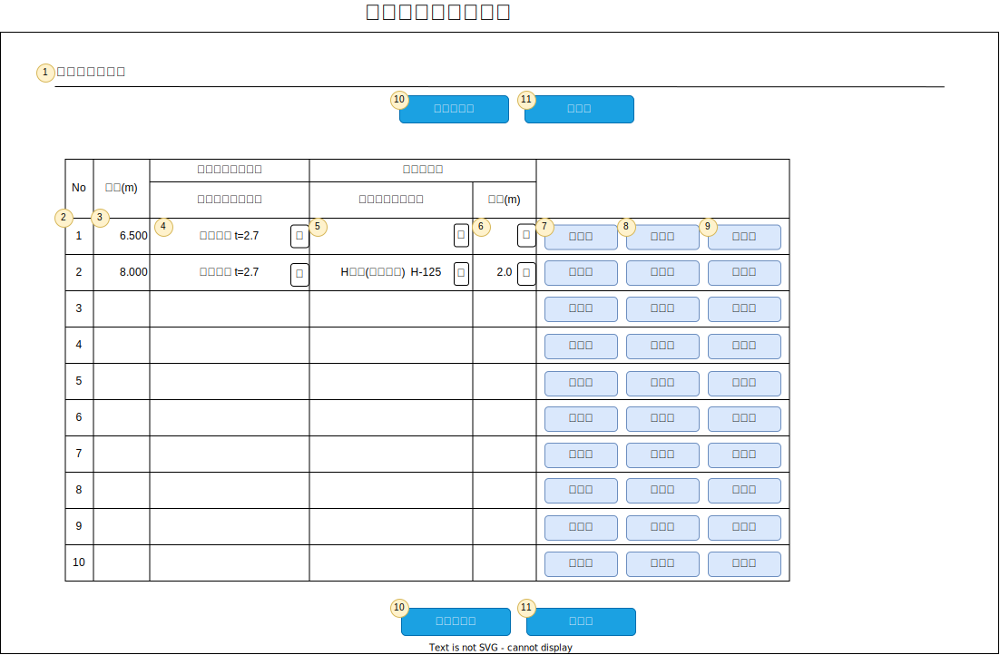{class=resizable height=600px}

表は10行固定で表示する。

<table>
  <caption>外枠の手動計算画面</caption>
  <thead>
    <tr>
      <th>No</th>
      <th>ラベル</th>
      <th>コントロール</th>
      <th>表示桁数</th>
      <th>文字揃え</th>
      <th>初期値</th>
      <th>説明</th>
    </tr>
  </thead>
  <tbody>
    <tr>
      <td>1</td>
      <td>外枠の自動計算</td>
      <td>text</td>
      <td>-</td>
      <td>-</td>
      <td>-</td>
      <td>画面のタイトル</td>
    </tr>
    <tr>
      <td>2</td>
      <td>No</td>
      <td>text</td>
      <td>-</td>
      <td>右</td>
      <td>-</td>
      <td>行番号を表示</td>
    </tr>
    <tr>
      <td>3</td>
      <td>深度(m)</td>
      <td>number</td>
      <td>0.000</td>
      <td>右</td>
      <td>`outer_frame_liner_plates.depth`, `outer_frame_reinforcing_rings.depth`</td>
      <td>`outer_frame_liner_plates.depth`, `outer_frame_reinforcing_rings.depth`の値を表示、保存する。
      深度は上から下に向かって深くなり、同じ深度の入力は不可</td>
    </tr>
    <tr>
      <td>4</td>
      <td>ライナープレート</td>
      <td>dropdown</td>
      <td>-</td>
      <td>-</td>
      <td>`outer_frame_liner_plates.liner_plate_calc_master_id`の項目</td>
      <td>ドロップダウンリストの表示項目は以下のリストとなる 
      `liner_plate_calc_masters.name` + " t=" + `liner_plate_calc_masters.thickness`</td>
    </tr>
    <tr>
      <td>5</td>
      <td>補強リング</td>
      <td>dropdown</td>
      <td>-</td>
      <td>-</td>
      <td>`outer_frame_reinforcing_rings.h_beam_calc_master_id` の項目</td>
      <td>ドロップダウンリストボックスの表示項目は以下のリストとなる。 
      `h_beam_calc_masters.name` + " H-" + `h_beam_calc_masters.height` 
      ただし、リストの先頭に"空"を追加し、補強リンクの設定を空にできるようにする。
      </td>
    </tr>
    <tr>
      <td>6</td>
      <td>間隔</td>
      <td>dropdown</td>
      <td>-</td>
      <td>-</td>
      <td>`outer_frame_reinforcing_rings.reinforcing_ring_pitch`/td>
      <td>選択肢
        <dl>
          <ul>
            <li>"(空)", </li>
            <li>0.5</li>
            <li>1.0</li>
            <li>1.5</li>
            <li>2.0</li>
          </ul>
        </dl>
      </td>
    </tr>
    <tr>
      <td>7</td>
      <td>行挿入ボタン</td>
      <td>button</td>
      <td>-</td>
      <td>-</td>
      <td>-</td>
      <td>上行に空行を追加する。最下の行にデータがある場合は、空行は追加されない。(エラー表示もしない)
      </td>
    </tr>
    <tr>
      <td>8</td>
      <td>行複写ボタン</td>
      <td>button</td>
      <td>-</td>
      <td>-</td>
      <td>-</td>
      <td>行挿入機能＋クリックした行の数値を挿入した行の数値の初期値とする。 行挿入されなかった場合は何もしない。(エラー表示もしない)</td>
    </tr>
    <tr>
      <td>9</td>
      <td>行削除ボタン</td>
      <td>button</td>
      <td>-</td>
      <td>-</td>
      <td>-</td>
      <td>クリックした行を削除する。さらに、クリックした行よりも下のデータをすべて1段づつ上行に移動する。※最下段にデータがあった場合は、上行に移動するので、最下段は空行となる 
      1行もない状態でクリックした場合は、何もしない。(エラー表示もしない)
      </td>
    </tr>
    <tr>
      <td>10</td>
      <td>キャンセルボタン</td>
      <td>button</td>
      <td>-</td>
      <td>-</td>
      <td>-</td>
      <td>入力内容を破棄し、画面をクローズする。</td>
    </tr>
    <tr>
      <td>11</td>
      <td>再計算ボタン</td>
      <td>button</td>
      <td>-</td>
      <td>-</td>
      <td>-</td>
      <td>入力内容を保存し、画面をクローズ後、再計算を実行する。</td>
    </tr>
  </tbody>
</table>

### 支保工の手動計算画面

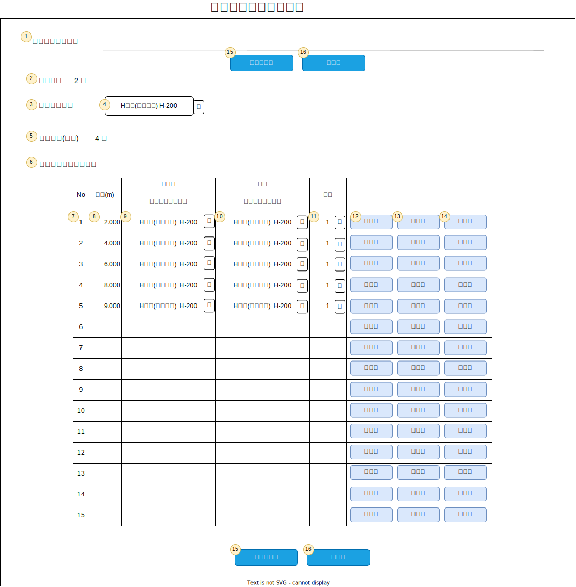{class=resizable height=600px}

<table>
  <caption>支保工の手動計算画面</caption>
  <thead>
    <tr>
      <th>No</th>
      <th>ラベル</th>
      <th>コントロール</th>
      <th>表示桁数</th>
      <th>文字揃え</th>
      <th>初期値</th>
      <th>説明</th>
    </tr>
  </thead>
  <tbody>
    <tr>
      <td>1</td>
      <td>支保工の手動計算</td>
      <td>text</td>
      <td>-</td>
      <td>左</td>
      <td>-</td>
      <td>画面のタイトル</td>
    </tr>
    <tr>
      <td>2</td>
      <td>縦梁本数</td>
      <td>text</td>
      <td>-</td>
      <td>左</td>
      <td>`shorings.quantity_of_vertical_beam`</td>
      <td>縦梁本数の値を表示</td>
    </tr>
    <tr>
      <td>3</td>
      <td>縦梁使用部材</td>
      <td>label</td>
      <td>-</td>
      <td>左</td>
      <td>-</td>
      <td>項目名のラベル</td>
    </tr>
    <tr>
      <td>4</td>
      <td>縦梁使用部材 ドロップダウン</td>
      <td>dropdown</td>
      <td>-</td>
      <td>左</td>
      <td>`shorings.h_beam_calc_master_id` の項目-</td>
      <td>
      
`h_beam_calc_masters.name` + " H-" + `h_beam_calc_masters.height`のリスト

      選択肢は以下の通り
        <dl>
          <dt>権限：営業、社外</dt>
          <dd>マスタの標準のみ</dd>
          <dt>権限：設計</dt>
          <dd>マスタの標準+設計者用</dd>
        </dl>
      </td>
    </tr>
    <tr>
      <td>5</td>
      <td>切梁本数(平面)</td>
      <td>label</td>
      <td>-</td>
      <td>左</td>
      <td>`shoring_installings.quantity` の合計</td>
      <td>切梁本数を表示</td>
    </tr>
    <tr>
      <td>6</td>
      <td>腹起し・切梁使用部材</td>
      <td>label</td>
      <td>-</td>
      <td>左</td>
      <td>-</td>
      <td>項目名のラベル</td>
    </tr>
    <tr>
      <td>7</td>
      <td>No</td>
      <td>text</td>
      <td>-</td>
      <td>右</td>
      <td>-</td>
      <td>行番号を表示</td>
    </tr>
    <tr>
      <td>8</td>
      <td>深度(mm)</td>
      <td>text</td>
      <td>-</td>
      <td>右</td>
      <td>`shoring_installings.depth`</td>
      <td></td>
    </tr>
    <tr>
      <td>9</td>
      <td>腹起し</td>
      <td></td>
      <td>-</td>
      <td>左</td>
      <td>`shoring_installings.waling_id` の項目</td>
      <td>>`h_beam_calc_masters.name` + " H-" + `h_beam_calc_masters.height`のリスト
      </td>
    </tr>
    <tr>
      <td>10</td>
      <td>切梁</td>
      <td></td>
      <td>-</td>
      <td>左</td>
      <td>`shoring_installings.strut_id` の項目</td>
      <td>>`h_beam_calc_masters.name` + " H-" + `h_beam_calc_masters.height`のリスト</td>
    </tr>
    <tr>
      <td>11</td>
      <td>本数</td>
      <td></td>
      <td>-</td>
      <td>左</td>
      <td>`shoring_installings.quantity`</td>
      <td>選択肢
        <ul>
        <li>1</li>
        <li>2</li>
        <li>3</li>
        </ul>
      </td>
    </tr>
      <td>12</td>
      <td>行挿入ボタン</td>
      <td>button</td>
      <td>-</td>
      <td>-</td>
      <td>-</td>
      <td>上行に空行を追加する。最下の行にデータがある場合は、空行は追加されない。(エラー表示もしない)
      </td>
    </tr>
    <tr>
      <td>13</td>
      <td>行複写ボタン</td>
      <td>button</td>
      <td>-</td>
      <td>-</td>
      <td>-</td>
      <td>行挿入機能＋クリックした行の数値を挿入した行の数値の初期値とする。 行挿入されなかった場合は何もしない。(エラー表示もしない)</td>
    </tr>
    <tr>
      <td>14</td>
      <td>行削除ボタン</td>
      <td>button</td>
      <td>-</td>
      <td>-</td>
      <td>-</td>
      <td>クリックした行を削除する。さらに、クリックした行よりも下のデータをすべて1段づつ上行に移動する。※最下段にデータがあった場合は、上行に移動するので、最下段は空行となる 
      1行もない状態でクリックした場合は、何もしない。(エラー表示もしない)
      </td>
    </tr>
    <tr>
      <td>15</td>
      <td>キャンセルボタン</td>
      <td>button</td>
      <td>-</td>
      <td>-</td>
      <td>-</td>
      <td>入力内容を破棄し、画面をクローズする。</td>
    </tr>
    <tr>
      <td>16</td>
      <td>再計算ボタン</td>
      <td>button</td>
      <td>-</td>
      <td>-</td>
      <td>-</td>
      <td>入力内容を保存し、画面をクローズ後、再計算を実行する。</td>
    </tr>
  </tbody>
</table>

### 継手部の手動計算画面 (矩形・矩形支保工)

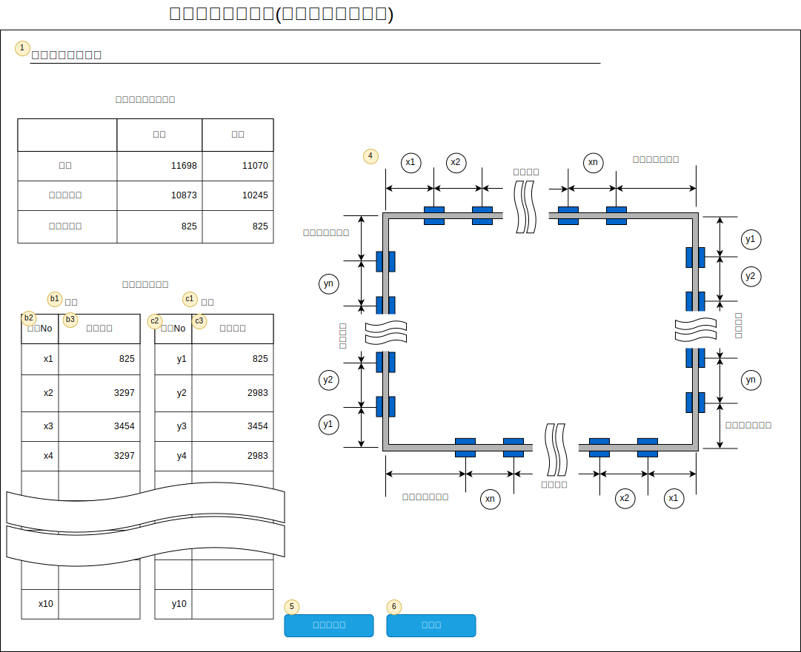{height=500px}

<table>
  <caption></caption>
  <thead>
    <tr>
      <th>No</th>
      <th>ラベル</th>
      <th>コントロール</th>
      <th>表示桁数</th>
      <th>文字揃え</th>
      <th>初期値</th>
      <th>説明</th>
    </tr>
  </thead>
  <tbody>
    <tr>
      <td>1</td>
      <td>継ぎ手部の手動計算</td>
      <td>text</td>
      <td>-</td>
      <td>-</td>
      <td>-</td>
      <td>画面のタイトル</td>
    </tr>
    <tr>
      <td>2</td>
      <td>継手位置の入力状況</td>
      <td>text</td>
      <td>-</td>
      <td>-</td>
      <td>-</td>
      <td></td>
    </tr>
    <tr>
    <tr>
      <td>3</td>
      <td>継手位置の入力</td>
      <td>text</td>
      <td>-</td>
      <td>-</td>
      <td>-</td>
      <td></td>
    </tr>
    <tr>
      <td>4</td>
      <td>継手の絵</td>
      <td>image</td>
      <td>-</td>
      <td>-</td>
      <td>-</td>
      <td>矩形・矩形支保工の継手の絵を表示</td>
    </tr>
    <tr>
      <td>5</td>
      <td>キャンセルボタン</td>
      <td>button</td>
      <td>-</td>
      <td>-</td>
      <td>-</td>
      <td>入力内容を破棄し、画面をクローズする。</td>
    </tr>
    <tr>
      <td>6</td>
      <td>再計算ボタン</td>
      <td>button</td>
      <td>-</td>
      <td>-</td>
      <td>-</td>
      <td>入力内容を保存し、画面をクローズ後、再計算を実行する。</td>
    </tr>
    <tr>
      <td>a1</td>
      <td>全長</td>
      <td>text</td>
      <td>-</td>
      <td>-</td>
      <td>-</td>
      <td>長径の全長を表示</td>
    </tr>
    <tr>
      <td>a2</td>
      <td>間隔の合計</td>
      <td>text</td>
      <td>-</td>
      <td>-</td>
      <td>-</td>
      <td>長径に入力された継手の間隔の合計を表示</td>
    </tr>
    <tr>
      <td>a3</td>
      <td>残りの長さ</td>
      <td>text</td>
      <td>-</td>
      <td>-</td>
      <td>-</td>
      <td>長径の(全長) - (間隔の合計)を表示</td>
    </tr>
    <tr>
      <td>a4</td>
      <td>全長</td>
      <td>text</td>
      <td>-</td>
      <td>-</td>
      <td>-</td>
      <td>短径の全長を表示</td>
    </tr>
    <tr>
      <td>a5</td>
      <td>間隔の合計</td>
      <td>text</td>
      <td>-</td>
      <td>-</td>
      <td>-</td>
      <td>短径に入力された継手の間隔の合計を表示</td>
    </tr>
    <tr>
      <td>a6</td>
      <td>残りの長さ</td>
      <td>text</td>
      <td>-</td>
      <td>-</td>
      <td>-</td>
      <td>短径の(全長) - (間隔の合計)を表示</td>
    </tr>
    <tr>
      <td>b1</td>
      <td>長径</td>
      <td>text</td>
      <td>-</td>
      <td>-</td>
      <td>-</td>
      <td></td>
    </tr>
    <tr>
      <td>b2</td>
      <td>継手No</td>
      <td>label</td>
      <td>-</td>
      <td>左</td>
      <td>-</td>
      <td>長径の継手番号（1~10）</td>
    </tr>
    <tr>
      <td>b3</td>
      <td>継手間隔</td>
      <td>number</td>
      <td>-</td>
      <td>-</td>
      <td>-</td>
      <td>
        長径の継手間隔を入力
        <dl>
          <dt>x1(入力必須)</dt>
          <dd>157n + 40 で入力</dd>
          <dt>x2以降</dt>
          <dd>157n で入力</dd>
        </dl>
      </td>
    </tr>
    <tr>
      <td>c1</td>
      <td>短径</td>
      <td>text</td>
      <td>-</td>
      <td>-</td>
      <td>-</td>
      <td></td>
    </tr>
    <tr>
      <td>c2</td>
      <td>継手No</td>
      <td>label</td>
      <td>-</td>
      <td>左</td>
      <td>-</td>
      <td>短径の継手番号（1~10）</td>
    </tr>
    <tr>
      <td>c3</td>
      <td>継手間隔</td>
      <td>number</td>
      <td>-</td>
      <td>-</td>
      <td>-</td>
      <td>
        <dl>
          短径の継手間隔を入力
          <dt>y1(入力必須)</dt>
          <dd>157n + 40 で入力</dd>
          <dt>y2以降</dt>
          <dd>157n で入力</dd>
        </dl>
      </td>
    </tr>
  </tbody>
</table>

### 継手部の手動計算画面（R矩形）

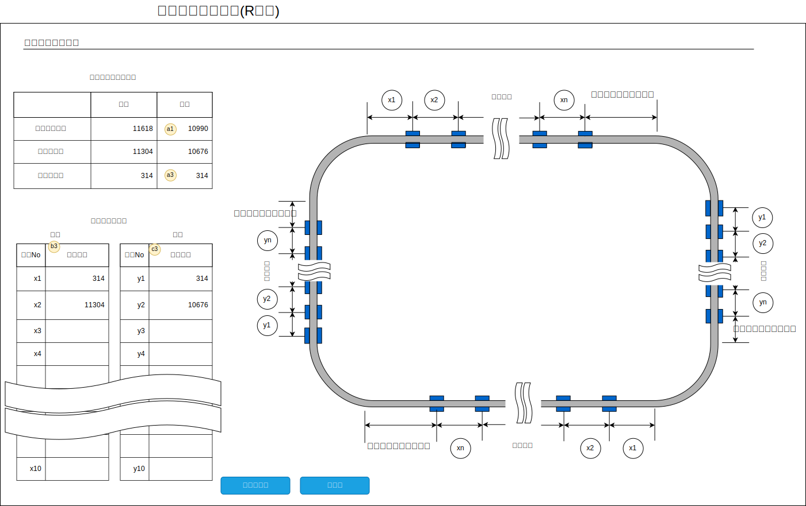{height=500px}

以下の項目以外は「継手部の手動計算画面（矩形・矩形支保工）」と同じ

<table>
  <caption></caption>
  <thead>
    <tr>
      <th>No</th>
      <th>ラベル</th>
      <th>コントロール</th>
      <th>表示桁数</th>
      <th>文字揃え</th>
      <th>初期値</th>
      <th>説明</th>
    </tr>
  </thead>
  <tbody>
  <tr>
      <td>4</td>
      <td>継手の絵</td>
      <td>image</td>
      <td>-</td>
      <td>-</td>
      <td>-</td>
      <td>R矩形の継手の絵を表示</td>
    </tr>
    <tr>
      <td>a1</td>
      <td>直線部の長さ</td>
      <td>text</td>
      <td>-</td>
      <td>-</td>
      <td>-</td>
      <td>長径の直線部の長さを表示</td>
    </tr>
    <tr>
      <td>a3</td>
      <td>残りの長さ</td>
      <td>text</td>
      <td>-</td>
      <td>-</td>
      <td>-</td>
      <td>長径の(直線部の長さ) - (間隔の合計)を表示</td>
    </tr>
    <tr>
      <td>a4</td>
      <td>全長</td>
      <td>text</td>
      <td>-</td>
      <td>-</td>
      <td>-</td>
      <td>短径直線部の長さを表示</td>
    </tr>
    <tr>
      <td>a6</td>
      <td>残りの長さ</td>
      <td>text</td>
      <td>-</td>
      <td>-</td>
      <td>-</td>
      <td>短径の(直線部の長さ) - (間隔の合計)を表示</td>
    </tr>
    <tr>
      <td>b3</td>
      <td>継手間隔</td>
      <td>number</td>
      <td>-</td>
      <td>-</td>
      <td>-</td>
      <td>
        長径の継手間隔を入力 
        x1は入力必須
         
        157n で入力
      </td>
    </tr>
    <tr>
      <td>c3</td>
      <td>継手間隔</td>
      <td>number</td>
      <td>-</td>
      <td>-</td>
      <td>-</td>
      <td>
        短径の継手間隔を入力 
        y1は入力必須
         
        157n で入力
      </td>
    </tr>
  </tbody>
</table>

### 形状図表示画面

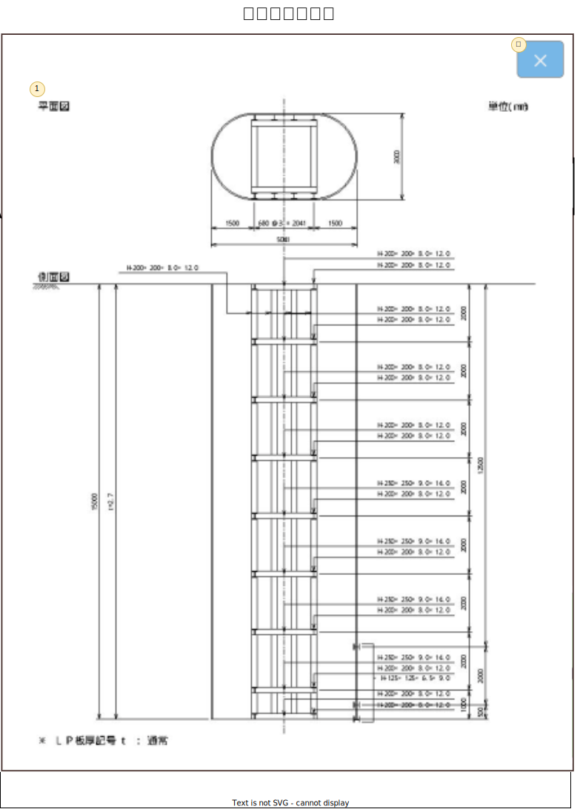

<table>
  <caption>形状図表示画面</caption>
  <thead>
    <tr>
      <th>No</th>
      <th>ラベル</th>
      <th>コントロール</th>
      <th>表示桁数</th>
      <th>文字揃え</th>
      <th>初期値</th>
      <th>説明</th>
    </tr>
  </thead>
  <tbody>
    <tr>
      <td>1</td>
      <td>形状図</td>
      <td>image</td>
      <td>-</td>
      <td>-</td>
      <td>-</td>
      <td>形状図を表示する。画像フォーマットはsvg。</td>
    </tr>
    <tr>
      <td>2</td>
      <td>クローズボタン</td>
      <td>button</td>
      <td>-</td>
      <td>-</td>
      <td>-</td>
      <td>形状図表示画面を閉じる</td>
    </tr>
  </tbody>
</table>

### 別構成提案画面

{class=resizable height=480px}

<table>
  <caption>別構成提案画面</caption>
  <thead>
    <tr>
      <th>No</th>
      <th>ラベル</th>
      <th>コントロール</th>
      <th>表示桁数</th>
      <th>文字揃え</th>
      <th>初期値</th>
      <th>説明</th>
    </tr>
  </thead>
  <tbody>
    <tr>
      <td>1</td>
      <td>別構成提案</td>
      <td></td>
      <td>-</td>
      <td>-</td>
      <td>-</td>
      <td></td>
    </tr>
    <tr>
      <td>2</td>
      <td>戻る</td>
      <td>button</td>
      <td>-</td>
      <td>-</td>
      <td>-</td>
      <td>外枠・支保工画面に遷移する</td>
    </tr>
    <tr>
      <td>3</td>
      <td>次へ</td>
      <td>button</td>
      <td>-</td>
      <td>-</td>
      <td>-</td>
      <td>計算結果画面へ遷移する</td>
    </tr>
    <tr>
      <td>a1</td>
      <td>別構成</td>
      <td>label</td>
      <td>-</td>
      <td>-</td>
      <td>-</td>
      <td></td>
    </tr>
    <tr>
      <td>a2</td>
      <td>採用</td>
      <td>radio</td>
      <td>-</td>
      <td>-</td>
      <td>-</td>
      <td>選択した別構成の材料表、見積書を表示する。ラジオボタンの選択を変更すると該当の表示に切り替わる</td>
    </tr>
    <tr>
      <td>a3</td>
      <td>製造可能範囲</td>
      <td>text</td>
      <td>-</td>
      <td>中央</td>
      <td>-</td>
      <td>標準サイズ範囲：◎/加工範囲：●の範囲：〇/加工範囲：●※１：※１/加工範囲：●※２：※２ 
          (社内営業・社外利用権限は※1※2 を表示しない。)</td>
    </tr>
    <tr>
      <td>a4</td>
      <td>構成名</td>
      <td>text</td>
      <td>00.000</td>
      <td>-</td>
      <td>LP or HP-xxx</td>
      <td>補強リングを使用せずLPのみの場合は「LPのみ」/補強リングを使用した場合は「HP-」＋補強リングの高さ</td>
    </tr>
    <tr>
      <td>a5</td>
      <td>ライナープレート - 板厚(t)(mm)</td>
      <td>number</td>
      <td>0.0</td>
      <td>左寄せ</td>
      <td>materials.thickness OR material_pattern_items.thickness</td>
      <td>材料表で使用したLPの板厚を表示。LPのみの場合は複数の板厚を使用している場合、「×」でつないで表示。例：「2.7×3.2×4.0」</td>
    </tr>
    <tr>
      <td>a6</td>
      <td>補強リング-高さ(H)(mm)</td>
      <td>text</td>
      <td>-</td>
      <td>右</td>
      <td>`materials.height`</td>
      <td></td>
    </tr>
    <tr>
      <td>a7</td>
      <td>補強リング-本数(本)</td>
      <td>text</td>
      <td>-</td>
      <td>右</td>
      <td>material_arrangement_pattern_items.quantity</td>
      <td>計算結果の補強リング本数。material_arrangement_pattern_items.type=補強リング</td>
    </tr>
    <tr>
      <td>a8</td>
      <td>質量（kg）</td>
      <td>number</td>
      <td>-</td>
      <td>右</td>
      <td>materials.total_mass</td>
      <td>材料表で算出した質量の合計値</td>
    </tr>
    <tr>
      <td>a9</td>
      <td>金額(円)</td>
      <td>text</td>
      <td>estimates.total_amount</td>
      <td>右</td>
      <td>
      </td>
      <td>見積書で算出した金額の合計値</td>
    </tr>
    <tr>
      <td>b1</td>
      <td>材料表</td>
      <td>label</td>
      <td></td>
      <td>左</td>
      <td>-</td>
      <td></td>
    </tr>
    <tr>
      <td>b2</td>
      <td>品名</td>
      <td>text</td>
      <td></td>
      <td>中央</td>
      <td>先頭行:material_arrangement_pattern_items.product_name,それ以外：material_pattern_items.name</td>
      <td>品名。LPや補強リングの先頭行は太字表示
      </td>
    </tr>
    <tr>
      <td>b3</td>
      <td>サイズ(mm)</td>
      <td>text</td>
      <td>-</td>
      <td>左</td>
      <td>先頭行:material_arrangement_pattern_items.size_name,それ以外：material_pattern_itemsの組み合わせ</td>
      <td>サイズ。LPや補強リングの先頭行は太字表示</td>
    </tr>
    <tr>
      <td>b4</td>
      <td>単位質量(kg)</td>
      <td>text</td>
      <td>-</td>
      <td>左</td>
      <td>material_arrangement_pattern_items.unit_mass</td>
      <td></td>
    </tr>
    <tr>
      <td>b5</td>
      <td>数量</td>
      <td>text</td>
      <td>-</td>
      <td>右</td>
      <td>material_arrangement_pattern_items.quantity</td>
      <td></td>
    </tr>
    <tr>
      <td>b6</td>
      <td>質量(kg)</td>
      <td>text</td>
      <td>-</td>
      <td>右</td>
      <td>material_arrangement_pattern_items.mass</td>
      <td></td>
    </tr>
    <tr>
      <td>b7</td>
      <td>合計</td>
      <td>text</td>
      <td>-</td>
      <td>右</td>
      <td>materials.total_mass</td>
      <td>質量（kg）の合計</td>
    </tr>
    <tr>
      <td>c1</td>
      <td>見積書</td>
      <td>label</td>
      <td>-</td>
      <td>左</td>
      <td>-</td>
      <td></td>
    </tr>
    <tr>
      <td>c2</td>
      <td>名称</td>
      <td>text</td>
      <td>-</td>
      <td>左</td>
      <td>estimate_pattern_items.type</td>
      <td>ライナープレート、補強リング、パッキングのいずれか</td>
    </tr>
    <tr>
      <td>c3</td>
      <td>形状・寸法</td>
      <td>text</td>
      <td>-</td>
      <td>左</td>
      <td>estimate_pattern_items.*</td>
      <td></td>
    </tr>
    <tr>
      <td>c4</td>
      <td>数量</td>
      <td>text</td>
      <td>-</td>
      <td>右</td>
      <td>補強リング：estimate_pattern_items.ring_number ライナープレート：estimate_pattern_items.depth パッキング:ライナープレート：estimate_pattern_items.number</td>
      <td>材料の種類によって数量が異なる</td>
    </tr>
    <tr>
      <td>c5</td>
      <td>単位</td>
      <td>text</td>
      <td>-</td>
      <td>右</td>
      <td>-</td>
      <td></td>
    </tr>
    <tr>
      <td>c6</td>
      <td>建値(円)</td>
      <td>text</td>
      <td>-</td>
      <td>右</td>
      <td>estimate_pattern_items.sales_price</td>
      <td></td>
    </tr>
    <tr>
      <td>c7</td>
      <td>金額(円)</td>
      <td>text</td>
      <td>-</td>
      <td>右</td>
      <td>estimate_pattern_items.amount</td>
      <td></td>
    </tr>
    <tr>
      <td>c8</td>
      <td>合計</td>
      <td>text</td>
      <td>-</td>
      <td>右</td>
      <td>estimates.total_amount</td>
      <td></td>
    </tr>
  </tbody>
</table>

### 設計計算書情報入力画面

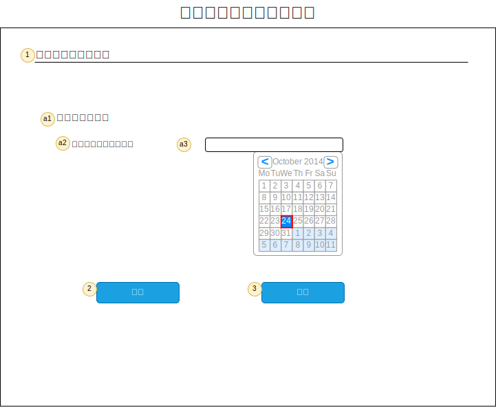{class=resizable height=480px}

<table>
  <caption>設計計算書情報入力画面</caption>
  <thead>
    <tr>
      <th>No</th>
      <th>ラベル</th>
      <th>コントロール</th>
      <th>表示桁数</th>
      <th>文字揃え</th>
      <th>初期値</th>
      <th>説明</th>
    </tr>
  </thead>
  <tbody>
    <tr>
      <td>1</td>
      <td>設計計算書情報入力</td>
      <td></td>
      <td>-</td>
      <td>-</td>
      <td>-</td>
      <td></td>
    </tr>
    <tr>
      <td>2</td>
      <td>戻る</td>
      <td>button</td>
      <td>-</td>
      <td>-</td>
      <td>-</td>
      <td>計算結果画面（計算設計書入力への遷移前の画面）に遷移する</td>
    </tr>
    <tr>
      <td>3</td>
      <td>保存</td>
      <td>button</td>
      <td>-</td>
      <td>-</td>
      <td>-</td>
      <td>保存をクリックすると計算設計書の情報を保存する。計算設計書入力情報への遷移前の画面に遷移する</td>
    </tr>
    <tr>
      <td>a1</td>
      <td>設計計算書情報</td>
      <td>label</td>
      <td>-</td>
      <td>-</td>
      <td>-</td>
      <td></td>
    </tr>
    <tr>
      <td>a2</td>
      <td>作成日(表紙に記載)</td>
      <td>label</td>
      <td></td>
      <td></td>
      <td></td>
      <td></td>
    </tr>
    <tr>
      <td>a3</td>
      <td>作成日(表紙に記載) 入力フィールド</td>
      <td>calendar</td>
      <td>-</td>
      <td>-</td>
      <td>design_calculations.created_date</td>
      <td>liner_plate_calc_results.created_atを初期値とする </td>
    </tr>
  </tbody>
</table>

### 材料・図面情報入力画面

{class=resizable height=480px}

<table>
  <caption>材料・図面情報入力画面</caption>
  <thead>
    <tr>
      <th>No</th>
      <th>ラベル</th>
      <th>コントロール</th>
      <th>表示桁数</th>
      <th>文字揃え</th>
      <th>初期値</th>
      <th>説明</th>
    </tr>
  </thead>
  <tbody>
    <tr>
      <td>1</td>
      <td>材料・図面情報入力</td>
      <td></td>
      <td>-</td>
      <td>-</td>
      <td>-</td>
      <td></td>
    </tr>
    <tr>
      <td>2</td>
      <td>戻る</td>
      <td>button</td>
      <td>-</td>
      <td>-</td>
      <td>-</td>
      <td>別構成提案画面か計算結果画面（材料・図面情報への遷移前の画面）に遷移する</td>
    </tr>
    <tr>
      <td>3</td>
      <td>保存</td>
      <td>button</td>
      <td>-</td>
      <td>-</td>
      <td>-</td>
      <td>保存をクリックすると設計・材料・見積の再計算をする。材料・図面情報への遷移前の画面に遷移する</td>
    </tr>
    <tr>
      <td>a1</td>
      <td>材料情報</td>
      <td>label</td>
      <td>-</td>
      <td>-</td>
      <td>-</td>
      <td></td>
    </tr>
    <tr>
      <td>a2</td>
      <td>表面処理</td>
      <td>label</td>
      <td>-</td>
      <td>-</td>
      <td>-</td>
      <td></td>
    </tr>
    <tr>
      <td>a3</td>
      <td>表面処理 入力フィールド</td>
      <td>dropdown</td>
      <td>-</td>
      <td>-</td>
      <td>materials.surface_treatment</td>
      <td>表面処理 の選択肢は 黒皮品/めっき </td>
    </tr>
    <tr>
      <td>a4</td>
      <td>パッキングを使用</td>
      <td>label</td>
      <td>-</td>
      <td>-</td>
      <td>-</td>
      <td></td>
    </tr>
    <tr>
      <td>a5</td>
      <td>パッキングを使用 チェックボックス</td>
      <td>checkbox</td>
      <td>-</td>
      <td>-</td>
      <td>materials.material_pattern_items.width</td>
      <td>パッキングを使用 の入力チェックボックス。material_pattern_itemsでパッキングを使用していたらON </td>
    </tr>
    <tr>
      <td>a6</td>
      <td>エルボルトを使用</td>
      <td>label</td>
      <td>-</td>
      <td>-</td>
      <td>-</td>
      <td></td>
    </tr>
    <tr>
      <td>a7</td>
      <td>エルボルトを使用 チェックボックス</td>
      <td>checkbox</td>
      <td>-</td>
      <td>-</td>
      <td>materials.material_pattern_items.width</td>
      <td>エルボルトを使用 の入力チェックボックス。 </td>
    </tr>
    <tr>
      <td>b1</td>
      <td>図面情報</td>
      <td>label</td>
      <td>-</td>
      <td>-</td>
      <td>-</td>
      <td></td>
    </tr>
    <tr>
      <td>b2</td>
      <td>宛先１行目</td>
      <td>label</td>
      <td></td>
      <td></td>
      <td></td>
      <td></td>
    </tr>
    <tr>
      <td>b3</td>
      <td>宛先１行目 入力フィールド</td>
      <td>textfield</td>
      <td>-</td>
      <td>-</td>
      <td>drawings.recipient1</td>
      <td>宛先１行目 の入力フィールド </td>
    </tr>
    <tr>
      <td>b4</td>
      <td>宛先2行目</td>
      <td>label</td>
      <td></td>
      <td></td>
      <td></td>
      <td></td>
    </tr>
    <tr>
      <td>b5</td>
      <td>宛先2行目 入力フィールド</td>
      <td>textfield</td>
      <td>-</td>
      <td>-</td>
      <td>drawings.recipient2</td>
      <td>宛先2行目 の入力フィールド </td>
    </tr>
    <tr>
      <td>b6</td>
      <td>宛先3行目</td>
      <td>label</td>
      <td></td>
      <td></td>
      <td></td>
      <td></td>
    </tr>
    <tr>
      <td>b7</td>
      <td>宛先3行目 入力フィールド</td>
      <td>textfield</td>
      <td>-</td>
      <td>-</td>
      <td>drawings.recipient3</td>
      <td>宛先3行目 の入力フィールド </td>
    </tr>
    <tr>
      <td>b8</td>
      <td>承認者</td>
      <td>label</td>
      <td></td>
      <td></td>
      <td></td>
      <td></td>
    </tr>
    <tr>
      <td>b9</td>
      <td>承認者 入力フィールド</td>
      <td>textfield</td>
      <td>-</td>
      <td>-</td>
      <td>drawings.approver</td>
      <td>承認者 の入力フィールド </td>
    </tr>
    <tr>
      <td>b10</td>
      <td>確認者</td>
      <td>label</td>
      <td></td>
      <td></td>
      <td></td>
      <td></td>
    </tr>
    <tr>
      <td>b11</td>
      <td>確認者 入力フィールド</td>
      <td>textfield</td>
      <td>-</td>
      <td>-</td>
      <td>drawings.confirmer</td>
      <td>確認者 の入力フィールド </td>
    </tr>
    <tr>
      <td>b12</td>
      <td>作成者</td>
      <td>label</td>
      <td></td>
      <td></td>
      <td></td>
      <td></td>
    </tr>
    <tr>
      <td>b13</td>
      <td>作成者 入力フィールド</td>
      <td>textfield</td>
      <td>-</td>
      <td>-</td>
      <td>drawings.creator</td>
      <td>作成者 の入力フィールド </td>
    </tr>
    <tr>
      <td>b14</td>
      <td>日付</td>
      <td>label</td>
      <td></td>
      <td></td>
      <td></td>
      <td></td>
    </tr>
    <tr>
      <td>b15</td>
      <td>日付 入力フィールド</td>
      <td>calendar</td>
      <td>-</td>
      <td>-</td>
      <td>drawings.date</td>
      <td>日付 の入力フィールド </td>
    </tr>
  </tbody>
</table>

### 見積書入力画面

{class=resizable height=480px}

<table>
  <caption>見積書入力画面</caption>
  <thead>
    <tr>
      <th>No</th>
      <th>ラベル</th>
      <th>コントロール</th>
      <th>表示桁数</th>
      <th>文字揃え</th>
      <th>初期値</th>
      <th>説明</th>
    </tr>
  </thead>
  <tbody>
    <tr>
      <td>1</td>
      <td>見積書入力</td>
      <td></td>
      <td>-</td>
      <td>-</td>
      <td>-</td>
      <td></td>
    </tr>
    <tr>
      <td>a1</td>
      <td>共通項目</td>
      <td>label</td>
      <td>-</td>
      <td>-</td>
      <td>-</td>
      <td></td>
    </tr>
    <tr>
      <td>a2</td>
      <td>出力タイプ</td>
      <td>label</td>
      <td>-</td>
      <td>-</td>
      <td>-</td>
      <td></td>
    </tr>
    <tr>
      <td>a3</td>
      <td>出力タイプ</td>
      <td>dropdown</td>
      <td>-</td>
      <td>-</td>
      <td>estimates.formattype</td>
      <td>出力タイプ。販売店用/役所用</td>
    </tr>
    <tr>
      <td>a4</td>
      <td>見積番号</td>
      <td>label</td>
      <td>-</td>
      <td>-</td>
      <td>-</td>
      <td></td>
    </tr>
    <tr>
      <td>a5</td>
      <td>見積番号 入力フォーム</td>
      <td>textfield</td>
      <td>-</td>
      <td>-</td>
      <td>estimates.number</td>
      <td>見積番号用の入力フォーム</td>
    </tr>
    <tr>
      <td>a6</td>
      <td>担当本社支社</td>
      <td>label</td>
      <td>-</td>
      <td>-</td>
      <td>-</td>
      <td></td>
    </tr>
    <tr>
      <td>a7</td>
      <td>担当本社支社 </td>
      <td>dropdown</td>
      <td>-</td>
      <td>-</td>
      <td>estimates.company_master_id.company_masters.name</td>
      <td>担当本社支社 の入力フォーム。</td>
    </tr>
    <tr>
      <td>a8</td>
      <td>向け先会社名</td>
      <td>label</td>
      <td>-</td>
      <td>-</td>
      <td>-</td>
      <td></td>
    </tr>
    <tr>
      <td>a9</td>
      <td>向け先会社名 コンボボックス</td>
      <td>combobox</td>
      <td>-</td>
      <td>-</td>
      <td>estimates.sales_company_name（入力先）/ sales_company_masters.name（選択肢）</td>
      <td>向け先会社名  の入力フォーム。コンボボックス。textfieldとして入力可能</td>
    </tr>
    <tr>
      <td>a10</td>
      <td>向け先担当者名</td>
      <td>label</td>
      <td>-</td>
      <td>-</td>
      <td>-</td>
      <td></td>
    </tr>
    <tr>
      <td>a11</td>
      <td>向け先担当者名 入力フォーム</td>
      <td>textfield</td>
      <td>-</td>
      <td>-</td>
      <td>estimates.sales_company_staff_name</td>
      <td>向け先担当者名 の入力フォーム </td>
    </tr>
    <tr>
      <td>a12</td>
      <td>見積有効期間</td>
      <td>label</td>
      <td>-</td>
      <td>-</td>
      <td>-</td>
      <td></td>
    </tr>
    <tr>
      <td>a13</td>
      <td>見積有効期間 カレンダー</td>
      <td>calendar</td>
      <td>-</td>
      <td>-</td>
      <td>estimates.quote_expiry_date</td>
      <td>向け先見積有効期間 の入力フォーム </td>
    </tr>
    <tr>
      <td>a14</td>
      <td>納入場所</td>
      <td>label</td>
      <td>-</td>
      <td>-</td>
      <td>-</td>
      <td></td>
    </tr>
    <tr>
      <td>a15</td>
      <td>納入場所 入力フォーム</td>
      <td>textfield</td>
      <td>-</td>
      <td>-</td>
      <td>estimates.delivery_location</td>
      <td>納入場所 の入力フォーム</td>
    </tr>
    <tr>
      <td>a16</td>
      <td>注釈</td>
      <td>label</td>
      <td>-</td>
      <td>-</td>
      <td>-</td>
      <td>-</td>
    </tr>
    <tr>
      <td>a17</td>
      <td>注釈 チェックボックス</td>
      <td>checkbox</td>
      <td>-</td>
      <td>-</td>
      <td>estimate_remarks.is_important</td>
      <td>注釈を赤文字にするかどうかのチェックボックスのチェックボックス。ON:赤文字/OFF:黒文字 </td>
    </tr>
    <tr>
      <td>a18</td>
      <td>注釈 項目</td>
      <td>combobox</td>
      <td>-</td>
      <td>-</td>
      <td>estimate_remarks.remark</td>
      <td>注釈 項目。 出力タイプ（販売店/役所）によって表示する注釈項目を切り替える。表示順や、デフォルト値はDBに設定されている内容に準拠</td>
    </tr>
    <tr>
      <td>b1</td>
      <td>販売店用項目</td>
      <td>label</td>
      <td>-</td>
      <td>-</td>
      <td>-</td>
      <td></td>
    </tr>
    <tr>
      <td>b2</td>
      <td>納期文言</td>
      <td>label</td>
      <td>-</td>
      <td>-</td>
      <td>-</td>
      <td> </td>
    </tr>
    <tr>
      <td>b3</td>
      <td>納期文言</td>
      <td>combobox</td>
      <td>-</td>
      <td>-</td>
      <td>estimates.deadline_remark</td>
      <td>納期文言 の入力フォーム/初期値は「受注確定後」</td>
    </tr>
    <tr>
      <td>b4</td>
      <td>納期</td>
      <td>label</td>
      <td>-</td>
      <td>-</td>
      <td>-</td>
      <td> </td>
    </tr>
    <tr>
      <td>b5</td>
      <td>納期</td>
      <td>textfield</td>
      <td>-</td>
      <td>-</td>
      <td>estimates.deadline</td>
      <td>納期 の入力フォーム</td>
    </tr>
    <tr>
      <td>b6</td>
      <td>施主</td>
      <td>label</td>
      <td>-</td>
      <td>-</td>
      <td>-</td>
      <td></td>
    </tr>
    <tr>
      <td>b7</td>
      <td>施主 入力フォーム</td>
      <td>textfield</td>
      <td>-</td>
      <td>-</td>
      <td>estimates.client_name</td>
      <td>施主の 入力フォーム</td>
    </tr>
    <tr>
      <td>b8</td>
      <td>施工業者</td>
      <td>label</td>
      <td>-</td>
      <td>-</td>
      <td>-</td>
      <td></td>
    </tr>
    <tr>
      <td>b9</td>
      <td>施工業者 入力フォーム</td>
      <td>textfield</td>
      <td>-</td>
      <td>-</td>
      <td>estimates.contractors</td>
      <td>施工業者の 入力フォーム</td>
    </tr>
    <tr>
      <td>b10</td>
      <td>引合先</td>
      <td>label</td>
      <td>-</td>
      <td>-</td>
      <td>-</td>
      <td></td>
    </tr>
    <tr>
      <td>b11</td>
      <td>引合先 入力フォーム</td>
      <td>textfield</td>
      <td>-</td>
      <td>-</td>
      <td>estimates.competitors</td>
      <td>引合先の入力フォーム</td>
    </tr>
    <tr>
      <td>b12</td>
      <td>別途運賃</td>
      <td>label</td>
      <td>-</td>
      <td>-</td>
      <td>-</td>
      <td></td>
    </tr>
    <tr>
      <td>b13</td>
      <td>別途運賃 入力フォーム</td>
      <td>combobox</td>
      <td>-</td>
      <td>-</td>
      <td>estimates.fare</td>
      <td>別途運賃の入力フォーム/初期値は「40,000円」</td>
    </tr>
    <tr>
      <td>b14</td>
      <td>車種</td>
      <td>label</td>
      <td>-</td>
      <td>-</td>
      <td>-</td>
      <td></td>
    </tr>
    <tr>
      <td>b15</td>
      <td>車種 入力フォーム</td>
      <td>combobox</td>
      <td>-</td>
      <td>-</td>
      <td>estimates.shipping_condition</td>
      <td>車種の入力フォーム/初期値は「平車（４ｔ平車または１０ｔ平車、車上渡し、AM7時～10時の間で着時間指定可能）」</td>
    </tr>
    <tr>
      <td>b16</td>
      <td>仕切りタイプ</td>
      <td>label</td>
      <td>-</td>
      <td>-</td>
      <td>-</td>
      <td></td>
    </tr>
    <tr>
      <td>b17</td>
      <td>仕切りタイプ 入力フォーム</td>
      <td>textfield</td>
      <td>-</td>
      <td>-</td>
      <td>estimates.wholesale_type</td>
      <td>仕切りタイプの入力フォーム</td>
    </tr>
    <tr>
      <td>b18</td>
      <td>仕切り価格</td>
      <td>label</td>
      <td>-</td>
      <td>-</td>
      <td>-</td>
      <td></td>
    </tr>
    <tr>
      <td>b19</td>
      <td>仕切り価格 入力フォーム</td>
      <td>textfield</td>
      <td>-</td>
      <td>-</td>
      <td>estimates.wholesale_rate</td>
      <td>仕切り価格の入力フォーム</td>
    </tr>
    <tr>
      <td>b20</td>
      <td>内口銭</td>
      <td>label</td>
      <td>-</td>
      <td>-</td>
      <td>-</td>
      <td></td>
    </tr>
    <tr>
      <td>b21</td>
      <td>内口銭 入力フォーム</td>
      <td>textfield</td>
      <td>-</td>
      <td>-</td>
      <td>estimates.wholesale_margin_rate</td>
      <td>内口銭の入力フォーム</td>
    </tr>
  </tbody>
</table>

### 材料マスタ編集画面

{class=resizable height=480px}

<table>
  <caption>材料マスタ編集画面</caption>
  <thead>
    <tr>
      <th>No</th>
      <th>ラベル</th>
      <th>コントロール</th>
      <th>表示桁数</th>
      <th>文字揃え</th>
      <th>初期値</th>
      <th>説明</th>
    </tr>
  </thead>
  <tbody>
    <tr>
      <td>1</td>
      <td>材料マスタ編集</td>
      <td></td>
      <td>-</td>
      <td>-</td>
      <td>-</td>
      <td></td>
    </tr>
    <tr>
      <td>a1</td>
      <td>LP材料マスタ</td>
      <td>label</td>
      <td>-</td>
      <td>-</td>
      <td>-</td>
      <td></td>
    </tr>
    <tr>
      <td>a2</td>
      <td>LP単重マスタ</td>
      <td>link</td>
      <td>-</td>
      <td>-</td>
      <td>-</td>
      <td>LP単重マスタ編集へ遷移する</td>
    </tr>
    <tr>
      <td>a3</td>
      <td>LP本体組み立てボルトマスタ編集</td>
      <td>link</td>
      <td>-</td>
      <td>-</td>
      <td>-</td>
      <td>LP本体組み立てボルトマスタ編集へ遷移する</td>
    </tr>
    <tr>
      <td>a4</td>
      <td>LP鋼製造可能範囲マスタ編集</td>
      <td>link</td>
      <td>-</td>
      <td>-</td>
      <td>-</td>
      <td>LP鋼製造可能範囲マスタ編集へ遷移する</td>
    </tr>
    <tr>
      <td>a5</td>
      <td>小判形用LP構成マスタ編集</td>
      <td>link</td>
      <td>-</td>
      <td>-</td>
      <td>-</td>
      <td>小判形用LP構成マスタ編集へ遷移する</td>
    </tr>
    <tr>
      <td>b1</td>
      <td>H形鋼材料マスタ編集</td>
      <td>label</td>
      <td>-</td>
      <td>-</td>
      <td>-</td>
      <td></td>
    </tr>
    <tr>
      <td>b2</td>
      <td>H形鋼単重マスタ編集</td>
      <td>link</td>
      <td>-</td>
      <td>-</td>
      <td>-</td>
      <td>H形鋼単重マスタ編集へ遷移する</td>
    </tr>
    <tr>
      <td>b3</td>
      <td>継手板単重マスタ編集</td>
      <td>link</td>
      <td>-</td>
      <td>-</td>
      <td>-</td>
      <td>継手板単重マスタ編集へ遷移する</td>
    </tr>
    <tr>
      <td>b4</td>
      <td>H形鋼製造可能範囲マスタ編集</td>
      <td>link</td>
      <td>-</td>
      <td>-</td>
      <td>-</td>
      <td>H形鋼製造可能範囲マスタ編集へ遷移する</td>
    </tr>
    <tr>
      <td>b5</td>
      <td>H形鋼コーナーアングルマスタ編集</td>
      <td>link</td>
      <td>-</td>
      <td>-</td>
      <td>-</td>
      <td>H形鋼コーナーアングルマスタ編集へ遷移する</td>
    </tr>
  </tbody>
</table>

### 見積マスタ編集画面

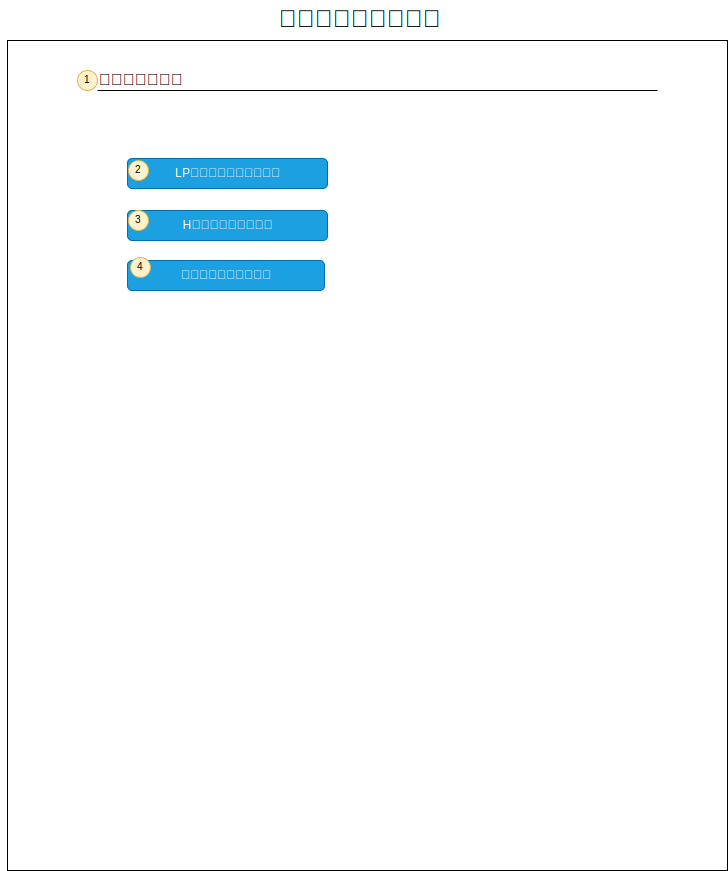{class=resizable height=480px}

<table>
  <caption>見積マスタ編集画面</caption>
  <thead>
    <tr>
      <th>No</th>
      <th>ラベル</th>
      <th>コントロール</th>
      <th>表示桁数</th>
      <th>文字揃え</th>
      <th>初期値</th>
      <th>説明</th>
    </tr>
  </thead>
  <tbody>
    <tr>
      <td>1</td>
      <td>見積マスタ編集</td>
      <td></td>
      <td>-</td>
      <td>-</td>
      <td>-</td>
      <td></td>
    </tr>
    <tr>
      <td>2</td>
      <td>LPマスタ単価マスタ編集</td>
      <td>link</td>
      <td>-</td>
      <td>-</td>
      <td>-</td>
      <td>LPマスタ単価マスタ編集へ遷移する</td>
    </tr>
    <tr>
      <td>3</td>
      <td>H形鋼単価マスタ編集</td>
      <td>link</td>
      <td>-</td>
      <td>-</td>
      <td>-</td>
      <td>H形鋼単価マスタ編集へ遷移する</td>
    </tr>
    <tr>
      <td>4</td>
      <td>パッキングマスタ編集</td>
      <td>link</td>
      <td>-</td>
      <td>-</td>
      <td>-</td>
      <td>パッキングマスタ編集へ遷移する</td>
    </tr>
  </tbody>
</table>

### LP単重マスタ編集画面

{class=resizable height=480px}

<table>
  <caption>LP単重マスタ編集画面</caption>
  <thead>
    <tr>
      <th>No</th>
      <th>ラベル</th>
      <th>コントロール</th>
      <th>表示桁数</th>
      <th>文字揃え</th>
      <th>初期値</th>
      <th>説明</th>
    </tr>
  </thead>
  <tbody>
    <tr>
      <td>1</td>
      <td>LP単重マスタ編集</td>
      <td></td>
      <td>-</td>
      <td>-</td>
      <td>-</td>
      <td></td>
    </tr>
    <tr>
      <td>2</td>
      <td>CSVダウンロード</td>
      <td></td>
      <td>-</td>
      <td>-</td>
      <td>-</td>
      <td>マスターデータのCSVを出力する</td>
    </tr>
    <tr>
      <td>3</td>
      <td>ファイル選択</td>
      <td>fileupload</td>
      <td>-</td>
      <td>-</td>
      <td>-</td>
      <td>更新するマスターデータのCSVを選択する</td>
    </tr>
    <tr>
      <td>4</td>
      <td>CSVアップロード</td>
      <td>button</td>
      <td>-</td>
      <td>-</td>
      <td>-</td>
      <td>CSVアップロード確認画面へ遷移する</td>
    </tr>
    <tr>
      <td>a1</td>
      <td>ID</td>
      <td>number</td>
      <td>-</td>
      <td>-</td>
      <td>-</td>
      <td>liner_plate_unit_mass_masters.id</td>
    </tr>
    <tr>
      <td>a2</td>
      <td>板厚(t)(mm)</td>
      <td>number</td>
      <td>-</td>
      <td>-</td>
      <td>liner_plate_unit_mass_masters.thickness</td>
      <td>ライナープレート板厚</td>
    </tr>
    <tr>
      <td>a3</td>
      <td>ピッチ</td>
      <td>number</td>
      <td>-</td>
      <td>-</td>
      <td>liner_plate_unit_mass_masters.pitch</td>
      <td>ピッチ</td>
    </tr>
    <tr>
      <td>a4</td>
      <td>単位質量(kg)</td>
      <td>number</td>
      <td>-</td>
      <td>-</td>
      <td>liner_plate_unit_mass_masters.mass</td>
      <td>ライナープレート質量</td>
    </tr>
    <tr>
      <td>a5</td>
      <td>表面処理</td>
      <td>text</td>
      <td>-</td>
      <td>-</td>
      <td>liner_plate_unit_mass_masters.surface_treatment</td>
      <td>mill_scale:黒皮品/galvanized:めっき品 と表示する</td>
    </tr>
  </tbody>
</table>

### LP本体組み立てボルトマスタ編集画面

{class=resizable height=480px}

<table>
  <caption>LP本体組み立てボルトマスタ編集画面</caption>
  <thead>
    <tr>
      <th>No</th>
      <th>ラベル</th>
      <th>コントロール</th>
      <th>表示桁数</th>
      <th>文字揃え</th>
      <th>初期値</th>
      <th>説明</th>
    </tr>
  </thead>
  <tbody>
    <tr>
      <td>1</td>
      <td>LP本体組み立てボルトマスタ編集</td>
      <td></td>
      <td>-</td>
      <td>-</td>
      <td>-</td>
      <td></td>
    </tr>
    <tr>
      <td>2</td>
      <td>CSVダウンロード</td>
      <td></td>
      <td>-</td>
      <td>-</td>
      <td>-</td>
      <td>マスターデータのCSVを出力する</td>
    </tr>
    <tr>
      <td>3</td>
      <td>ファイル選択</td>
      <td>fileupload</td>
      <td>-</td>
      <td>-</td>
      <td>-</td>
      <td>更新するマスターデータのCSVを選択する</td>
    </tr>
    <tr>
      <td>4</td>
      <td>CSVアップロード</td>
      <td>button</td>
      <td>-</td>
      <td>-</td>
      <td>-</td>
      <td>CSVアップロード確認画面へ遷移する</td>
    </tr>
    <tr>
      <td>a1</td>
      <td>ID</td>
      <td>number</td>
      <td>-</td>
      <td>-</td>
      <td>-</td>
      <td>liner_plate_bolt_masters.id</td>
    </tr>
    <tr>
      <td>a2</td>
      <td>板厚(t)(mm)</td>
      <td>number</td>
      <td>-</td>
      <td>-</td>
      <td>.thickness</td>
      <td>ライナープレート板厚</td>
    </tr>
    <tr>
      <td>a3</td>
      <td>直径(φ)(mm)</td>
      <td>number</td>
      <td>-</td>
      <td>-</td>
      <td>liner_plate_bolt_masters.diameter</td>
      <td>直径</td>
    </tr>
    <tr>
      <td>a4</td>
      <td>長さ(L)(mm)</td>
      <td>number</td>
      <td>-</td>
      <td>-</td>
      <td>liner_plate_bolt_masters.length</td>
      <td>長さ</td>
    </tr>
    <tr>
      <td>a5</td>
      <td>強度区分</td>
      <td>number</td>
      <td>-</td>
      <td>-</td>
      <td>liner_plate_bolt_masters.strength</td>
      <td>強度区分</td>
    </tr>
    <tr>
      <td>a6</td>
      <td>単位質量(w)(kg)</td>
      <td>number</td>
      <td>-</td>
      <td>-</td>
      <td>liner_plate_bolt_masters.unit_mass</td>
      <td>単重</td>
    </tr>
    <tr>
      <td>a7</td>
      <td>建値</td>
      <td>number</td>
      <td>-</td>
      <td>-</td>
      <td>liner_plate_bolt_masters.sales_price</td>
      <td>建値</td>
    </tr>
  </tbody>
</table>

### LP製造可能範囲マスタ編集画面

{class=resizable height=480px}

<table>
  <caption>LP製造可能範囲マスタ編集画面</caption>
  <thead>
    <tr>
      <th>No</th>
      <th>ラベル</th>
      <th>コントロール</th>
      <th>表示桁数</th>
      <th>文字揃え</th>
      <th>初期値</th>
      <th>説明</th>
    </tr>
  </thead>
  <tbody>
    <tr>
      <td>1</td>
      <td>LP製造可能範囲マスタ編集</td>
      <td></td>
      <td>-</td>
      <td>-</td>
      <td>-</td>
      <td></td>
    </tr>
    <tr>
      <td>2</td>
      <td>CSVダウンロード</td>
      <td></td>
      <td>-</td>
      <td>-</td>
      <td>-</td>
      <td>マスターデータのCSVを出力する</td>
    </tr>
    <tr>
      <td>3</td>
      <td>ファイル選択</td>
      <td>fileupload</td>
      <td>-</td>
      <td>-</td>
      <td>-</td>
      <td>更新するマスターデータのCSVを選択する</td>
    </tr>
    <tr>
      <td>4</td>
      <td>CSVアップロード</td>
      <td>button</td>
      <td>-</td>
      <td>-</td>
      <td>-</td>
      <td>CSVアップロード確認画面へ遷移する</td>
    </tr>
    <tr>
      <td>a1</td>
      <td>ID</td>
      <td>number</td>
      <td>-</td>
      <td>-</td>
      <td>-</td>
      <td>liner_plate_bending_process_scope_masters.id</td>
    </tr>
    <tr>
      <td>a2</td>
      <td>呼称径（Φ）(mm)</td>
      <td>number</td>
      <td>-</td>
      <td>-</td>
      <td>liner_plate_bending_process_scope_masters.diameter</td>
      <td>	呼称径（Φ）</td>
    </tr>
    <tr>
      <td>a3</td>
      <td>板厚(mm)</td>
      <td>number</td>
      <td>-</td>
      <td>-</td>
      <td>liner_plate_bending_process_scope_masters.thickness</td>
      <td>ライナープレート板厚</td>
    </tr>
    <tr>
      <td>a4</td>
      <td>加工範囲</td>
      <td>text</td>
      <td>-</td>
      <td>-</td>
      <td>liner_plate_bending_process_scope_masters.scope</td>
      <td>以下のように表示する 標準(standard)/製造可能(fabricable)/特殊1(special)/特殊2(special2)</td>
    </tr>
  </tbody>
</table>

### H形鋼単重マスタ編集画面

{class=resizable height=480px}

<table>
  <caption>H形鋼単重マスタ編集画面/caption>
  <thead>
    <tr>
      <th>No</th>
      <th>ラベル</th>
      <th>コントロール</th>
      <th>表示桁数</th>
      <th>文字揃え</th>
      <th>初期値</th>
      <th>説明</th>
    </tr>
  </thead>
  <tbody>
    <tr>
      <td>1</td>
      <td>H形鋼単重マスタ編集</td>
      <td></td>
      <td>-</td>
      <td>-</td>
      <td>-</td>
      <td></td>
    </tr>
    <tr>
      <td>2</td>
      <td>CSVダウンロード</td>
      <td></td>
      <td>-</td>
      <td>-</td>
      <td>-</td>
      <td>マスターデータのCSVを出力する</td>
    </tr>
    <tr>
      <td>3</td>
      <td>ファイル選択</td>
      <td>fileupload</td>
      <td>-</td>
      <td>-</td>
      <td>-</td>
      <td>更新するマスターデータのCSVを選択する</td>
    </tr>
    <tr>
      <td>4</td>
      <td>CSVアップロード</td>
      <td>button</td>
      <td>-</td>
      <td>-</td>
      <td>-</td>
      <td>CSVアップロード確認画面へ遷移する</td>
    </tr>
    <tr>
      <td>a1</td>
      <td>ID</td>
      <td>number</td>
      <td>-</td>
      <td>-</td>
      <td>-</td>
      <td>h_beam_unit_mass_masters.id</td>
    </tr>
    <tr>
      <td>a2</td>
      <td>高さ(H)(mm)</td>
      <td>number</td>
      <td>-</td>
      <td>-</td>
      <td>h_beam_unit_mass_masters.height</td>
      <td>高さ</td>
    </tr>
    <tr>
      <td>a3</td>
      <td>幅(B)(mm)</td>
      <td>number</td>
      <td>-</td>
      <td>-</td>
      <td>h_beam_unit_mass_masters.width</td>
      <td>長さ</td>
    </tr>
    <tr>
      <td>a4</td>
      <td>ウェブ厚さ(t1)(mm)</td>
      <td>number</td>
      <td>-</td>
      <td>-</td>
      <td>h_beam_unit_mass_masters.web_thickness1</td>
      <td>ウェブ厚さ(t1)</td>
    </tr>
    <tr>
      <td>a5</td>
      <td>ウェブ厚さ(t2）(mm)</td>
      <td>number</td>
      <td>-</td>
      <td>-</td>
      <td>h_beam_unit_mass_masters.web_thickness2</td>
      <td>ウェブ厚さ(t2)</td>
    </tr>
    <tr>
      <td>a6</td>
      <td>単位質量(kg)</td>
      <td>number</td>
      <td>-</td>
      <td>-</td>
      <td>h_beam_unit_mass_masters.unit_mass</td>
      <td>単位質量</td>
    </tr>
    <tr>
      <td>a7</td>
      <td>表面処理</td>
      <td>text</td>
      <td>-</td>
      <td>-</td>
      <td>h_beam_unit_mass_masters.surface_treatment</td>
      <td>mill_scale:黒皮品/galvanized:めっき品 と表示する</td>
    </tr>
  </tbody>
</table>

### H形鋼継手板マスタ編集画面

{class=resizable height=480px}

<table>
  <caption>H形鋼継手板マスタ編集画面</caption>
  <thead>
    <tr>
      <th>No</th>
      <th>ラベル</th>
      <th>コントロール</th>
      <th>表示桁数</th>
      <th>文字揃え</th>
      <th>初期値</th>
      <th>説明</th>
    </tr>
  </thead>
  <tbody>
    <tr>
      <td>1</td>
      <td>H形鋼継手板マスタ編集</td>
      <td></td>
      <td>-</td>
      <td>-</td>
      <td>-</td>
      <td></td>
    </tr>
    <tr>
      <td>2</td>
      <td>CSVダウンロード</td>
      <td></td>
      <td>-</td>
      <td>-</td>
      <td>-</td>
      <td>マスターデータのCSVを出力する</td>
    </tr>
    <tr>
      <td>3</td>
      <td>ファイル選択</td>
      <td>fileupload</td>
      <td>-</td>
      <td>-</td>
      <td>-</td>
      <td>更新するマスターデータのCSVを選択する</td>
    </tr>
    <tr>
      <td>4</td>
      <td>CSVアップロード</td>
      <td>button</td>
      <td>-</td>
      <td>-</td>
      <td>-</td>
      <td>CSVアップロード確認画面へ遷移する</td>
    </tr>
    <tr>
      <td>a1</td>
      <td>ID</td>
      <td>number</td>
      <td>-</td>
      <td>-</td>
      <td>-</td>
      <td>h_beam_splice_plate_unit_mass_masters.id</td>
    </tr>
    <tr>
      <td>a2</td>
      <td>高さ(H)(mm)</td>
      <td>number</td>
      <td>-</td>
      <td>-</td>
      <td>h_beam_splice_plate_unit_mass_masters.height</td>
      <td>高さ</td>
    </tr>
    <tr>
      <td>a3</td>
      <td>板厚(t)(mm)</td>
      <td>number</td>
      <td>-</td>
      <td>-</td>
      <td>h_beam_splice_plate_unit_mass_masters.thickness</td>
      <td>板厚</td>
    </tr>
    <tr>
      <td>a4</td>
      <td>長さ(L)(mm)</td>
      <td>number</td>
      <td>-</td>
      <td>-</td>
      <td>h_beam_splice_plate_unit_mass_masters.length</td>
      <td>長さ</td>
    </tr>
    <tr>
      <td>a5</td>
      <td>単位質量(w)(kg)</td>
      <td>number</td>
      <td>-</td>
      <td>-</td>
      <td>h_beam_splice_plate_unit_mass_masters.unit_mass</td>
      <td>単位質量</td>
    </tr>
    <tr>
      <td>a7</td>
      <td>表面処理</td>
      <td>text</td>
      <td>-</td>
      <td>-</td>
      <td>h_beam_splice_plate_unit_mass_masters.surface_treatment</td>
      <td>mill_scale:黒皮品/galvanized:めっき品 と表示する</td>
    </tr>
  </tbody>
</table>

### H形鋼製造可能範囲マスタ編集画面

{class=resizable height=480px}

<table>
  <caption>H形鋼製造可能範囲マスタ編集画面</caption>
  <thead>
    <tr>
      <th>No</th>
      <th>ラベル</th>
      <th>コントロール</th>
      <th>表示桁数</th>
      <th>文字揃え</th>
      <th>初期値</th>
      <th>説明</th>
    </tr>
  </thead>
  <tbody>
    <tr>
      <td>1</td>
      <td>H形鋼製造可能範囲マスタ編集</td>
      <td></td>
      <td>-</td>
      <td>-</td>
      <td>-</td>
      <td></td>
    </tr>
    <tr>
      <td>2</td>
      <td>CSVダウンロード</td>
      <td></td>
      <td>-</td>
      <td>-</td>
      <td>-</td>
      <td>マスターデータのCSVを出力する</td>
    </tr>
    <tr>
      <td>3</td>
      <td>ファイル選択</td>
      <td>fileupload</td>
      <td>-</td>
      <td>-</td>
      <td>-</td>
      <td>更新するマスターデータのCSVを選択する</td>
    </tr>
    <tr>
      <td>4</td>
      <td>CSVアップロード</td>
      <td>button</td>
      <td>-</td>
      <td>-</td>
      <td>-</td>
      <td>CSVアップロード確認画面へ遷移する</td>
    </tr>
    <tr>
      <td>a1</td>
      <td>ID</td>
      <td>number</td>
      <td>-</td>
      <td>-</td>
      <td>-</td>
      <td>h_beam_bending_process_scope_masters.id</td>
    </tr>
    <tr>
      <td>a2</td>
      <td>呼称径（Φ）(mm)</td>
      <td>number</td>
      <td>-</td>
      <td>-</td>
      <td>h_beam_bending_process_scope_masters.diameter</td>
      <td>	呼称径（Φ）</td>
    </tr>
    <tr>
      <td>a3</td>
      <td>板厚(t)(mm)</td>
      <td>number</td>
      <td>-</td>
      <td>-</td>
      <td>h_beam_bending_process_scope_masters.thickness</td>
      <td>ライナープレート板厚</td>
    </tr>
    <tr>
      <td>a4</td>
      <td>加工範囲</td>
      <td>text</td>
      <td>-</td>
      <td>-</td>
      <td>h_beam_bending_process_scope_masters.scope</td>
      <td>以下のように表示する 標準(standard)/製造可能(fabricable)/特殊1(special)/特殊2(special2)</td>
    </tr>
  </tbody>
</table>

### H形鋼コーナーアングルマスタ編集画面

{class=resizable height=480px}

<table>
  <caption>H形鋼コーナーアングルマスタ編集画面</caption>
  <thead>
    <tr>
      <th>No</th>
      <th>ラベル</th>
      <th>コントロール</th>
      <th>表示桁数</th>
      <th>文字揃え</th>
      <th>初期値</th>
      <th>説明</th>
    </tr>
  </thead>
  <tbody>
    <tr>
      <td>1</td>
      <td>H形鋼コーナーアングルマスタ編集</td>
      <td></td>
      <td>-</td>
      <td>-</td>
      <td>-</td>
      <td></td>
    </tr>
    <tr>
      <td>2</td>
      <td>CSVダウンロード</td>
      <td></td>
      <td>-</td>
      <td>-</td>
      <td>-</td>
      <td>マスターデータのCSVを出力する</td>
    </tr>
    <tr>
      <td>3</td>
      <td>ファイル選択</td>
      <td>fileupload</td>
      <td>-</td>
      <td>-</td>
      <td>-</td>
      <td>更新するマスターデータのCSVを選択する</td>
    </tr>
    <tr>
      <td>4</td>
      <td>CSVアップロード</td>
      <td>button</td>
      <td>-</td>
      <td>-</td>
      <td>-</td>
      <td>CSVアップロード確認画面へ遷移する</td>
    </tr>
    <tr>
      <td>a1</td>
      <td>ID</td>
      <td>number</td>
      <td>-</td>
      <td>-</td>
      <td>-</td>
      <td>h_beam_corner_angle_masters.id</td>
    </tr>
    <tr>
      <td>a2</td>
      <td>補強リング高さ(mm)</td>
      <td>number</td>
      <td>-</td>
      <td>-</td>
      <td>h_beam_corner_angle_masters.height</td>
      <td>補強リング高さ</td>
    </tr>
    <tr>
      <td>a3</td>
      <td>コーナーアングル高さ（CA）(mm)</td>
      <td>number</td>
      <td>-</td>
      <td>-</td>
      <td>h_beam_corner_angle_masters.dimension</td>
      <td>寸法</td>
    </tr>
    <tr>
      <td>a4</td>
      <td>単位質量(w)(kg)</td>
      <td>number</td>
      <td>-</td>
      <td>-</td>
      <td>h_beam_splice_plate_unit_mass_masters.unit_mass</td>
      <td>単位質量</td>
    </tr>
  </tbody>
</table>

### LP単価マスタ編集画面

{class=resizable height=480px}

<table>
  <caption>LP単価マスタ編集画面</caption>
  <thead>
    <tr>
      <th>No</th>
      <th>ラベル</th>
      <th>コントロール</th>
      <th>表示桁数</th>
      <th>文字揃え</th>
      <th>初期値</th>
      <th>説明</th>
    </tr>
  </thead>
  <tbody>
    <tr>
      <td>1</td>
      <td>LP単価マスタ編集</td>
      <td></td>
      <td>-</td>
      <td>-</td>
      <td>-</td>
      <td></td>
    </tr>
    <tr>
      <td>2</td>
      <td>CSVダウンロード</td>
      <td></td>
      <td>-</td>
      <td>-</td>
      <td>-</td>
      <td>マスターデータのCSVを出力する</td>
    </tr>
    <tr>
      <td>3</td>
      <td>ファイル選択</td>
      <td>fileupload</td>
      <td>-</td>
      <td>-</td>
      <td>-</td>
      <td>更新するマスターデータのCSVを選択する</td>
    </tr>
    <tr>
      <td>4</td>
      <td>CSVアップロード</td>
      <td>button</td>
      <td>-</td>
      <td>-</td>
      <td>-</td>
      <td>CSVアップロード確認画面へ遷移する</td>
    </tr>
    <tr>
      <td>a1</td>
      <td>ID</td>
      <td>number</td>
      <td>-</td>
      <td>-</td>
      <td>-</td>
      <td>lp_unit_price_masters.id</td>
    </tr>
    <tr>
      <td>a2</td>
      <td>直径(D)/短径(B)(mm)</td>
      <td>number</td>
      <td>-</td>
      <td>-</td>
      <td>lp_unit_price_masters.diameter</td>
      <td>直径/短径</td>
    </tr>
    <tr>
      <td>a3</td>
      <td>長径(L)(mm)</td>
      <td>number</td>
      <td>-</td>
      <td>-</td>
      <td>lp_unit_price_masters.long_diameter</td>
      <td>長径</td>
    </tr>
    <tr>
      <td>a4</td>
      <td>建値(円)</td>
      <td>number</td>
      <td>-</td>
      <td>-</td>
      <td>lp_unit_price_masters.sales_price</td>
      <td>建値</td>
    </tr>
      <tr>
      <td>a5</td>
      <td>立坑形式</td>
      <td>text</td>
      <td>-</td>
      <td>-</td>
      <td>lp_unit_price_masters.calc_type</td>
      <td>円形(circle)/小判形(oval)/矩形(rectangle)</td>
    </tr>
    <tr>
      <td>a6</td>
      <td>表面処理</td>
      <td>text</td>
      <td>-</td>
      <td>-</td>
      <td>lp_unit_price_masters.surface_treatment</td>
      <td>mill_scale:黒皮品/galvanized:めっき品 と表示す</td>
    </tr>
  </tbody>
</table>

### H形鋼単価マスタ編集画面

{class=resizable height=480px}

<table>
  <caption>H形鋼単価マスタ編集画面</caption>
  <thead>
    <tr>
      <th>No</th>
      <th>ラベル</th>
      <th>コントロール</th>
      <th>表示桁数</th>
      <th>文字揃え</th>
      <th>初期値</th>
      <th>説明</th>
    </tr>
  </thead>
  <tbody>
    <tr>
      <td>1</td>
      <td>H形鋼単価マスタ編集</td>
      <td></td>
      <td>-</td>
      <td>-</td>
      <td>-</td>
      <td></td>
    </tr>
    <tr>
      <td>2</td>
      <td>CSVダウンロード</td>
      <td></td>
      <td>-</td>
      <td>-</td>
      <td>-</td>
      <td>マスターデータのCSVを出力する</td>
    </tr>
    <tr>
      <td>3</td>
      <td>ファイル選択</td>
      <td>fileupload</td>
      <td>-</td>
      <td>-</td>
      <td>-</td>
      <td>更新するマスターデータのCSVを選択する</td>
    </tr>
    <tr>
      <td>4</td>
      <td>CSVアップロード</td>
      <td>button</td>
      <td>-</td>
      <td>-</td>
      <td>-</td>
      <td>CSVアップロード確認画面へ遷移する</td>
    </tr>
    <tr>
      <td>a1</td>
      <td>ID</td>
      <td>number</td>
      <td>-</td>
      <td>-</td>
      <td>-</td>
      <td>h_beam_unit_price_masters.id</td>
    </tr>
    <tr>
      <td>a2</td>
      <td>直径(φ)(mm)</td>
      <td>number</td>
      <td>-</td>
      <td>-</td>
      <td>-</td>
      <td>h_beam_unit_price_masters.diameter</td>
    </tr>
    <tr>
      <td>a3</td>
      <td>高さ(H)(mm)</td>
      <td>number</td>
      <td>-</td>
      <td>-</td>
      <td>h_beam_unit_price_masters.height</td>
      <td>高さ</td>
    </tr>
    <tr>
      <td>a4</td>
      <td>分割数</td>
      <td>number</td>
      <td>-</td>
      <td>-</td>
      <td>h_beam_unit_price_masters.divisions</td>
      <td>分割数</td>
    </tr>
    <tr>
      <td>a5</td>
      <td>建値(円)</td>
      <td>number</td>
      <td>-</td>
      <td>-</td>
      <td>h_beam_unit_price_masters.sales_price</td>
      <td>建値</td>
    </tr>
    <tr>
      <td>a6</td>
      <td>継手価格(円)</td>
      <td>number</td>
      <td>-</td>
      <td>-</td>
      <td>h_beam_unit_price_masters.joint_sales_price</td>
      <td>継手価格</td>
    </tr>
    <tr>
      <td>a7</td>
      <td>加工費(円)</td>
      <td>number</td>
      <td>-</td>
      <td>-</td>
      <td>h_beam_unit_price_masters.processing_cost</td>
      <td>加工費</td>
    </tr>
    <tr>
      <td>a8</td>
      <td>立坑形式</td>
      <td>text</td>
      <td>-</td>
      <td>-</td>
      <td>h_beam_unit_price_masters.calc_type</td>
      <td>円形(circle)/小判形(oval)/矩形(rectangle)</td>
    </tr>
  </tbody>
</table>

### パッキング編集画面

{class=resizable height=480px}

<table>
  <caption>パッキング編集画面</caption>
  <thead>
    <tr>
      <th>No</th>
      <th>ラベル</th>
      <th>コントロール</th>
      <th>表示桁数</th>
      <th>文字揃え</th>
      <th>初期値</th>
      <th>説明</th>
    </tr>
  </thead>
  <tbody>
    <tr>
      <td>1</td>
      <td>パッキング編集</td>
      <td></td>
      <td>-</td>
      <td>-</td>
      <td>-</td>
      <td></td>
    </tr>
    <tr>
      <td>2</td>
      <td>CSVダウンロード</td>
      <td></td>
      <td>-</td>
      <td>-</td>
      <td>-</td>
      <td>マスターデータのCSVを出力する</td>
    </tr>
    <tr>
      <td>3</td>
      <td>ファイル選択</td>
      <td>fileupload</td>
      <td>-</td>
      <td>-</td>
      <td>-</td>
      <td>更新するマスターデータのCSVを選択する</td>
    </tr>
    <tr>
      <td>4</td>
      <td>CSVアップロード</td>
      <td>button</td>
      <td>-</td>
      <td>-</td>
      <td>-</td>
      <td>CSVアップロード確認画面へ遷移する</td>
    </tr>
    <tr>
      <td>a1</td>
      <td>ID</td>
      <td>number</td>
      <td>-</td>
      <td>-</td>
      <td>-</td>
      <td>packing_masters.id</td>
    </tr>
    <tr>
      <td>a2</td>
      <td>品名</td>
      <td>text</td>
      <td>-</td>
      <td>-</td>
      <td>packing_masters.name</td>
      <td>品名</td>
    </tr>
    <tr>
      <td>a3</td>
      <td>幅</td>
      <td>number</td>
      <td>-</td>
      <td>-</td>
      <td>packing_masters.width</td>
      <td>幅</td>
    </tr>
    <tr>
      <td>a4</td>
      <td>厚さ</td>
      <td>number</td>
      <td>-</td>
      <td>-</td>
      <td>packing_masters.thickness</td>
      <td>厚さ</td>
    </tr>
    <tr>
      <td>a5</td>
      <td>長さ</td>
      <td>number</td>
      <td>-</td>
      <td>-</td>
      <td>packing_masters.length</td>
      <td>長さ</td>
    </tr>
    <tr>
      <td>a6</td>
      <td>建値</td>
      <td>number</td>
      <td>-</td>
      <td>-</td>
      <td>packing_masters.sales_price</td>
      <td>建値</td>
    </tr>
    <tr>
      <td>a7</td>
      <td>材質</td>
      <td>text</td>
      <td>-</td>
      <td>-</td>
      <td>packing_masters.material</td>
      <td>材質</td>
    </tr>
  </tbody>
</table>

### CSVアップロード確認画面

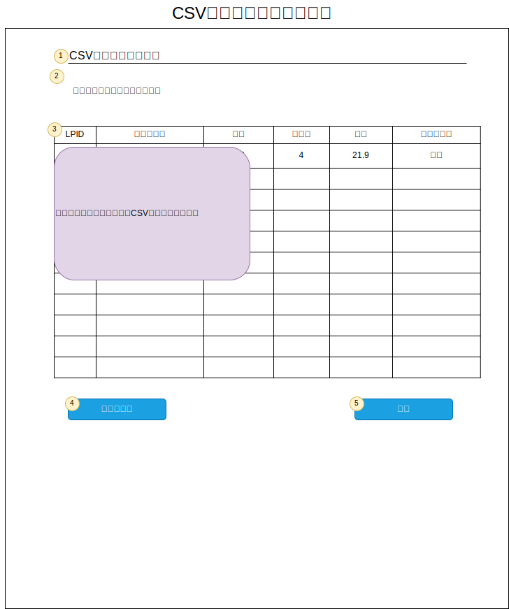{class=resizable height=480px}

<table>
  <caption>CSVアップロード確認画面</caption>
  <thead>
    <tr>
      <th>No</th>
      <th>ラベル</th>
      <th>コントロール</th>
      <th>表示桁数</th>
      <th>文字揃え</th>
      <th>初期値</th>
      <th>説明</th>
    </tr>
  </thead>
  <tbody>
    <tr>
      <td>1</td>
      <td>CSVアップロード確認</td>
      <td></td>
      <td>-</td>
      <td>-</td>
      <td>-</td>
      <td></td>
    </tr>
    <tr>
      <td>2</td>
      <td>下記の内容で上書きしますか？</td>
      <td></td>
      <td>-</td>
      <td>-</td>
      <td>-</td>
      <td>注意文言</td>
    </tr>
    <tr>
      <td>3</td>
      <td>内容確認</td>
      <td>table</td>
      <td>-</td>
      <td>-</td>
      <td>-</td>
      <td>前画面でアップロードしたCSVの内容を表示する。アップロード内容に問題があれば、テーブル上部に問題点を表示する。</td>
    </tr>
    <tr>
      <td>4</td>
      <td>キャンセル</td>
      <td>button</td>
      <td>-</td>
      <td>-</td>
      <td>-</td>
      <td>マスターを更新をせずに、前画面へ遷移する</td>
    </tr>
    <tr>
      <td>5</td>
      <td>更新</td>
      <td>button</td>
      <td>-</td>
      <td>-</td>
      <td>-</td>
      <td>マスターを更新し、前画面へ遷移する</td>
    </tr>
  </tbody>
</table>

### 計算指示書管理画面

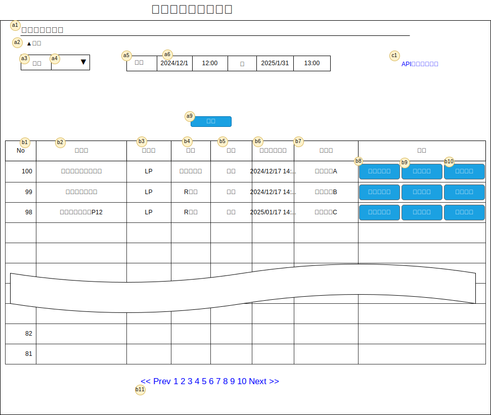{class=resizable height=480px}

<table>
  <caption>計算指示書管理画面</caption>
  <thead>
    <tr>
      <th>No</th>
      <th>ラベル</th>
      <th>コントロール</th>
      <th>表示桁数</th>
      <th>文字揃え</th>
      <th>初期値</th>
      <th>説明</th>
    </tr>
  </thead>
  <tbody>
    <tr>
      <td>a1</td>
      <td>計算指示書管理</td>
      <td>text</td>
      <td>-</td>
      <td>-</td>
      <td>-</td>
      <td></td>
    </tr>
    <tr>
      <td>a2</td>
      <td>▲検索</td>
      <td>text</td>
      <td>-</td>
      <td>-</td>
      <td>-</td>
      <td>クリックすると検索項目が隠れる。▼の時にクリックすると検索項目が表示される。</td>
    </tr>
    <tr>
      <td>a3</td>
      <td>状態</td>
      <td>label</td>
      <td>-</td>
      <td>-</td>
      <td>-</td>
      <td>検索項目:状態のラベル</td>
    </tr>
    <tr>
      <td>a4</td>
      <td>状態入力フィールド</td>
      <td>dropdown</td>
      <td>-</td>
      <td>-</td>
      <td>-</td>
      <td>検索条件の状態を入力する。選択肢は以下の通り。
        <ul>
          <li>待ち</li>
          <li>計算中</li>
          <li>成功</li>
          <li>失敗</li>
          <li>キャンセル</li>
        </ul>
      </td>
    </tr>
    <tr>
      <td>a5</td>
      <td>期間</td>
      <td>label</td>
      <td>-</td>
      <td>-</td>
      <td>-</td>
      <td>検索項目:作成日のラベル</td>
    </tr>
    <tr>
      <td>a6</td>
      <td>期間入力フィールド</td>
      <td>calendar</td>
      <td>-</td>
      <td>-</td>
      <td>-</td>
      <td>検索条件の作成日の期間を入力するフィールド</td>
    </tr>
    <tr>
      <td>b1</td>
      <td>No</td>
      <td>number</td>
      <td>-</td>
      <td>-</td>
      <td>-</td>
      <td>
        <ul>
          <li>行番号を表示する</li>
          <li>クリックすると該当の計算指示書詳細画面へ遷移する</li>
        </ul>
      </td>
    </tr>
    <tr>
      <td>b2</td>
      <td>案件名</td>
      <td>text</td>
      <td>-</td>
      <td>-</td>
      <td>-</td>
      <td>案件名を表示する</td>
    </tr>
    <tr>
      <td>b3</td>
      <td>商品名</td>
      <td>text</td>
      <td>-</td>
      <td>-</td>
      <td>-</td>
      <td>商品名を表示する(LPまたはカゴ枠)</td>
    </tr>
    <tr>
      <td>b4</td>
      <td>形状</td>
      <td>text</td>
      <td>-</td>
      <td>-</td>
      <td>-</td>
      <td>形状を表示する</td>
    </tr>
    <tr>
      <td>b5</td>
      <td>状態</td>
      <td>text</td>
      <td>-</td>
      <td>-</td>
      <td>-</td>
      <td>計算指示書の処理状態を表示する</td>
    </tr>
    <tr>
      <td>b6</td>
      <td>状態更新日時</td>
      <td>text</td>
      <td>-</td>
      <td>-</td>
      <td>-</td>
      <td>計算指示書の状態の最終更新日時を表示する</td>
    </tr>
    <tr>
      <td>b7</td>
      <td>操作者</td>
      <td>text</td>
      <td>-</td>
      <td>-</td>
      <td>-</td>
      <td>計算指示書の最後の操作した人を表示する</td>
    </tr>
    <tr>
      <td>b8</td>
      <td>キャンセル</td>
      <td>button</td>
      <td>-</td>
      <td>-</td>
      <td>-</td>
      <td>計算指示書の状態をキャンセルに変更する</td>
    </tr>
    <tr>
      <td>b9</td>
      <td>リトライ</td>
      <td>button</td>
      <td>-</td>
      <td>-</td>
      <td>-</td>
      <td>計算指示書の状態を待ちに変更する</td>
    </tr>
    <tr>
      <td>b10</td>
      <td>完了通知</td>
      <td>button</td>
      <td>-</td>
      <td>-</td>
      <td>-</td>
      <td>計算指示書の計算が完了した通知を送る</td>
    </tr>
    <tr>
      <td>b10</td>
      <td>ページへのリンク</td>
      <td>link</td>
      <td>-</td>
      <td>-</td>
      <td>-</td>
      <td>20件以上データがあると、ページネーションのリンクを出力する。20件以下の場合は表示しない</td>
    </tr>
    <tr>
      <td>c1</td>
      <td>APIトークン一覧</td>
      <td>link</td>
      <td>-</td>
      <td>-</td>
      <td>-</td>
      <td>クリックするとAPIトークン一覧画面へ遷移する</td>
    </tr>
  </tbody>
</table>

### 計算指示書詳細画面

{class=resizable height=480px}

<table>
  <caption>計算指示書詳細画面</caption>
  <thead>
    <tr>
      <th>No</th>
      <th>ラベル</th>
      <th>コントロール</th>
      <th>表示桁数</th>
      <th>文字揃え</th>
      <th>初期値</th>
      <th>説明</th>
    </tr>
  </thead>
  <tbody>
    <tr>
      <td>1</td>
      <td>計算指示書詳細</td>
      <td>text</td>
      <td>-</td>
      <td>-</td>
      <td>-</td>
      <td></td>
    </tr>
    <tr>
      <td>a1</td>
      <td>計算指示書</td>
      <td>text</td>
      <td>-</td>
      <td>-</td>
      <td></td>
      <td></td>
    </tr>
    <tr>
      <td>a2</td>
      <td>No</td>
      <td>number</td>
      <td>-</td>
      <td>-</td>
      <td>-</td>
      <td>行番号を表示する</td>
    </tr>
    <tr>
      <td>a3</td>
      <td>案件名</td>
      <td>text</td>
      <td>-</td>
      <td>-</td>
      <td>-</td>
      <td>案件名を表示する</td>
    </tr>
    <tr>
      <td>a4</td>
      <td>商品名</td>
      <td>text</td>
      <td>-</td>
      <td>-</td>
      <td>-</td>
      <td>商品名を表示する(LPまたはカゴ枠)</td>
    </tr>
    <tr>
      <td>a5</td>
      <td>形状</td>
      <td>text</td>
      <td>-</td>
      <td>-</td>
      <td>-</td>
      <td>形状を表示する</td>
    </tr>
    <tr>
      <td>a6</td>
      <td>状態</td>
      <td>text</td>
      <td>-</td>
      <td>-</td>
      <td>-</td>
      <td>計算指示書の処理状態を表示する</td>
    </tr>
    <tr>
      <td>a7</td>
      <td>状態更新日時</td>
      <td>text</td>
      <td>-</td>
      <td>-</td>
      <td>-</td>
      <td>計算指示書の状態の最終更新日時を表示する</td>
    </tr>
    <tr>
      <td>a8</td>
      <td>操作者</td>
      <td>text</td>
      <td>-</td>
      <td>-</td>
      <td>-</td>
      <td>計算指示書の最後の操作した人を表示する</td>
    </tr>
    <tr>
      <td>b1</td>
      <td>計算結果</td>
      <td>text</td>
      <td>-</td>
      <td>-</td>
      <td>-</td>
      <td></td>
    </tr>
    <tr>
      <td>b2</td>
      <td>PDFファイル</td>
      <td>link</td>
      <td>-</td>
      <td>-</td>
      <td>-</td>
      <td>クリックするとFRAME計算結果PDFをダウンロード</td>
    </tr>
    <tr>
      <td>b3</td>
      <td>テキストファイル</td>
      <td>link</td>
      <td>-</td>
      <td>-</td>
      <td>-</td>
      <td>クリックするとFRAME計算結果TXTをダウンロード</td>
    </tr>
    <tr>
      <td>c1</td>
      <td>計算指示書</td>
      <td>button</td>
      <td>-</td>
      <td>-</td>
      <td>-</td>
      <td>クリックすると計算指示書のJSONが表示される</td>
    </tr>
    <tr>
      <td>d1</td>
      <td>履歴</td>
      <td>text</td>
      <td>-</td>
      <td>-</td>
      <td>-</td>
      <td></td>
    </tr>
    <tr>
      <td>d2</td>
      <td>No</td>
      <td>label</td>
      <td>-</td>
      <td>center</td>
      <td>-</td>
      <td>履歴の行番号を表示する</td>
    </tr>
    <tr>
      <td>d3</td>
      <td>状態</td>
      <td>text</td>
      <td>-</td>
      <td>-</td>
      <td>-</td>
      <td>履歴の状態を表示する</td>
    </tr>
    <tr>
      <td>d4</td>
      <td>状態更新日時</td>
      <td>text</td>
      <td>-</td>
      <td>-</td>
      <td>-</td>
      <td>履歴の状態更新日時を表示</td>
    </tr>
     <tr>
      <td>d5</td>
      <td>操作者</td>
      <td>text</td>
      <td>-</td>
      <td>-</td>
      <td>-</td>
      <td>履歴の操作者を表示する</td>
    </tr>
    <tr>
      <td>e1</td>
      <td>戻る</td>
      <td>button</td>
      <td>-</td>
      <td>-</td>
      <td>-</td>
      <td>クリックで計算指示書管理画面へ遷移する</td>
    </tr>
  </tbody>
</table>

### APIトークン一覧画面

{class=resizable height=480px}

<table>
  <caption>APIトークン一覧画面</caption>
  <thead>
    <tr>
      <th>No</th>
      <th>ラベル</th>
      <th>コントロール</th>
      <th>表示桁数</th>
      <th>文字揃え</th>
      <th>初期値</th>
      <th>説明</th>
    </tr>
  </thead>
  <tbody>
    <tr>
      <td>a1</td>
      <td>APIトークン一覧</td>
      <td>text</td>
      <td>-</td>
      <td>-</td>
      <td>-</td>
      <td></td>
    </tr>
    <td>a2</td>
      <td>タイトル</td>
      <td>label</td>
      <td>-</td>
      <td>-</td>
      <td>-</td>
      <td>入力項目:タイトルのラベル</td>
    </tr>
    <tr>
      <td>a3</td>
      <td>タイトル入力フィールド</td>
      <td>textfield</td>
      <td>-</td>
      <td></td>
      <td>-</td>
      <td>トークンのタイトルを入力する</td>
    </tr>
    <tr>
      <td>a4</td>
      <td>新規作成</td>
      <td>button</td>
      <td>-</td>
      <td>-</td>
      <td>-</td>
      <td>トークンを新規作成する</td>
    </tr>
    <tr>
      <td>b1</td>
      <td>No</td>
      <td>number</td>
      <td>-</td>
      <td>-</td>
      <td>-</td>
      <td>行番号を表示する</td>
    </tr>
    <tr>
      <td>b2</td>
      <td>タイトル</td>
      <td>text</td>
      <td>-</td>
      <td>-</td>
      <td>-</td>
      <td>タイトル表示する</td>
    </tr>
    <tr>
      <td>b3</td>
      <td>トークン</td>
      <td>text</td>
      <td>-</td>
      <td>-</td>
      <td>-</td>
      <td>トークンを表示する</td>
    </tr>
    <tr>
      <td>b4</td>
      <td>作成日</td>
      <td>calendar</td>
      <td>-</td>
      <td>-</td>
      <td>-</td>
      <td>作成日を表示する</td>
    </tr>
    <tr>
      <td>b5</td>
      <td>削除</td>
      <td>button</td>
      <td>-</td>
      <td>-</td>
      <td>-</td>
      <td>クリックでトークンを削除する</td>
    </tr>
    <tr>
      <td>c1</td>
      <td>戻る</td>
      <td>button</td>
      <td>-</td>
      <td>-</td>
      <td>-</td>
      <td>クリックで計算指示書管理画面へ遷移する</td>
    </tr>
  </tbody>
</table>

## 変更履歴

<table>
  <thead>
    <tr>
      <th>日付</th>
      <th>改版</th>
      <th>担当</th>
      <th width="350px">内容</th>
    </tr>
  </thead>
  <tbody>
    <tr>
      <td>2024.11.29</td>
      <td>1.0</td>
      <td>アンタス</td>
      <td>初版</td>
    </tr>
    <tr>
      <td>2025.02.28</td>
      <td>1.1</td>
      <td>アンタス</td>
      <td>Phase2 対応の改修分を追記</td>
    </tr>
    <tr>
      <td>2025.06.06</td>
      <td>1.2</td>
      <td>アンタス</td>
      <td>
        社外利用対応の改修分を追記
        <ul>
          <li>フッターにお問い合わせ、利用規約、操作説明書を追加</li>
          <li>ユーザー一覧画面に検索と権限についての機能を追加</li>
          <li>ユーザー詳細画面(営業)を追加</li>
          <li>登録情報画面を追加</li>
          <li>案件一覧画面に検索機能とCSVダウンロードを追加</li>
          <li>社外ユーザーにビジター権限を追加し、それに伴い権限範囲等を修正</li>
        </ul>
      </td>
    </tr>
    <tr>
      <td>2025.07.16</td>
      <td>1.2.1</td>
      <td>アンタス</td>
      <td>計算結果画面のボタンメニューを修正、設計計算書情報入力画面を追加</td>
    </tr>
    <tr>
      <td>2025.09.30</td>
      <td>1.3</td>
      <td>アンタス</td>
      <td>Phase4 R矩形、矩形支保工を追加</td>
    </tr>
  </tbody>
</table>
